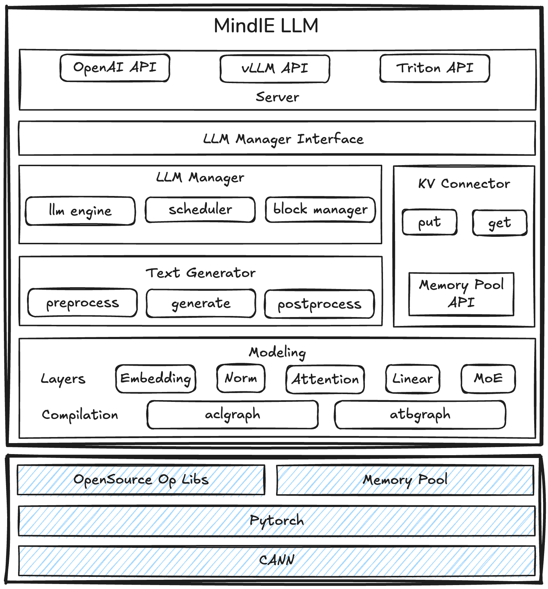

# Architecture Design

## Overview

Mind Inference Engine for Large Language Models (MindIE LLM), as a key component of the MindIE inference series, provides Ascend-native scheduling and inference optimization capabilities. It supports inference acceleration features such as Continuous Batching, PagedAttention, and FlashDecoding to enable high-performance inference across diverse scenarios.

## Architecture



- **Server**: inference engine service layer, which provides model inference as a service. It supports mainstream protocols such as OpenAI, vLLM, and Triton. The endpoint encapsulates and converts protocols and provides external RESTful APIs.

- **LLM Manager**: inference engine scheduling layer, which manages request status and schedules tasks. It uses CB scheduling to batch user requests, dispatch inference tasks, return results, and provide status recording and query interfaces.
    - Interface: Provides model instance management and runtime APIs in C++/Python, enabling integration with third-party serving frameworks.

    - Engine: Orchestrates scheduler, executor, worker, and other components. Through their collaboration, it delivers unified request handling and execution across different inference scenarios.
    - Scheduler: Finishes request queueing and scheduling logic. Its scheduling policies maximize host-device computation efficiency, improving overall system throughput.
    - Block manager: Efficiently allocates and manages KV cache memory with multiple strategies to enhance memory reuse.

    - KV connector: Enables cross-card and cross-device KV cache linking and transfer, supporting various pooling backends.

- **Text Generator**: inference engine execution layer, which a unified preprocess, inference, and postprocess workflow. It also supports inference acceleration features such as SpecDecoding and ChunkPrefill.

    - Preprocess: Provides preprocessing interfaces to handle all necessary data preparation steps for moving raw data from host to device before inference.
    - Generate: Orchestrates the inference workflow based on engine configuration, managing model forward and sampling calls.
    - Postprocess: Implements various stop logic and token validation methods, and handles context state updates and cleanup during inference.

- **Modeling**: inference engine backend, focusing on performance optimization during model execution. It provides efficient operator orchestration, dispatch, and execution interfaces via custom layers, supporting two graph-based backends: ACLGraph and ATBGraph.

    - Layer: general built-in modules of a model, including Attention, Embedding, ColumnLinear, RowLinear, MLP, and MoE.
    - Compilation: backend of the graph engine, which converts a model from eager mode to graph mode and delivers the entire graph for execution, thereby improving inference performance.

## Directory Structure

```text
├── mindie_llm                                     # Core Python code of the inference engine
│   ├── text_generator                             # Core inference engine
│   │   ├── plugins                                # Advanced feature plugins
│   │   │   ├── prefix_cache                       # Prefix Cache
│   │   │   ├── splitfuse                          # SplitFuse
│   │   │   ├── memory_decoding                    # Memory Decoding
│   │   │   ├── la                                 # Lookahead Decoding
│   ├── modeling                                   # Inference engine backend
│   │   ├── model_wrapper/atb                      # ATBGraph backend abstraction
│   ├── utils                                      # Tool modules: log/tensor/profiling/verification
├── examples                                       # Sample code
│   ├── atb_models                                 # ATBGraph model backend
│   │   ├── atb_framework                          # ATBGraph running framework
│   │   ├── atb_llm                                # ATBGraph adaptation layer
├── docs                                           # Project documentation
├── src                                            #  Core C++ code of the inference engine
│   ├── engine                                     # Main logic of the LLM engine
│   ├── scheduler                                  # Scheduler
│   ├── block_manager                              # KV cache block management
│   ├── llm_manager                                # Engine scheduling layer
│   ├── server                                     # Server
│   ├── utils                                      # Basic tools (shared memory, encryption, logs, etc.)
│   ├── include                                    # External header file interface
├── scripts                                        # Build and deployment scripts
├── tools                                          # Tools
│   ├── llm_manager_python_api_demo                # Legacy Python API demo
├── tests                                          # Test
├── ...
├── CMakeLists.txt                                 # CMake build configuration
├── README.md
├── requirements.txt                               # Python installation dependencies
```
