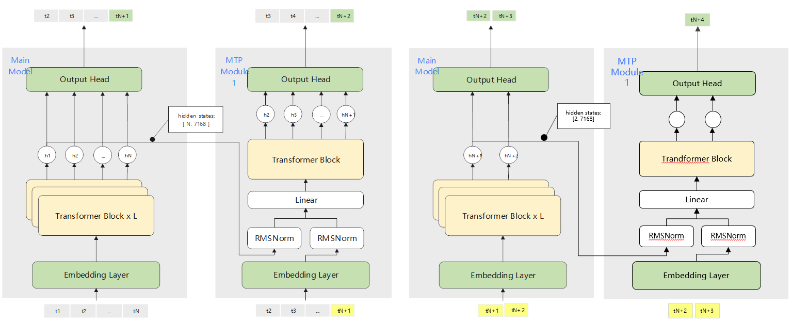
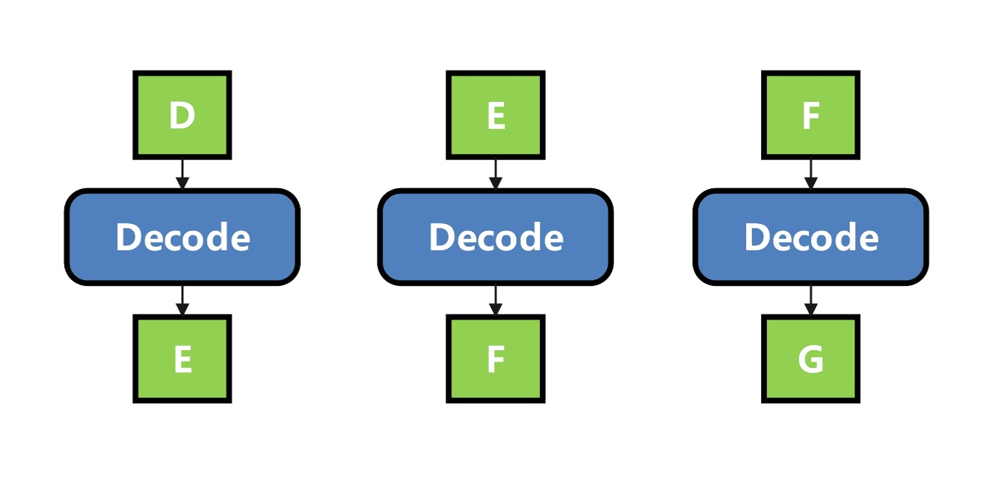
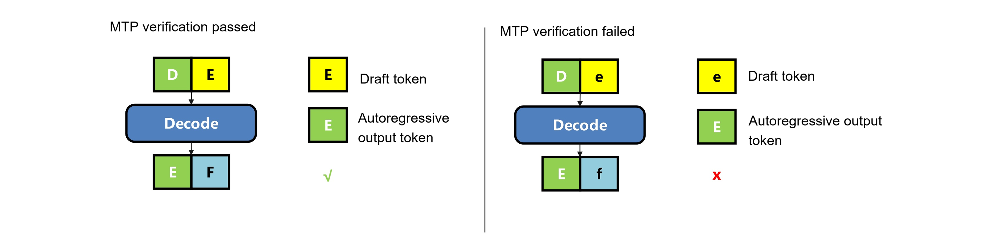

# MTP Overview

Multi-Token Prediction (MTP) is a parallel decoding method proposed in DeepSeek for generating multiple tokens each time. The core idea of MTP parallel decoding is to predict several tokens simultaneously during inference, thereby significantly improving model generation speed.

For the original paper, see: <https://arxiv.org/pdf/2404.19737>

A simplified diagram of the MTP inference process is shown below (using MTP=1 as an example):



First, the main model performs inference with input tokens \(t_1\) to \(t_N\). After one inference round, it produces an output token \(t_{N+1}\) along with the hidden states of the last layer.  

Next, the MTP layer performs inference. Its input tokens are obtained by rolling the main model's prefilled tokens: starting from \(t_2\) and appending the main model's output token \(t_{N+1}\). After one inference round, the MTP layer generates a draft token \(t_{N+2}\).  

Once the draft token \(t_{N+2}\) is obtained, it is concatenated with the previous main model output token \(t_{N+1}\) and fed back into the main model for inference, yielding tokens \(t_{N+2}\) and \(t_{N+3}\).  

Subsequently, the last-layer hidden states of \(t_{N+1}\) and \(t_{N+2}\) (draft), together with tokens \(t_{N+2}\) and \(t_{N+3}\), are fed into the MTP layer to produce the next draft token. This process is repeated iteratively.

# Enabling Method

Add the following fields to `ModelConfig` in `ModelDeployConfig` in the servitization `config.json` file (using MTP=1 as an example)

```json
"plugin_params": "{\"plugin_type\":\"mtp\",\"num_speculative_tokens\": 1}"
```

Here, `num_speculative_tokens` indicates the number of draft tokens guessed per round when MTP is enabled.

# Inference Process Example

Taking MTP=2 as an example, the specific procedure for each inference round is provided below.

## Prefill Phase

```text
|---------------|--------------|----------------------|----------------------|----------------------|----------------------|----------------------|
|target model   | input        | input_ids            | A                    | B                    | C                    | D                    |
|               |              | slot                 | 0                    | 1                    | 2                    | 3                    |
|               |              | position             | 0                    | 1                    | 2                    | 3                    |
|               |              | context length       | 4                    |                      |                      |                      |
|               |              | lm head indices      | 3                    |                      |                      |                      |
|               |--------------|----------------------|----------------------|----------------------|----------------------|----------------------|
|               | output       | output_tokenid       | E                    |                      |                      |                      |
|               |              | output_hiddenstates  | hiddenstates(ABCD)   |                      |                      |                      |
|---------------|--------------|----------------------|----------------------|----------------------|----------------------|----------------------|
|mtp            | input        | input_ids            | B                    | C                    | D                    | E                    |
|               |              | slot                 | 0                    | 1                    | 2                    | 3                    |
|               |              | position             | 0                    | 1                    | 2                    | 3                    |
|               |              | context length       | 4                    |                      |                      |                      |
|               |              | lm head indices      | 3                    |                      |                      |                      |
|               |              | hiddenstates         | hiddenstates(ABCD)   |                      |                      |                      |
|               |--------------|----------------------|----------------------|----------------------|----------------------|----------------------|
|               | output       | output_tokenid       | (ignore)             |                      |                      |                      |
|               |              | output_hiddenstates  | (ignore)             |                      |                      |                      |
|---------------|--------------|----------------------|----------------------|----------------------|----------------------|----------------------|
|                              | final output tokens  | E                    |                      |                      |                      |
|                              | savehiddenstates     | hiddenstates(D)      |                      |                      |                      |
|---------------|--------------|----------------------|----------------------|----------------------|----------------------|----------------------|
```

During the prefill phase, processing is performed separately on the main model and the MTP layer (small model).  
After the main model completes inference on the input prompt "ABCD," it outputs the intermediate hidden states corresponding to the input, denoted as `hiddenstates(ABCD)`. These hidden states are then used as input to the small model.  
Simultaneously, the output token E from the prefill step is concatenated into "BCDE," which serves as the prompt for the small model to perform an additional prefill inference. Specifically for token E, the MTP layer takes both token E and the hidden states of the corresponding token D as input for inference. At this point, both the main model and the small model have obtained the complete KV cache of the prompt.

To normalize the subsequent decode process, we first discard the draft token output in this round, so that this token can be re-acquired during the decode phase.

## Decode Phase

### First Decode

```text
|---------------|--------------|----------------------|----------------------|----------------------|----------------------|
|mtp1           | input        | input_ids            | E                    | 0                    | 0                    |
|               |              | slot                 | 3                    | 4                    | 5                    |
|               |              | position             | 4                    | 5                    | 6                    |
|               |              | context length       | 6                    |                      |                      |
|               |              | lm head indices      | 0                    |                      |                      |
|               |              | hiddenstates         | hiddenstates(D00)    |                      |                      |
|               |--------------|----------------------|----------------------|----------------------|----------------------|
|               | output       | output_tokenid       | f                    |                      |                      |
|               |              | output_hiddenstates  | hiddenstates_mtp(Exx)|                      |                      |
|---------------|--------------|----------------------|----------------------|----------------------|----------------------|
|mtp2           | input        | input_ids            | f                    | 0                    | 0                    |
|               |              | slot                 | 4                    | 5                    | 6                    |
|               |              | position             | 5                    | 6                    | 7                    |
|               |              | context length       | 7                    |                      |                      |
|               |              | lm head indices      | 0                    |                      |                      |
|               |              | hiddenstates         | hiddenstates_mtp(Exx)|                      |                      |
|               |--------------|----------------------|----------------------|----------------------|----------------------|
|               | output       | output_tokenid       | g                    |                      |                      |
|               |              | output_hiddenstates  | (ignore)             |                      |                      |
|---------------|--------------|----------------------|----------------------|----------------------|----------------------|
|target model   | input        | input_ids            | E                    | f                    | g                    |
|               |              | slot                 | 4                    | 5                    | 6                    |
|               |              | position             | 4                    | 5                    | 6                    |
|               |              | context length       | 7                    |                      |                      |
|               |              | lm head indices      | 0                    | 1                    | 2                    |
|               |--------------|----------------------|----------------------|----------------------|----------------------|
|               | output       | output_tokenid       | F                    | x                    | x                    |
|               |              | output_hiddenstates  | hiddenstates(Efg)    |                      |                      |
|               |--------------|----------------------|----------------------|----------------------|----------------------|
|               | verify       | accept tokens        | F                    |                      |                      |
|               | verify miss  | savehiddenstates     | hiddenstates(E)      |                      |                      |
|---------------|--------------|----------------------|----------------------|----------------------|----------------------|
```

The inference process during the decoding phase resembles speculative inference in main-small model collaboration: a small model first performs inference, followed by the main model.  
① The small model (MTP layer) infers and outputs draft tokens.  
② The draft tokens are concatenated and fed into the main model to obtain inference results.  
③ A token-by-token verification is performed to determine the number of acceptable tokens.

For the first decode, the token E output from prefill is used as the input of the small model. For ease of processing, the input length of the small model is padded to ```num_speculative_tokens + 1```. The hidden states used are those of the last token D from prefill, and are padded to the shape of ```num_speculative_tokens + 1```, ensuring consistent MTP shapes across multiple rounds.

[Note] In a Prefill-Decode disaggregation scenario, the D node cannot obtain the correct hidden states output by P, so they are replaced with all zeros here. The KV cache required for the first round of MTP has already been computed on the P node and pulled to the D node. Therefore, the first layer of MTP in the first decode does not need to save the KV cache. The current implementation achieves this by storing the cache in a dummy block table, ensuring that the correct KV cache remains uncontaminated.

### Non-First Decode

```text
|---------------|--------------|----------------------|----------------------|----------------------|----------------------|
|mtp1           | input        | input_ids            | F                    | 0                    | 0                    |
|               |              | slot                 | 4                    | 5                    | 6                    |
|               |              | position             | 5                    | 6                    | 7                    |
|               |              | context length       | 7                    |                      |                      |
|               |              | lm head indices      | 0                    |                      |                      |
|               |              | hiddenstates         | hiddenstates(E00)    |                      |                      |
|               |--------------|----------------------|----------------------|----------------------|----------------------|
|               | output       | output_tokenid       | G                    |                      |                      |
|               |              | output_hiddenstates  | hiddenstates_mtp(Fxx)|                      |                      |
|---------------|--------------|----------------------|----------------------|----------------------|----------------------|
|mtp2           | input        | input_ids            | G                    | 0                    | 0                    |
|               |              | slot                 | 5                    | 6                    | 7                    |
|               |              | position             | 6                    | 7                    | 8                    |
|               |              | context length       | 8                    |                      |                      |
|               |              | lm head indices      | 0                    |                      |                      |
|               |              | hiddenstates         | hiddenstates_mtp(Fxx)|                      |                      |
|               |--------------|----------------------|----------------------|----------------------|----------------------|
|               | output       | output_tokenid       | H                    |                      |                      |
|               |              | output_hiddenstates  | (ignore)             |                      |                      |
|---------------|--------------|----------------------|----------------------|----------------------|----------------------|
|target model   | input        | input_ids            | F                    | G                    | H                    |
|               |              | slot                 | 5                    | 6                    | 7                    |
|               |              | position             | 5                    | 6                    | 7                    |
|               |              | context length       | 8                    |                      |                      |
|               |              | lm head indices      | 0                    | 1                    | 2                    |
|               |--------------|----------------------|----------------------|----------------------|----------------------|
|               | output       | output_tokenid       | I                    | x                    | x                    |
|               |              | output_hiddenstates  | hiddenstates(FGH)    |                      |                      |
|               |--------------|----------------------|----------------------|----------------------|----------------------|
|               | verify       | accept tokens        | I                    |                      |                      |
|               | verify all hit | savehiddenstates     | hiddenstates(FGH)    |                      |                      |
|---------------|--------------|----------------------|----------------------|----------------------|----------------------|
```

For subsequent decoding, the input to the first MTP layer is obtained by padding the main model's output from the previous decoding round to a length of `num_speculative_tokens + 1`, with hidden states handled similarly. The input length for each MTP layer remains `num_speculative_tokens + 1`. To reuse the `lm_head_indice` values, the input for each MTP round is produced by left-rolling the previous MTP layer's input by one position and replacing the token at the `lm_head_indice` position with the token output by the previous MTP round. The `slots` and `position_id` are updated accordingly.
The main model concatenates the draft tokens output by the MTP layers into its `input_ids`. Thus, both the MTP layers and the main model maintain the same input shape, with each `bs` having a length of `num_speculative_tokens + 1`.

### Token-by-Token Verification

The purpose of verification is to ensure completely lossless precision when MTP is enabled or disabled, meaning the output with MTP enabled is identical to the autoregressive output.

According to autoregressive inference, as shown in the figure below, token E is inferred from token D, token F is inferred from E, and so on.



For scenarios where MTP is enabled, as shown in the figure below, it is necessary to compare whether draft E and the autoregressive token E output by D are the same. If they are the same, it means that token F obtained from draft E is also correct. Conversely, if they are not the same, it indicates that token F inferred from this draft token E is incorrect, and therefore this token cannot be accepted.



# Code Call Flow Diagram

The following figure illustrates the code execution flow of MTP in the MindIE_LLM repository, using a centralized, synchronous scheduling scenario as an example (distributed scenarios omit DP splitting and padding calculations in generator torch).


# Summary of Input and Output Parameters Across Modules

## `plugin_manager` and `generator_torch`

### Input Parameters

#### Prefill Phase

`model_inputs` (host, np array): Inputs for the main model

[Note] During the prefill phase, only the main model's input needs to be constructed. The draft model's input is completely identical to the main model's except for `input_ids`. Therefore, in the `flash_causal_deepseekv2.py` file, after the main model execution is complete, `input_ids` are updated, and the draft model can directly reuse the main model's input without additional construction.

#### Decode Phase

1. `model_inputs` (host, np array): Inputs for the main model, where each batch size has a fixed input of ```num_speculative_tokens + 1``` tokens, with positions reserved for draft tokens in `input_ids`.

2. `sub_model_inputs` (host, np array): Inputs for the MTP layer, with a structure consistent with `model_inputs`. Even when MTP > 1, there is only one copy of `sub_model_inputs`; parameter updates across multiple MTP rounds are handled within the `flash_causal_deepseekv2` file.

3. `q_lens` (List): Number of input tokens for each `bs`. In the current scenario, it is fixed as a 1-dimensional list consisting of `bs` ```num_speculative_tokens + 1``` values.

4. `hidden_states` (host, torch.tensor): `hidden_states` output by the main model in the previous round, with a shape of [(num_speculative_tokens + 1) *bs,hidden_size]

[Note] When MTP > 1, for small models, each additional MTP inference layer requires an extra slot to store the newly added KV cache. Consequently, the number of slots in `sub_model_inputs` may exceed the number of input `input_ids`. The shape of `slots` is `[1, bs * mtp * 2]`. Subsequently, in the `flash_causal_deepseekv2.py` file, `slots` are partitioned per inference layer. Ultimately, the shape of `slots` obtained by each MTP layer remains `[1, bs * (num_speculative_tokens + 1)]`.

### Output Parameters

The output parameters here are passed through from `flash_causal_deepseekv2.py`.

#### Prefill Phase

1. `logits` (device, torch.tensor): The output of the main model

2. `hidden_states` (device, torch.tensor): The hidden_states of the last layer of the main model. Only the hidden states of the last token are output here, with a shape of ```[1 *bs,hidden_size]```.

#### Decode Phase

1. `logits` (device, torch.tensor): The output of the main model

2. `hidden_states` (device, torch.tensor): `hidden_states` of the last layer of the main model, with a shape of ```[(num_speculative_tokens + 1) *bs,hidden_size]```

3. `draft_tokens` (device, torch.tensor): Format is ```[batch0 (draft_token0~num_speculative_tokens-1) batch1 ...batch2...]```

## `generator_torch` and `flash_causal_deepseekv2`

### Input Parameters

1. `sub_model_inputs` (device, torch.tensor): The `model_inputs` of the small model, present only during the decode phase.

2. `lm_head_local_dp`: Available only in centralized mode, used when MTP > 1 to indicate the indice positions for updating input tokens in the small model at each round.

3. `q_lens`: A 1-dimensional list representing the number of input tokens for each `bs`. In centralized mode, this is the `qlen` after DP splitting; in distributed mode, it is transparently passed through by `plugin_manager`.

### Output Parameters

Same as the output parameters of the `plugin_manager` and `generator_torch` data interfaces.

# Code Implementation

## Main Process

The primary new code additions in the MTP process are contained within the following files:

1. [mtp_plugin.py](../../../../mindie_llm/text_generator/plugins/mtp/mtp_plugin.py) & [decoding_policy.py](../../../../mindie_llm/text_generator/plugins/mtp/decoding_policy.py)

    The [mtp_plugin.py](../../../../mindie_llm/text_generator/plugins/mtp/mtp_plugin.py) file is called by the [plugin_manager.py](../../../../mindie_llm/text_generator/plugins/plugin_manager.py) file. Within the main scheduling process, the following MTP functions are invoked:

    ① Based on the base model input during autoregression, construct the model inputs required for both the main model and the draft model in the MTP scenario.

    ② Construct sampling parameters.

    ③ Manage information that needs to be cached in each round of decoding in MTP scenarios.

    ④ Verify draft tokens (currently only token comparison is supported).

    ⑤ Update model input parameters when asynchronous scheduling is applied.

2. [flash_causal_deepseekv2.py](../../../../examples/atb_models/atb_llm/models/deepseekv2/flash_causal_deepseekv2.py)

    The entry function of `flash_causal_deepseekv2.py` is the `forward()` method, with the following calling sequence:

    [plugin_manager.py](../../../../mindie_llm/text_generator/plugins/plugin_manager.py) (generate_token() or generate_token_async()) --> [generator_torch.py](../../../../mindie_llm/text_generator/adapter/generator_torch.py) (forward()) --> [atb_model_wrapper.py](../../../../mindie_llm/modeling/model_wrapper/atb/atb_model_wrapper.py) (forward()) --> [flash_causal_deepseekv2.py](../../../../examples/atb_models/atb_llm/models/deepseekv2/flash_causal_deepseekv2.py) (forward())

    ① The entry function for MTP prefill and decode.

    ② Update model inputs between multiple draft models and between draft models and the main model.

    ③ Load weights for MTP (during initialization).

3. [mtp_decoder_model.cpp](../../../../examples/atb_models/atb_framework/models/deepseekv2/model/mtp_decoder_model.cpp)

    Graphs of the draft model

## MTP Adaptation for DP Parallelism in Centralized Scenarios

The data flow of DP in centralized scenarios is as follows (using the synchronous scenario as an example):

```text
      input_metadata        ← Sequence data for all DPs, without host dummy data.
            ↓
+------------------------+
|     plugin_manager     |  ← Generates model_inputs, qlen, mask, hidden_states.
+------------------------+
            ↓
       model_inputs
 qlen, mask, hidden_states   ← Sequence data for all DPs, without host dummy data.
            ↓
+------------------------+
|    generator_torch     |  ← DP sharding; retain only the sequence model inputs for the current DP group and construct dummy data.
+------------------------+
            ↓
       model_inputs
 qlen, mask, hidden_states   ← Sequence model inputs for the current card's DP (host)
     Other model input parameters
            ↓
+------------------------+
|   atb_model_wrapper    |  ← Model input H2D
+------------------------+
            ↓
    Current DP group model input parameters ← Model inputs (device)
            ↓
+------------------------+
|  model_runner.forward  |  ← Model execution
+------------------------+
            ↓
      Model execution output
   logits, hidden_states     ← Sequence data for all DPs, without device dummy data.
       draft_tokens
```

### Code Adaptation Points

Adaptation function location: [generator_torch.py](../../../../mindie_llm/text_generator/adapter/generator_torch.py)

1. Adaptation of `qlen` and `mask`: Extract the `qlen` and `mask` of the current DP group. If the current DP group has no data, construct dummy data with `qlen = 1` and a `mask` containing only one row.

2. Adaptation of `lm_head_indice`:

    Under centralized scenarios, `lm_head_indice` includes the functionality to exclude dummy data. The corresponding implementation function is named: `_partition_data`.

    ① MTP layer's `lm_head_indice`:

    Using MTP=3 as an example, the input to the MTP layer is 4 tokens per seq. The final required logits output position depends on the number of tokens output in the previous round. An example is as follows:

    Assume there are currently 4 bs and 4 DP groups.

       ```text
       |-----------------|-------------------|-------------------|-------------------|-------------------|
       | batch           | bs1               | bs2               | bs3               | bs4               |
       | input_ids       | A1 | A2 | A3 | A4 | B1 | B2 | B3 | B4 | C1 | C2 | C3 | C4 | D1 | D2 | D3 | D4 |
       | dp_rank_ids     | 0                 | 0                 | 2                 | 3                 |
       | last_output_len | 4                 | 2                 | 1                 | 3                 |
       | total_indice    | 0  | 1  | 2  | 3  | 4  | 5  | 6  | 7  | 8  | 9  | 10 | 11 | 12 | 13 | 14 | 15 |
       | lm_head_indice  |                3  |      5            | 8                 |           14      |
      |-----------------|-------------------|-------------------|-------------------|-------------------|
       ```

    In this example, the case where `dp_rank_id` = `1` is missing, meaning that DP 1 will have a dummy run. Currently, the dummy run only inputs 1 token, i.e., `qlen=1`. Therefore, when the DP group collects all results, the output is as follows:

       ```text
       |-----------------|-------------------|-------------------|-------|-------------------|-------------------|
       | batch           | bs1               | bs2               | dummy | bs3               | bs4               |
       | input_ids       | A1 | A2 | A3 | A4 | B1 | B2 | B3 | B4 | 1     | C1 | C2 | C3 | C4 | D1 | D2 | D3 | D4 |
       | dp_rank_ids     | 0                 | 0                 | 1     | 2                 | 3                 |
       | last_output_len | 4                 | 2                 | -     | 1                 | 3                 |
       | total_indice    | 0  | 1  | 2  | 3  | 4  | 5  | 6  | 7  | 8     | 9  | 10 | 11 | 12 | 13 | 14 | 15 | 16 |
       |-----------------|-------------------|-------------------|-------|-------------------|-------------------|
       ```

    In the presence of a dummy, to ensure that the extracted output positions remain correct, `lm_head_indice` needs to be modified to: ```[3, 5, 9, 15]```

    ② Main model's `lm_head_indice`:
    Since the main model's output requires all tokens, the initial `lm_head_indice` retains everything, i.e., ```np.arange(len(input_ids))```, and is updated when a dummy exists. The dummy run logic is the same as for the small model.

    [Note] The current adaptation support for `lm_head_indice` assumes that `dp_rank_ids` may be out of order in distributed scenarios. However, in practice, this out-of-order situation does not occur, and further optimization is possible.

3. Calculation of `lm_head_local_dp`:

    Function: Each round of MTP layer inference for the small model requires updating `input_ids`, i.e., rolling `input_ids` and appending the new tokens. However, `input_ids` in the forward pass is specific to the current DP group. Therefore, an index is needed to indicate the token position within the current DP group's `input_ids` for updates.

    Implementation function name: ```_lm_head_local_dp_calc```

    Continuing with the example given in 2 and using `dp4` as an illustration:

    `mtp1` input of `dp0`:

        ```json
        input_ids :  A1  A2  A3  A4  B1  B2  B3  B4
       lm_head_indice : [3, 5, 9, 15]
       ```

    **Input for `dp4`'s `mtp2`**: Replace the corresponding token based on `last_output_len`.

        ```json
        input_ids :  A2  A3  A4  A5  B2  B5  B4  x
        lm_head_indice : [3, 5, 9, 15]
        ```

    The required value of `lm_head_local_dp` on `dp0` is `[3, 5]`.

    Similarly, `dp1` is in a dummy run, with `lm_head_local_dp` set to `[0]`; `dp2` also uses `[0]`, and `dp3` uses `[2]`.

    [Note] The current `lm_head_local_dp` implementation assumes support for out-of-order `dp_rank_ids` distribution. However, such out-of-order cases do not occur in practice and can be further optimized.

## MTP Adaptation for Asynchronous Scheduling

In async scheduling scenarios, the cached results from `batch_context` may be missing one inference round. Therefore, the model input parameters obtained after preprocessing must be updated with the latest outputs before being enqueued into the input queue.

However, not all request parameters require updating; only those requests that were also scheduled in the previous round need to be updated. Therefore, it is necessary to precompute the positions of requests that need updates and use `hit_mask` to select the requests.

### Code Adaptation Points

1. Point 1: ```hit_mask``` calculation

    Implementation function: `prepare_masks_for_filling` (file location: `../../../../mindie_llm/text_generator/plugins/mtp/mtp_plugin.py`)

    Feature: Identifies requests that need updating by checking whether the current round's `seq_id` matches the previous round's scheduled `seq_id`.

2. Point 2: model input parameter update

    Implementation function: `fill_in_model_result` (file location: `../../../../mindie_llm/text_generator/plugins/mtp/mtp_plugin.py`)

    Feature: Updates `input_ids`, `slots`, `position_ids`, `context_length`, and `lm_head_indice` independently since they all depend on the previous turn's output.
