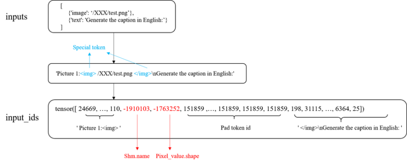
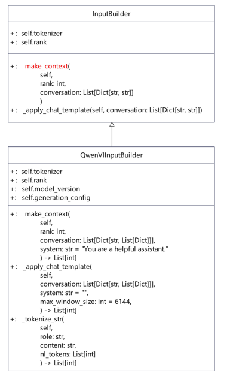

# Multimodal Understanding Model Adaptation Guide

## Overview

This section applies to the scenario where the base LLM has been adapted in the MindIE LLM model repository and a multimodal encoder model (such as ViT of vision understanding) on which a multimodal understanding model depends needs to be adapted.

During this process, four main classes need to be implemented. You can design other methods as required.

Class to be adapted at the entry end:

`{llm_path}/examples/models/{model}/run_pa.py` (`{model}Runner`)

Classes to be adapted at the model end:

`{llm_path}/atb_llm/models/{model}/router_{model}.py` (`_{model}_Router`)

`{llm_path}/atb_llm/models/{model}/config_{model}.py` (`{model}Config`)

`{llm_path}/atb_llm/models/{model}/flash_causal_{model}.py` (`{model}Flash{model}ForCausalLM`)

`{llm_path}` is the path of the model repository.

- If the compiled package is used, the path is `$\{working\_dir\}/MindIE-LLM/`.
- If the code is downloaded from Gitee, the path is `${working_dir}/MindIE-LLM/examples/atb_models`.

## Entry Adaptation

During entry adaptation, you need to create a `run_pa.py` script in the `{llm_path}/examples/models/{model}` directory. This script creates a subclass `{model}Runner` that inherits from the base class `MultimodalPARunner`. The subclass implements the following functions:

1. Call `_{model}Router`, `{model}Config`, and `Flash{model}_ForCausalLM` to load model configurations and weights.
2. Implement `warm_up` and forward inference.

You can rewrite the corresponding function or method if necessary.

### Input Type

The input types supported by the inference APIs are as follows:

```python
@dataclass
class MultimodalInput:
    input_texts:List | None
    image_path:List | None
    video_path:List | None
    audio_path:List | None
```

- `input_texts` is of the `List[str]` or `List[dict]` type. For example, `input_texts` of InternVL2.5 can be:

    `[{'role': 'user', 'content': 'Write an essay about this image, at least 256 words.'}]` or `['Write an essay about this image, at least 256 words.']`

- `image_path`, `video_path`, and `audio_path` are lists of paths for storing modal data. For example, `image_path` must store the path of each image, not the directory.

The following uses InternVL2.5 as an example. The model uses images and text as inputs.

If multiple images are inferred at the same time, the path of each image must be parsed and stored in the corresponding variable of `MultimodalInput.image_path`. During model inference, elements in `input_texts` and `image_path` are paired sequentially-each pair forming a group of inputs for inference. For example, the first element in `input_texts` corresponds to the first element in `image_path`, the second to the second, and so forth.

### Initialization and Warm-up

In most cases, you can directly call the initialization method of the base class `MultimodalPARunner`. The subclass only needs to initialize the corresponding attributes or methods.

The following uses InternVL2.5 as an example:

```python

class InternvlRunner(MultimodalPARunner):
    def __init__(self, **kwargs):
        super().__init__(**kwargs)
        self.pred_file = PRED_FILE

    def init_processor(self):
        self.processor = self.model.tokenizer
```

The model warm-up process performs inference using the first set of input parameters. If no custom parameters are provided, overriding the warm-up method is unnecessary.

### Forward Inference

The forward inference part requires the `max_iters` parameter, which indicates the maximum number of iterations. The calculation method of `max_iters` varies with models. Therefore, the `infer` function of forward inference must be overridden in the subclass, or the parameter must be calculated in advance. If you overwrite the `infer` function in the subclass, ensure that the input parameter format is the same as that of the `infer` function in the base class. After the parameter is calculated, call `super().infer()` to execute the `infer` function logic in the base class.

    Example:

    ```python

    def infer(self, mm_inputs, batch_size, max_output_length, ignore_eos, max_iters=None, **kwargs):
            input_texts = mm_inputs.input_texts
            image_path_list = mm_inputs.image_path
            video_path_list = mm_inputs.video_path
            path_list = image_path_list if image_path_list else video_path_list
            if len(input_texts) != len(image_path_list):
                raise RuntimeError("input_text length must equal input_images length")
            if not ENV.profiling_enable:
                if self.max_batch_size > 0:
                    max_iters = math.ceil(len(mm_inputs.image_path) / self.max_batch_size)
                else:
                    raise RuntimeError("f{self.max_batch_size} max_batch_size should > 0, please check")
            return super().infer(mm_inputs, batch_size, max_output_length, ignore_eos, max_iters=max_iters)
    ```

- If there are other custom parameters besides the four modalities (text, image, audio, or video), you need to rewrite `prepare_request` by referring to the implementation of `prepare_request` in `{llm_path}/examples/models/multimodal_runner.py`.
- If you need to save the precision test result, rewrite the `precision_save` method in the subclass. Example:

    ```python

    def precision_save(self, precision_inputs, **kwargs):
            all_input_texts = precision_inputs.all_input_texts
            all_generate_text_list = precision_inputs.all_generate_text_list
            image_file_list = precision_inputs.image_file_list
            video_file_list = precision_inputs.video_file_list
            file_list = image_file_list if image_file_list else video_file_list
            answer_pairs = {}
            if not file_list:
                raise ValueError("Both image_file_list and video_file_list are empty.")
            if len(all_input_texts) != len(file_list):
                raise ValueError(f"Mismatched lengths between \
                    all_input_texts={all_input_texts} and file_list={file_list}")
            for text_index in range(len(all_input_texts)):
                image_answer_pairs[file_list[text_index]] = all_generate_text_list[text_index]
                image_answer_pairs = dict(sorted(answer_pairs.items()))
            super().precision_save(precision_inputs, answer_pairs=answer_pairs)
    ```

### Main Function Implementation Example

After the `MultimodalPARunner` base class is adapted by inheriting or overwriting the initialization, warm-up, and forward inference methods, you need to implement path parsing and input preparation in the `main` function. The following uses InternVL2.5 as an example:

```python

if __name__ == '__main__':
    args = parse_arguments()
    rank = ENV.rank
    local_rank = ENV.local_rank
    world_size = ENV.world_size
    image_or_video_path = standardize_path(args.image_or_video_path)
    check_file_safety(image_or_video_path, 'r')
    file_name = safe_listdir(image_or_video_path)
    file_length = len(file_name)
    input_dict = {
        'rank': rank,
        'world_size': world_size,
        'local_rank': local_rank,
        'perf_file': PERF_FILE,
        **vars(args)
    }
    if is_image_path(image_or_video_path):
        image_path = [os.path.join(image_or_video_path, f) for f in file_name]
        video_path = None
        input_dict['image_path'] = image_path
        texts = args.input_texts_for_image
    elif is_video_path(image_or_video_path):
        video_path = [os.path.join(image_or_video_path, f) for f in file_name]
        image_path = None
        input_dict['video_path'] = video_path
        texts = args.input_texts_for_video
    else:
        logger.error("Unsupported media type, it should be a video or image, please check your input.", ErrorCode.ATB_MODELS_PARAM_OUT_OF_RANGE)
        raise KeyError("Unsupported media type, it should be a video or image, please check your input.")
    if len(texts) > file_length:
        raise ValueError(f"The number of input texts is greater than the number of files.")
    texts.extend([texts[-1]] * (file_length - len(texts)))
    input_dict['input_texts'] = texts
    pa_runner = InternvlRunner(**input_dict)
    if image_path:
        image_length = len(image_path)
        remainder = image_length % args.max_batch_size
        if remainder != 0:
            num_to_add = args.max_batch_size - remainder
            image_path.extend([image_path[-1]] * num_to_add)
            texts.extend([texts[-1]] * num_to_add)
    elif video_path:
        video_length = len(video_path)
        remainder = video_length % args.max_batch_size
        if remainder != 0:
            num_to_add = args.max_batch_size - remainder
            video_path.extend([video_path[-1]] * num_to_add)
            texts.extend([texts[-1]] * num_to_add)
    print_log(rank, logger.info, f'pa_runner: {pa_runner}')
    infer_params = {
        "mm_inputs": MultimodalInput(texts,
                                     image_path,
                                     video_path,
                                     None),
        "batch_size": args.max_batch_size,
        "max_output_length": args.max_output_length,
        "ignore_eos": args.ignore_eos
    }
    pa_runner.warm_up()
    generate_texts, token_nums, latency = pa_runner.infer(**infer_params)
    for i, generate_text in enumerate(generate_texts):
        print_log(rank, logger.info, f'Answer[{i}]: {generate_text}')
        print_log(rank, logger.info, f'Generate[{i}] token num: {token_nums[i]}')
        print_log(rank, logger.info, f"Latency: {latency}")
```

## Model Adaptation

During model adaptation, you need to adapt the `{model}Router`, `{model}Config`, and `Flash{model}ForCausalLM` classes.

### `{model}Router` Class Adaptation

`MultimodalPARunner` calls `{llm_path}/atb_llm/models/{model}/router_{model}.py` to initialize a model and load a configuration file. `{model}` indicates the model name, which must be the same as the value of `model_type` in the model configuration file.

`{model}Router` provides routing, specifying the loading path for a model and its associated configuration file.

`{model}Router` is inherited from the base class `BaseRouter`. For model porting and adaptation, this class needs to implement the `get_config` and `get_tokenizer` methods.

- `get_config` loads related parameters from the `config.json` file of model weights and initializes the `config` class of a model.
- `get_tokenizer` initializes the tokenizer.

Example:

```python

from ..base.router import BaseRouter
@dataclass
class InternvlRouter(BaseRouter):
    def get_config(self):
        config = InternvlConfig.from_pretrained(self.model_name_or_path)
        if self.max_position_embeddings:
            config.max_position_embeddings = self.max_position_embeddings
        config.model_name_or_path = self.model_name_or_path
        super().check_config(config)
        return config
    def get_tokenizer(self):
        try:
            llm_model_architectures = self.config_dict['llm_config']['architectures'][0]
        except KeyError as e:
            logger.error("`llm_config.architectures` does not exist! Check `config.json`.",
                         ErrorCode.ATB_MODELS_MODEL_PARAM_JSON_INVALID)
            raise ValueError("`llm_config.architectures` does not exist! Check `config.json`.") from e

        if llm_model_architectures == INTERNLM2_ARCHITECTURE:
            tokenizer = safe_get_tokenizer_from_pretrained(
                self.model_name_or_path,
                trust_remote_code=self.trust_remote_code
            )
        elif llm_model_architectures == LLAMA_ARCHITECTURE:
            tokenizer = safe_get_tokenizer_from_pretrained(
                self.model_name_or_path,
                revision=self.revision,
                padding_side="left",
                trust_remote_code=self.trust_remote_code,
                use_fast=False
            )
        elif llm_model_architectures == QWEN2_ARCHITECTURE:
            tokenizer = safe_get_tokenizer_from_pretrained(
                self.model_name_or_path,
                padding_side="left",
                trust_remote_code=self.trust_remote_code,
            )
        else:
            logger.error(
                "`llm_config.architectures` must in "
                f"[{LLAMA_ARCHITECTURE}, {INTERNLM2_ARCHITECTURE}, {QWEN2_ARCHITECTURE}], "
                f"got {llm_model_architectures}.",
                ErrorCode.ATB_MODELS_PARAM_OUT_OF_RANGE)
            raise ValueError(
                "`llm_config.architectures` must in "
                f"[{LLAMA_ARCHITECTURE}, {INTERNLM2_ARCHITECTURE}, {QWEN2_ARCHITECTURE}], "
                f"got {llm_model_architectures}.")
        return tokenizer
    def get_input_builder(self):
        return InternvlInputBuilder(self.tokenizer, self.config)
    def tokenize(self, inputs, **kwargs):
        img_begin_id = self.tokenizer.encode("")[-1]
        img_end_id = self.tokenizer.encode("</img>")[-1]
        shm_name_save_path = kwargs.get("shm_name_save_path", None)
        image_size = self.config.force_image_size or self.config.vision_config.image_size
        patch_size = self.config.vision_config.patch_size
        if patch_size == 0:
            logger.error('The vision patch_size of config can not be 0.',
                         ErrorCode.ATB_MODELS_PARAM_OUT_OF_RANGE)
            raise ValueError('The vision patch_size of config can not be 0.')
        num_image_token = int((image_size // patch_size) ** 2 * (self.config.downsample_ratio ** 2))

        use_dynamic_prepro = False if self.config.ps_version == "v1" else True
        system_prompt = INTERNVL_SYSTEM_PROMPTS[self.config.ps_version][self.config.template]
        query = ('<|im_start|>system\n'
                f'{system_prompt}<|im_end|><|im_start|>user\n')
        text = ""
        image_index = 1
        shm_name_list = []
        shape_value_list = []
        image_num = sum(1 for d in inputs if _IMAGE in d)
        for single_input in inputs:
            if _TEXT in single_input:
                text += single_input.get(_TEXT)
                continue
            if _IMAGE in single_input:
                current_query, shm_name_value, shape_value = process_image_input(
                    single_input,
                    image_num,
                    image_index,
                    use_dynamic_prepro,
                    num_image_token,
                    shm_name_save_path
                )
                query += current_query
                image_index += 1
                shm_name_list.append(shm_name_value)
                shape_value_list.append(shape_value)
            elif _VIDEO in single_input:
                current_query, shm_name_value, shape_value = process_video_input(
                    single_input,
                    use_dynamic_prepro,
                    num_image_token,
                    shm_name_save_path
                )
                query += current_query
                shm_name_list += shm_name_value
                shape_value_list += shape_value
            else:
                logger.error("Unsupported media type, it should be a video or image, please check your input.",
                             ErrorCode.ATB_MODELS_PARAM_OUT_OF_RANGE)
                raise KeyError("Unsupported media type, it should be a video or image, please check your input.")
        query += f'{text}<|im_end|><|im_start|>assistant\n'
        query_ids = torch.tensor(self.tokenizer.encode(query))
        bos_pos_set = torch.nonzero(query_ids == img_begin_id).view(-1)
        eos_pos_set = torch.nonzero(query_ids == img_end_id).view(-1)
        for i, (bos_pos, eos_pos) in enumerate(zip(bos_pos_set, eos_pos_set)):
            if eos_pos - bos_pos < 3:
                logger.error("tokenize input error.",
                             ErrorCode.ATB_MODELS_PARAM_OUT_OF_RANGE)
                raise ValueError("tokenize input error.")
            query_ids[bos_pos + 1] = shm_name_list[i]
            query_ids[bos_pos + 2] = shape_value_list[i]

        return query_ids
```

### `{model}Config` Class Adaptation

The `{model}Config` class loads model configurations for model initialization. It can be placed in the `{llm_path}/atb_llm/models/{model}/flash_causal_{model}.py` file or in a separate file `{llm_path}/atb_llm/models/{model}/config_{model}.py`.

The following uses InternVL2.5 as an example:

```python

from dataclasses import dataclass
from atb_llm.models.base.config import BaseConfig
from atb_llm.models.internvl.config_intern_vit import InternVisionConfig
from atb_llm.models.internvl.flash_causal_internvl import INTERNLM2_ARCHITECTURE, LLAMA_ARCHITECTURE, QWEN2_ARCHITECTURE
from atb_llm.models.internlm2.v2.config_internlm2 import Internlm2Config
from atb_llm.models.llama.config_llama import LlamaConfig
from atb_llm.models.qwen2.config_qwen2 import Qwen2Config
from atb_llm.utils.log.error_code import ErrorCode
from atb_llm.utils.log.logging import logger
@dataclass
class InternvlConfig(BaseConfig):
    model_type = 'internvl_chat'
    is_composition = True
    def __init__(self,
                 vision_config=None,
                 llm_config=None,
                 use_backbone_lora=0,
                 use_llm_lora=0,
                 select_layer=-1,
                 force_image_size=None,
                 downsample_ratio=0.5,
                 template=None,
                 dynamic_image_size=False,
                 use_thumbnail=False,
                 ps_version='v1',
                 min_dynamic_patch=1,
                 max_dynamic_patch=12,
                 **kwargs):
        llm_config["quantize"] = None
        llm_config["quantization_config"] = None
        super().__init__(**llm_config)
        self.vision_config = InternVisionConfig(**vision_config)
        llm_model_architectures = llm_config['architectures'][0]
        if llm_model_architectures == INTERNLM2_ARCHITECTURE:
            self.llm_config = Internlm2Config(**llm_config)
        elif llm_model_architectures == LLAMA_ARCHITECTURE:
            self.llm_config = LlamaConfig(**llm_config)
        elif llm_model_architectures == QWEN2_ARCHITECTURE:
            self.llm_config = Qwen2Config(**llm_config)
        else:
            error_msg = (f"{llm_model_architectures} is an unsupported architecture, "
                         "check llm_config['architectures'] in config.json, "
                         "currently only InternLM2ForCausalLM, LlamaForCausalLM and Qwen2ForCausalLM are supported.")
            logger.error(error_msg, ErrorCode.ATB_MODELS_PARAM_OUT_OF_RANGE)
            raise ValueError(error_msg)
        self.use_backbone_lora = use_backbone_lora
        self.use_llm_lora = use_llm_lora
        self.select_layer = select_layer
        self.force_image_size = force_image_size
        self.downsample_ratio = downsample_ratio
        self.template = template
        self.dynamic_image_size = dynamic_image_size
        self.use_thumbnail = use_thumbnail
        self.ps_version = ps_version  # pixel shuffle version
        self.min_dynamic_patch = min_dynamic_patch
        self.max_dynamic_patch = max_dynamic_patch
```

### `Flash{model}ForCausalLM` Class Adaptation

The `Flash{model}ForCausalLM` class implements model initialization, weight loading, and forward inference. This class is stored in `{llm_path}/atb_llm/models/{model}/flash_causal_{model}.py`.

The following uses InternVL2.5 as an example:

```python

from ..base.flash_causal_multimodal import MultiModalLLm
class FlashInternvlForCausalLM(FlashForCausalLM):
    def __init__(self, config, weights, **kwargs):
        super().__init__(config, weights, **kwargs)
        self.config = config
        self.trust_remote_code = kwargs.get('trust_remote_code', False)
        self.weights = weights # Identical IDs; pass by reference
        self.dtype = weights.dtype
        self.vision_config = config.vision_config
        enable_vit_dp = kwargs.get('enable_vit_dp', True)
        setattr(self.vision_config, 'enable_vit_dp', enable_vit_dp)
        self.llm_config = config.llm_config
        self.llm_config.quantize = None
        # # Image processing parameters
        self.downsample_ratio = config.downsample_ratio
        self.vit_hidden_size = self.vision_config.hidden_size
        self.llm_hidden_size = self.llm_config.hidden_size
        self.image_size = config.force_image_size or self.vision_config.image_size
        self.patch_size = self.vision_config.patch_size
        self.select_layer = config.select_layer
        self.num_image_token = int((self.image_size // self.patch_size) ** 2 * (self.downsample_ratio ** 2))
        self.neftune_alpha = None
        self.im_mask = None
        self.template = config.template
        self.ps_version = config.ps_version
        if self.template not in ['Hermes-2', 'internlm2-chat', 'phi3-chat', 'internvl2_5']:
            raise ValueError(
                f"Unsupported template {self.template}, supported templates are `Hermes-2`, "
                "`internlm2-chat`, `phi3-chat`, `internvl2_5`. Please check the value of 'template' in config.json"
            )
        if self.ps_version not in ['v1', 'v2']:
            raise ValueError(
                f"Unsupported ps_version {self.ps_version}, supported templates are `v1` and `v2`."
                "Please check the value of 'ps_version' in config.json"
            )
        self.npu_id = weights.device.index
        self.process_group, self.device = initialize_torch_distributed(self.tp_rank, self.npu_id, self.tp_world_size)
        self.init_llm_model_type()
        self.init_vision_model()
        self.init_mlp_projector()
        self.init_language_model()
        self.init_normalizer()
        if self.llm_model_type == ACTION_INTERNLM2:
            if self.dtype != torch.float16:
                logger.error(
                    f"{self.dtype} is unsupported, supported dtypes are float16."
                    "Please check the value of 'torch_dtype' in config.json",
                    ErrorCode.ATB_MODELS_MODEL_PARAM_JSON_INVALID
                )
                raise ValueError(
                    f"{self.dtype} is unsupported, supported dtypes are float16."
                    "Please check the value of 'torch_dtype' in config.json"
                )
            self.llm_embedding_layer = self.language_model.get_embedding_layer()
            self.processor = safe_get_tokenizer_from_pretrained(
                config.model_name_or_path, trust_remote_code=self.trust_remote_code
            )
            self.config.eos_token_id = INTERNLM2_EOS_TOKEN_ID
        elif self.llm_model_type == ACTION_LLAMA:
            self.llm_embedding_layer = self.language_model.model.embed_tokens
            self.processor = safe_get_tokenizer_from_pretrained(
                self.config.model_name_or_path, trust_remote_code=self.trust_remote_code, use_fast=False
            )
            self.config.eos_token_id = self.llm_config.eos_token_id
        elif self.llm_model_type == ACTION_QWEN2:
            self.llm_embedding_layer = self.language_model.transformer.wte
            self.processor = safe_get_tokenizer_from_pretrained(
                self.config.model_name_or_path, padding_side="left", trust_remote_code=self.trust_remote_code,
            )
            self.config.eos_token_id = self.llm_config.eos_token_id
        self.img_begin_id = self.processor.encode("")[-1]
        self.img_end_id = self.processor.encode("</img>")[-1]
        self.img_context_token_id = self.processor.encode("<IMG_CONTEXT>")[-1]
    def init_module_weight(self, module, weights, prefix="model", prefixskip=None):
        model_weights = [model_weight for model_weight in module.state_dict().keys()]
        for model_weight in model_weights:
            if prefixskip and prefixskip in model_weight:
                continue
            saved_weight = torch.nn.Parameter(
                    weights.get_tensor(f"{prefix}.{model_weight}"), requires_grad=False
                )
            if not self.vision_config.enable_vit_dp:
                saved_weight = internvl_tensor_parallel_split(model_weight, prefix, \
                    self.tp_rank, self.tp_world_size, saved_weight)
            model_weight_list = model_weight.split(".")
            target_module = module
            for nxt_module in model_weight_list[:-1]:
                target_module = getattr(target_module, nxt_module)
            setattr(target_module, model_weight_list[-1], saved_weight)
    def init_llm_model_type(self):
        llm_model_architectures = self.llm_config.architectures[0]
        if llm_model_architectures == INTERNLM2_ARCHITECTURE:
            self.llm_model_type = ACTION_INTERNLM2 # InternLM: VL2-2B, VL2-8B, VL2-20B
        elif llm_model_architectures == LLAMA_ARCHITECTURE:
            self.llm_model_type = ACTION_LLAMA # LLaMA Yi: VL2-40B, VL2-76B
        elif llm_model_architectures == QWEN2_ARCHITECTURE:
            self.llm_model_type = ACTION_QWEN2 # qwen: VL2-1B
        else:
            logger.error("Currently only InternVL-Chat-V1-2, InternVL-Chat-V1-5, InternVL2 are supported. "
                         "Please check `config.json`.",
                         ErrorCode.ATB_MODELS_MODEL_PARAM_JSON_INVALID)
            raise KeyError("Currently only InternVL-Chat-V1-2, InternVL-Chat-V1-5, and InternVL2 are supported. "
                           "Please check `config.json`.")
    def init_normalizer(self):
        weight, bias = create_standardization_params(IMAGENET_MEAN, IMAGENET_STD, RESCALE_FACTOR, CONV_CHANNELS)
        self.normalizer = nn.Conv2d(in_channels=CONV_CHANNELS, out_channels=CONV_CHANNELS, kernel_size=1, \
            groups=CONV_GROUPS)
        self.normalizer.weight = nn.Parameter(data=weight, requires_grad=False)
        self.normalizer.bias = nn.Parameter(data=bias, requires_grad=False)
        self.normalizer.npu()
        # Normalizer warmup
        self.normalizer(torch.randn(MAX_NUM_PATCHES, CONV_CHANNELS, IMAGE_SIZE, IMAGE_SIZE, device='npu'))
    def init_vision_model(self):
        self.vision_model = InternVisionModel(self.vision_config, self.process_group).to(dtype=self.dtype)
        self.init_module_weight(self.vision_model, self.weights, prefix="vision_model")
        self.vision_model = self.vision_model.to(self.device)
    def init_mlp_projector(self):
        if self.downsample_ratio == 0:
            raise ZeroDivisionError("Downsample ratio will be zero")
        input_dim = self.vit_hidden_size * int(np.divide(1, self.downsample_ratio)) ** 2
        if self.vision_config.enable_vit_dp:
            self.mlp1 = nn.Sequential(
                nn.LayerNorm(input_dim),
                nn.Linear(input_dim, self.llm_hidden_size),
                nn.GELU(),
                nn.Linear(self.llm_hidden_size, self.llm_hidden_size)
            ).to(dtype=self.dtype)
        else:
            self.mlp1 = nn.Sequential(
                nn.LayerNorm(input_dim),
                ColumnLinear(input_dim, self.llm_hidden_size, gather_output=False, process_group=self.process_group),
                nn.GELU(),
                RowLinear(self.llm_hidden_size, self.llm_hidden_size, process_group=self.process_group)
            ).to(dtype=self.dtype)
        self.init_module_weight(self.mlp1, self.weights, prefix="mlp1")
        self.mlp1 = self.mlp1.to(self.device)
    def init_language_model(self):
        model_type = self.llm_model_type
        if model_type == ACTION_INTERNLM2:
            self.language_model = FlashInternlm2ForCausalLM(
                self.config,
                self.weights,
                lmhead_prefix=LMHEAD_PREFIX.replace('lm_head', 'output'),
                model_prefix=MODEL_PREFIX,
            )
        elif model_type == ACTION_LLAMA:
            self.language_model = LlamaForCausalLM(
                self.llm_config,
                self.weights,
                lmhead_prefix=LMHEAD_PREFIX,
                model_prefix=MODEL_PREFIX,
            )
        elif model_type == ACTION_QWEN2:
            self.language_model = FlashQwen2ForCausalLM(
                self.llm_config,
                self.weights,
                lmhead_prefix=LMHEAD_PREFIX,
                model_prefix=MODEL_PREFIX,
                transformer_wte_parallel=False,
            )
        else:
            logger.error(f"Currently only {LLAMA_ARCHITECTURE}, {INTERNLM2_ARCHITECTURE}, {QWEN2_ARCHITECTURE} "
                         "are supported. Please check `config.json`.",
                         ErrorCode.ATB_MODELS_MODEL_PARAM_JSON_INVALID)
            raise KeyError(f"Currently only {LLAMA_ARCHITECTURE}, {INTERNLM2_ARCHITECTURE}, {QWEN2_ARCHITECTURE} "
                           "are supported. Please check `config.json`.")
        self.language_model.skip_word_embedding = True
    def pixel_shuffle(self, x, scale_factor=0.5):
        n, w, h, c = x.size()
        # N, W, H, C --> N, W, H * scale, C // scale
        if scale_factor == 0:
            raise ZeroDivisionError("Scale factor will be zero")
        x = x.view(n, w, int(h * scale_factor), int(np.divide(c, scale_factor)))
        # N, W, H * scale, C // scale --> N, H * scale, W, C // scale
        x = x.permute(0, 2, 1, 3).contiguous()
        # N, H * scale, W, C // scale --> N, H * scale, W * scale, C // (scale ** 2)
        if scale_factor == 0:
            raise ZeroDivisionError("Scale factor will be zero")
        x = x.view(n, int(h * scale_factor), int(w * scale_factor),
                   int(np.divide(c, scale_factor * scale_factor)))
        if self.ps_version == 'v1':
            print_log(self.tp_rank, logger.warning,
                      "In ps_version 'v1', the height and width have not been swapped back, "
                      "which results in a transposed image.")
        else:
            x = x.permute(0, 2, 1, 3).contiguous()
        return x
    def noised_embed(self, vit_embeds, noise_alpha=5):
        dims = torch.tensor(vit_embeds.size(1) * vit_embeds.size(2))
        if dims == 0:
            raise ZeroDivisionError("Dim of the tensor is zero")
        mag_norm = np.divide(noise_alpha, torch.sqrt(dims))
        noise = torch.zeros_like(vit_embeds).uniform_(-mag_norm, mag_norm)
        return vit_embeds + noise
    def extract_feature(self, pixel_values):
        if self.select_layer == -1:
            vit_embeds = self.vision_model(
                pixel_values=pixel_values,
                output_hidden_states=False,
                return_dict=True).last_hidden_state
        else:
            vit_embeds = self.vision_model(
                pixel_values=pixel_values,
                output_hidden_states=True,
                return_dict=True).hidden_states[self.select_layer]
        vit_embeds = vit_embeds[:, 1:, :]
        if self.training and self.neftune_alpha is not None:
            vit_embeds = self.noised_embed(vit_embeds, self.neftune_alpha)
        h = w = int(vit_embeds.shape[1] ** 0.5)
        vit_embeds = vit_embeds.reshape(vit_embeds.shape[0], h, w, -1)
        vit_embeds = self.pixel_shuffle(vit_embeds, scale_factor=self.downsample_ratio)
        vit_embeds = vit_embeds.reshape(vit_embeds.shape[0], -1, vit_embeds.shape[-1])
        vit_embeds = self.mlp1(vit_embeds)
        return vit_embeds
```

In addition to the preceding model initialization methods, you need to adapt the `prepare_prefill_token` and `forward` methods for forward inference.

1. `prepare_prefill_token` obtains `input_embeds`, preprocessing, encoder, and tokenizer after the encoder and tokenizer are fused.

    ```python

    def prepare_prefill_token(self, multimodalinputs, processor):
            text = multimodalinputs.text
            image = multimodalinputs.image
            video = multimodalinputs.video
            current_query = ""
            if image is not None:
                use_dynamic_prepro = False if self.ps_version == "v1" else True
                pixel_values = load_and_preprocess_image(image, normalizer=self.normalizer, \
                    use_dynamic_prepro=use_dynamic_prepro).to(self.dtype).to(self.device)
                vit_embeds = self.extract_feature(pixel_values).to(self.dtype).to(self.device)
                image_tokens_num = self.num_image_token * vit_embeds.shape[0]
                current_query = (f'{"<IMG_CONTEXT>" * image_tokens_num}</img>\n')
            elif video is not None:
                pixel_values, num_patches_list = load_video(video)
                pixel_values = pixel_values.to(self.dtype).to(self.device)
                vit_embeds = self.extract_feature(pixel_values).to(self.dtype).to(self.device)
                for i, num_patch in enumerate(num_patches_list):
                    current_query += (f'Frame{i+1}: '
                        f'{"<IMG_CONTEXT>" * num_patch * self.num_image_token}</img>\n')

            system_prompt = INTERNVL_SYSTEM_PROMPTS[self.ps_version][self.template]
            texts = ('<|im_start|>system\n'
                    f'{system_prompt}<|im_end|><|im_start|>user\n')
            texts += current_query
            texts += (f'{text}<|im_end|><|im_start|>assistant\n')
            input_ids = processor.encode(texts)
            input_ids = torch.tensor(input_ids, requires_grad=False).to(self.device)
            input_embeds = self.llm_embedding_layer(input_ids)
            sequence_length, embedding_size = input_embeds.shape
            input_ids = input_ids.reshape(sequence_length)
            vit_embeds = vit_embeds.reshape(-1, embedding_size)
            selected = (input_ids == self.img_context_token_id)

            try:
                input_embeds[selected] = input_embeds[selected] * torch.zeros(1, dtype=self.dtype,
                                                            device=self.device) + vit_embeds.reshape(-1, embedding_size)
            except Exception as e:
                error_msg = f'{e} \ninput_embeds[selected].shape is {input_embeds[selected].shape}, '\
                            f'vit_embeds.shape is {vit_embeds.shape}\n'\
                            f'Please check whether shape of input_embeds[selected] matches the shape of vit_embeds.\n'\
                            f'If not, please check whether self.img_context_token_id '\
                            f'and the token-id of "<IMG_CONTEXT>" in processor are the same.'
                logger.error(error_msg,
                             ErrorCode.ATB_MODELS_PARAM_OUT_OF_RANGE)
                raise ValueError(error_msg) from e
            input_embeds = input_embeds.reshape(-1, embedding_size)
            return input_embeds
    ```

2. **self.language_model.forward** can be used directly as the base LLM has been adapted.

    ```python
    def forward(
            self,
            input_ids: torch.Tensor,
            position_ids: torch.Tensor,
            is_prefill: bool,
            kv_cache: List[Tuple[torch.Tensor, torch.Tensor]],
            block_tables: torch.Tensor,
            slots: torch.Tensor,
            input_lengths: torch.Tensor,
            max_seq_len: int,
            lm_head_indices: Optional[torch.Tensor] = None,
            **kwargs):
            if is_prefill and input_ids.dim() == 1:
                input_ids = self.prepare_prefill_token_service(input_ids)
            return self.language_model.forward(input_ids,
                                              position_ids,
                                              is_prefill,
                                              kv_cache,
                                              block_tables,
                                              slots,
                                              input_lengths,
                                              max_seq_len,
                                              lm_head_indices)
    ```

## Access Serving

Currently, inference backends, including Triton, TGI, vLLM, OpenAI, and MindIE, have their own URL request formats. Due to format differences, non-OpenAI serving and OpenAI API serving are described separately.

In the process, `tokenize()` in `Router` and `make_context()` in `InputBuilder` are used. The Qwen-VL model is used as an example.

### Non-OpenAI API Adaptation

1. <a id="step1"></a>Input of the `tokenize()` function

    Parameters passed by serving must be of the `List[Dict]` type. The dictionary contains the image, video, audio, and text keys. Example:

    ```text
    [
        {"text": "What is in the image?"},
        {"image": "/XXX/XXXX/image.png"},
        {"video": "/XXX/XXXX/video.mp4"},
        {"audio": "/XXX/XXXX/audio.mp3"}
    ]
    ```

2. Implementation of the `tokenize()` function

    

    The preceding figure shows the process of converting the input prompt information and multimedia information to input IDs in `tokenizer()`.

    The implementation of `tokenizer()` consists of the following steps:

    1. Convert the input into a query of the string type and use special token delimiters to facilitate identification of padding positions as well as the embedded name and data shape in shared memory.

    2. Encode the converted query to obtain `token_ids`.

    3. Iterate over the inputs, load and process the multimedia data, calculate the size of `input_ids`, and perform padding.

    4. Save the processed `pixel_value` data to the shared memory.
        1. The data must be converted to `numpy.ndarray` before being saved to the shared memory.
        2. The dtype is not restricted, but must be the same as that of the data to be read.

    5. Encode the name of the shared memory and the shape of the saved data. The involved encoding functions are defined in the following public code:

        `/usr/local/Ascend/atb-models/atb_llm/utils/shm_utils.py`

    6. Embed the encoded name and shape into `input_ids`, and return the one-dimensional `input_ids` of the `torch.Tensor` (device=cpu) type.

    **Sample code**:

    ```python

    def tokenize(self, inputs, **kwargs):
           #  1. Convert inputs to the query of the string type.
           query = self.tokenizer.from_list_format(inputs)
           #  2. Perform encoding. The function of Qwen-VL pads the input to a fixed length. If the model uses dynamic resolution, conduct padding after computing.
           input_ids = self.tokenizer([query], return_tensors="pt")["input_ids"].flatten()

           shm_name_save_path = kwargs.get('shm_name_save_path', None)
           shm_name_list = []
           shape_value_list = []
           image_type = "image"
           for single_input in inputs:
               if image_type not in single_input.keys():
                   continue
               # 3. Load and preprocess the image.
               image_pixel = _image_preprocess(single_input[image_type])
               image_pixel = image_pixel[None, :]

              #  ***************** Important Attention ********************************** #
               if shm_name_save_path is None:
                   shm_name_save_dir = os.path.dirname(os.path.dirname(single_input[image_type]))
                   shm_name_save_path = os.path.join(shm_name_save_dir, "shm_name.txt")
               #  ******************** Important Attention ******************************** #

    #  4. Store the data to the shared memory.
               shm = create_shm(image_pixel.nbytes, shm_name_save_path)
               shared_array = np.ndarray(image_pixel.shape, dtype=np.float32, buffer=shm.buf)
               shared_array[:] = image_pixel
                #  5. Encode the name of the shared memory and the shape of the stored pixel value both to int64.
               shm_name = encode_shm_name_to_int64(shm.name)
               shape_value = encode_shape_to_int64(image_pixel.shape)
               shm_name_list.append(shm_name)
               shape_value_list.append(shape_value)

           #  6. Embed the encoded name and shape into input_ids.
           image_start_id = self.config.visual["image_start_id"]
           bos_pos = torch.where(torch.eq(input_ids, image_start_id))[0]
           image_num = bos_pos.shape[0]
           for i in range(image_num):
               input_ids[bos_pos[i] + 1] = shm_name_list[i]
               input_ids[bos_pos[i] + 2] = shape_value_list[i]

           return input_ids
    ```

    > [!NOTE]
    > The code contains `Important Attention`. shm_name_save_path in the code specifies the storage path for the shared memory address file, enabling the service side to retrieve the address and subsequently release the shared memory. The release of resources on the service side is tightly coupled with the path of the input multimedia data. This parameter must be set to `None` during serving.
    >- If the interface is called by serving, this parameter is set to `None` by default. The code searches for the address using the multimedia path passed from the service side.
    >- If the interface is called by the pure model, this parameter needs to be specified, and the shared memory is released after model inference is executed in `run_pa.py`. For details, see `run_pa.py` of Qwen-VL.
    > Example:
>
    >    ```
    >    if file_utils.is_path_exists(args.shm_name_save_path):
    >            shm_utils.release_shared_memory(args.shm_name_save_path)
    >    ```

3. `forward()` multimedia data processing

    `forward()` is a member of the model's `flash_causal` class. It is the inverse transformation of `tokenize()`.

    The following uses Qwen-VL as an example to describe the `forward()` operation.

    1. Find the insertion position of multimedia data using a special token.
    2. Decode the name of the shared memory and data shape to obtain the processed data from the shared memory. Note that the third input parameter `dtype` of `get_data_from_shm()` specifies the data type of the content stored in shared memory. Accurate retrieval is only possible when `dtype` matches the actual type of the stored data. This function returns a tensor.
    3. Send `shared_array` obtained in the previous step to the network for processing multimedia data to obtain hidden features.
    4. Replace pad tokens in `input_ids` with hidden features.

    **Sample code**:

    ```python

    def forward(
            self,
            input_ids: torch.Tensor,
            ...
        ) -> torch.Tensor:
            if not self.ascend_weight:
                self.init_ascend_weight()

            self.init_kvcache(kv_cache)

            hidden_states = self.transformer.wte(input_ids)

            if is_prefill:
                if torch.any(torch.eq(input_ids, self.image_start_id)):
                    #  1. Find the insertion position of multimedia data using a special token.
                    bos_pos = torch.where(torch.eq(input_ids, self.image_start_id))[0]
                    eos_pos = torch.where(torch.eq(input_ids, self.image_start_id + 1))[0]
                    image_num = bos_pos.shape[0]
                    images = []
                    pixel_array = []
                    for i in range(image_num):
                        #  2. Decode the name of the shared memory and data shape to obtain the processed data from the shared memory.
                        shm_value = input_ids[bos_pos[i] + 1]
                        shape_value = input_ids[bos_pos[i] + 2]
                        shared_array = get_data_from_shm(shm_value, shape_value, np.float32, self.device)
                        pixel_array.append(shared_array)

                    #  3. Send the data to ViT to obtain hidden features.
                    if len(pixel_array) != 0:
                        pixel_array = torch.cat(pixel_array, dim=0)
                        images = self.visual(pixel_array)
                    else:
                        images = self.visual.encode(images)
                    #  4. Replace pad tokens with hidden features.
                    for i in range(image_num):
                        hidden_states[bos_pos[i] + 1 : eos_pos[i]] = images[i]

            acl_inputs, acl_param = self.prepare_inputs_for_ascend(
                ...
            )

            logits = self.execute_ascend_operator(acl_inputs, acl_param, is_prefill)
            return logits
    ```

### OpenAI API Adaptation

After receiving a request, the service side calls `tokenize()`. If the request is in OpenAI format, `make_context()` of the `InputBuilder` class on the model side is called.

1. `InputBuilder`

    When adapting a multimodal model for serving, create a new subclass `XXXInputBuilder` to inherit the base class `InputBuilder` and override `make_context()`.

    The `QwenVlInputBuilder` class of Qwen-VL is used as an example. After the class is overridden, instantiate it in `get_input_builder()` of the model `Router`. The corresponding file path is `/usr/local/Ascend/atb-models/atb_llm/models/qwen/router_qwen.py`.

    

2. Input of the `make_context()` function

    The OpenAI request format is changed to `List[Dict[str, Dict]]`, supporting multi-round dialogues. Each round of dialog is a `Dict`, which contains two new fields `role` and `content`, specifying the role and content of a round of dialog, respectively. The format is the same as that in [1](#step1).

    The sample code is as follows:

    ```python
    [
        {
            "role": "user",
            "content": [
                {"image": "/XXX/XXX/image.png"},
                {"video": "/XXX/XXX/video.mp4"},
                {"audio": "/XXX/XXX/audio.mp3"},
                {"text": "What is in the image?"}
            ]
        },
        {
            "role": "assistant",
            "content": [
                {"text": "A cute panda."}
            ]
        }
        ...
    ]
    ```

3. Implementation of the `make_context()` function

    This function shares the same implementation as `tokenize()`, meaning both convert their inputs into `input_ids`. However, this function is usually used to arrange the entire content based on the chat template supported by the model.

    The implementation of this function largely mirrors that of `tokenize()`, with the additional step [b.](#stepb). The implementation sequence of the following steps can be adjusted as required.

    a. Convert inputs into a query of the string type, and use special tokens for splitting.
    b. <a name="stepb"></a>**Concatenate content based on the template.**
    c.  Encode the converted query to obtain `token_ids`.
    d.  Iterate over the inputs, load and process the multimedia data, calculate the size of `input_ids`, and perform padding.
    e.  Save the processed `pixel_value` data to the shared memory.
    f.  Encode the name of the shared memory and the shape of the saved data.
    g.  Embed the encoded name and shape into `input_ids`, and return the one-dimensional `input_ids` of the `torch.Tensor` (device=cpu) type.

    **Sample code**:

    ```python

    def make_context(
            self,
            rank: int,
            conversation: List[Dict[str, List[Dict]]],
            system: str = "You are a helpful assistant.",
            **kwargs):
            if self.generation_config["chat_format"] != 'chatml':
                raise ValueError(_ERROR_BAD_CHAT_FORMAT)
            if not isinstance(conversation[0]["content"], list):
                raise ValueError("The conversation \"content\" should be a List[Dict].")

            shm_name_save_path = kwargs.get('shm_name_save_path', None)
            self.rank = rank
            max_window_size = kwargs.get('max_window_size', None)
            if max_window_size is None:
                max_window_size = self.generation_config["max_window_size"]

            context_tokens = self._apply_chat_template(
                conversation,
                system=system,
                max_window_size=max_window_size,
                shm_name_save_path=shm_name_save_path,
                )
            return context_tokens

        def _apply_chat_template(
            self,
            conversation: List[Dict[str, List[Dict]]],
            system: str = "",
            max_window_size: int = 6144,
            shm_name_save_path: str = None,
            **kwargs):

            #  1. Obtain special tokens.
            im_start_tokens = [self.tokenizer.im_start_id]
            im_end_tokens = [self.tokenizer.im_end_id]
            nl_tokens = self.tokenizer.encode("\n")

            system_tokens_part = self._tokenize_str("system", system, nl_tokens)
            system_tokens = im_start_tokens + system_tokens_part + im_end_tokens

            shm_name_list = []
            shape_value_list = []
            content_key = "content"
            image_key = "image"
            for message in conversation:
                for single_input in message[content_key]:
                    if image_key not in single_input.keys():
                        continue
                    #  4. Iterate over the inputs, load and process the multimedia data, calculate the size of `input_ids`, and perform padding.
                    image_pixel = _image_preprocess(single_input[image_key])
                    image_pixel = image_pixel[None, :]
                    if shm_name_save_path is None:
                        shm_name_save_dir = os.path.dirname(os.path.dirname(single_input[image_key]))
                        shm_name_save_path = os.path.join(shm_name_save_dir, "shm_name.txt")
                    shm = shm_utils.create_shm(image_pixel.nbytes, shm_name_save_path)
                    shared_array = np.ndarray(image_pixel.shape, dtype=np.float32, buffer=shm.buf)
                    shared_array[:] = image_pixel

                    #  5. Save the processed `pixel_value` data to the shared memory.
                    #  6. Encode the shared memory name and the shape of the saved data.
                    shm_name = shm_utils.encode_shm_name_to_int64(shm.name)
                    shape_value = shm_utils.encode_shape_to_int64(image_pixel.shape)
                    shm_name_list.append(shm_name)
                    shape_value_list.append(shape_value)

             #  1. Convert inputs into a query of the string type, and use special tokens for splitting.
            context_tokens = system_tokens
            query = self.tokenizer.from_list_format(conversation.pop()[content_key])

            for message in conversation[::-1]:
                turn_query = self.tokenizer.from_list_format(message[content_key])
                if message["role"] == self.user_role_name:
                    query_tokens = nl_tokens + im_start_tokens + \
                        self._tokenize_str(self.user_role_name, turn_query, nl_tokens) + im_end_tokens + nl_tokens
                elif message["role"] == self.system_role_name:
                    query_tokens = im_start_tokens + \
                        self._tokenize_str(self.system_role_name, turn_query, nl_tokens) + im_end_tokens
                else:
                    raise ValueError(f"message role not supported yet: {message['role']}")

                current_context_size = (
                    len(system_tokens) + len(query_tokens) + len(context_tokens)
                )
                if current_context_size < max_window_size:
                    context_tokens = query_tokens + context_tokens
                else:
                    break
             #  2. Concatenate content based on the template.
            context_tokens += (
                nl_tokens
                + im_start_tokens
                + self._tokenize_str(self.user_role_name, query, nl_tokens) # Encode the converted query to obtain token_ids.
                + im_end_tokens
                + nl_tokens
                + im_start_tokens
                + self.tokenizer.encode(self.system_role_name)
                + nl_tokens
            )

            #  7. Embed the encoded name and shape into input_ids, and return the one-dimensional input_ids of the torch.Tensor (cpu) type.
            context_tokens_tensor = torch.tensor(context_tokens)
            bos_pos = torch.where(torch.eq(context_tokens_tensor, self.image_start_id))[0]
            image_num = bos_pos.shape[0]
            for i in range(image_num):
                context_tokens[bos_pos[i] + 1] = shm_name_list[i]
                context_tokens[bos_pos[i] + 2] = shape_value_list[i]

            return context_tokens
    ```

4. Rewrite `get_input_builder()` in `Router`.

    The service side obtains `InputBuilder` of each model through `get_input_builder()` of the model `Router`. Therefore, this function must be rewritten.
