# FAQs

## What Are the Common Methods for Tuning LLM Inference Performance?

Operator fusion, quantization, tensor parallelism, and continuous batching.

## What to Do If Error "out of Memory, Need Block" Is Reported During Pure Model Inference

### Symptom

During pure model inference, the error message "out of memory, need block" is displayed, as shown in the following figure.

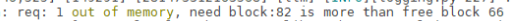

### Cause Analysis

This typically occurs when sequence length increases due to large images or videos, making the pre-allocated KV cache insufficient.

### Solution

Change the value of `max_input_length` in the `run_pa.sh` script to a larger value based on the actual application scenario.

## What to Do If Chat Interface Performance Degrades When Deploying PD Hybrid Services on a Standalone Atlas 800I A3 SuperPoD Server

### Symptom

There are a large number of experts on a single device, and each expert is allocated with a small number of tokens. When the precision is different, the performance of a chat interface may be worse than that of a non-chat interface.

### Cause Analysis

The experts activated by the chat interface are more evenly distributed, but the number of experts activated by a single device is larger. As a result, more experts need to be transferred, the performance deteriorates, and the GMM operator performance fluctuates.

### Solution

This is an inherent difference between chat and non-chat interfaces, which is normal.

## How to Locate the Fault When the Error Message "undefinedsymbols: *xxx*" Is Displayed

## Solution

Check whether MindIE LLM matches ATB, CANN, torch, and TorchNPU, and whether the value of `ABI` (`0` or `1`) is correctly selected.

## What to Do If `MASTER_ADDR` or `MASTER_PORT` Is Missing During Multi-Device Distributed Inference

### Symptom

When torch.distributed is enabled for multi-device inference, the `MASTER_ADDR` or `MASTER_PORT` environment variable does not exist on the server.

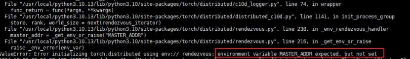

### Cause Analysis

The environment variable the `MASTER_ADDR` or `MASTER_PORT` environment variable is not set.

### Solution

You can set the environment variable in either of the following ways:

- Setting in the code
  
```python
   import os

   os.environ\['MASTER\_ADDR'\] = 'localhost'

   os.environ\['MASTER\_PORT'\] = '5678'

```

- Using environment variables

  ```bash
    export MASTER\_ADDR=localhost

    export MASTER\_PORT=5678
  ```

## What to Do If Error "Max retries exceeded with url" Is Reported During Model Startup

### Symptom

The error message "Max retries exceeded with url" is displayed during model startup, as shown in the following figure.

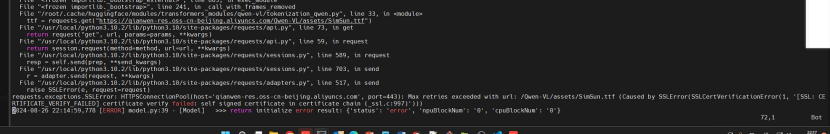

### Cause Analysis

This issue is most likely caused by intranet access.

### Solution

The solution uses Qwen-VL as an example. Open the `tokenization_qwen.py` file in the weight folder and modify the 29th and 30th lines as follows.

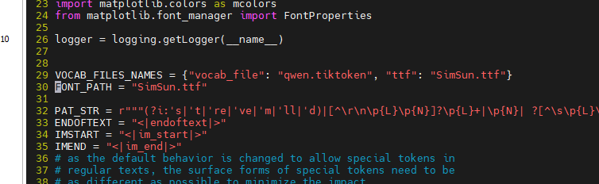

## What to Do If Error "Socket bind failed" Is Displayed After a Model Is Loaded

### Symptom

After a model is loaded, the program exits quickly, and the error message "Socket bind failed" is displayed, as illustrated in the following figure.

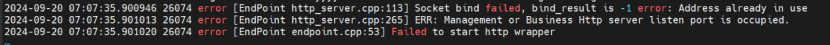

### Cause Analysis

MindIE Motor CPP uses HTTP or HTTPS for communication. The client can disconnect first to reduce the server load and ensure proper release of resources, including port resources.

### Solution

Modify the `port`, `managementPort`, and `metricsPort` parameters in the configuration file. To avoid this problem, disconnect requests before disconnecting the service process. Alternatively, run the `lsof -i :{port}` command to check the port status. If the port is still occupied by a residual process, run the `kill` command to clear the residual process. Replace `{port}` with the port number to be checked.

## What to Do If No Response Is Returned After Serving Is Started

### Symptom

After serving is started successfully, no response is returned after a request is sent.

### Cause Analysis

Check model logs to see if "out of memory" occurs.

### Solution

Change the values of `npuDeviceIds` and `npuMemSize` in the configuration file.

## How to Check Logs to Locate the Cause of a Serving Startup Failure

If serving fails to be started, check logs, which are stored in `/root/mindie/log/debug` by default.

## What to Do If LLaMA2-13b-hf Failed to Be Started for Serving and a Core Dump Error Related to ProtoBuf Is Reported

Run the `pip install protobuf==5.28` command to upgrade ProtoBuf.

## What to Do If Error "Check_path: config.json failed" Is Reported During Serving Startup

### Symptom

During serving startup, the error message "Check\_path: config.json failed" is displayed, as shown in the following figure.

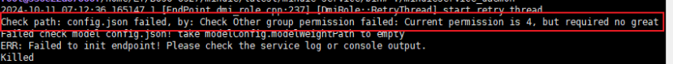

### Cause Analysis

The `config.json` file in the model weight path does not have the 640 permission.

### Solution

Use either of the following methods to change the permission:

- Change the permission on the `config.json` file.
  
  ```python
  chmod 640 {model_path}/config.json
  ```

- Change the permission on the entire model weight folder.
  
  ```python
  chmod -R 640 {model_path}
  ```

## What to Do If Error "pybind11::error\_already\_set" Is Reported During Serving Startup

### Symptom

The error "pybind11::error\_already\_set" is reported during service startup, as illustrated in the following figure.

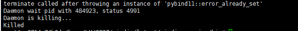

### Cause Analysis

The model's third-party dependencies are incorrect.

### Solution

Reinstall the third-party dependencies based on the `requirements.txt` file of the model. The default path of the dependency file is `{MindIE_installation_directory}/atb_llm/requirements/models/requirements_{model}.txt`.

## What to Do If No Core Dump Log Is Reported During Service Startup

### Symptom

No core dump log is generated during service startup.

### Cause Analysis

The model's third-party dependencies, such as Protobuf, are incorrect.

### Solution

Reinstall the third-party dependencies based on the `requirements.txt` file of the model. The default path of the dependency file is `{MindIE_installation_directory}/atb_llm/requirements/models/requirements_{model}.txt`.

## How to Enable Forcible Synchronization of the Acceleration Library to Locate Errors

### Solution

```bash
export ATB_STREAM_SYNC_EVERY_KERNEL_ENABLE=1
export ATB_STREAM_SYNC_EVERY_RUNNER_ENABLE=1
export ATB_STREAM_SYNC_EVERY_OPERATION_ENABLE=1
```

After the environment variable is enabled, run the model inference and further locate the fault based on the first error in the acceleration library log.

## What Is Deterministic Computing?

Deterministic computing refers to the process of running an inference application multiple times with unchanged inputs, such as an input dataset, ensuring that the output results are consistent each time.

## Why Does the Accuracy Result Fluctuate When the Accuracy Dataset Is Run?

1. After the model postprocessing is changed from **sampling** to **greedy**, the stability of the output text can be ensured.
2. Due to the problem of deterministic computing, the output may be slightly different.

## Why Are the Batch Forming Sequence and LLM Model Inference Outputs Different Even with the Same Input?

### Solution

1. The accumulation sequence of the MatMul operator varies across different rows. Additionally, floating-point precision lacks the commutative property of addition. Consequently, even if the input is the same across different rows, the calculation results are different.
2. You can set the environment variable `export ATB_MATMUL_SHUFFLE_K_ENABLE` to `0` to disable the shuffle k function of MatMul. After it is disabled, the operator accumulation sequence on all rows can be the same. However, the performance of MatMul decreases by about 10%.

## Why Is the Output Uncertain When the Same Input Is Sent to MindIE Server for Inference?

The scheduling framework code (in block query mode) can ensure deterministic scheduling. However, environmental factors such as CPU load can affect the request arrival time, ultimately impacting deterministic scheduling. For example, after an engine query, 10 requests can be submitted for a customer's external services. During the first run, all 10 requests quickly arrive and form a batch. However, during the second run, some requests arrive late due to environmental factors, and only five requests form a batch. As a result, the results of the two runs are different.

## What to Do If Difficult Fault Location Occurs During Asynchronous Execution

### Symptom

An error associated with fault location occurs during pure model inference.

### Cause Analysis

Model inference involves asynchronous execution, which may result in misleading error messages. Ensure synchronization before performing fault location.

### Solution

Set `export ASCEND_LAUNCH_BLOCKING` to `1` to enable synchronous execution before fault location.

## How to Ensure Deterministic Computing When LLM Inference Is Performed on Ascend

Deterministic computing refers to the process of running an inference application multiple times with unchanged inputs, such as an input dataset, ensuring that the output results are consistent each time.

1. Model level:
   
    Communication operator:
   
   ```bash
   export LCCL_DETERMINISTIC=1
   export HCCL_DETERMINISTIC=true
   ```
   
    MatMul:
   
   ```bash
   export ATB_MATMUL_SHUFFLE_K_ENABLE=0
   ```

2. Inference engine:
   
    MindIE: Obtains new requests based on blocks.
   
    TGI: not supported.

## What to Do if LLM Inference Result Contains Garbled Characters

### Solution

Check whether the tokenizer uses the correct model path when converting a token to an ID.

## What to Do If "Pull kv failed" Is Displayed on the Decode Node in the Prefill-Decode Disaggregation Scenario

### Symptom

During inference, the "Pull kv failed" log of the ERROR level is generated when the decode node pulls the KV cache, and the error code "timeout" is displayed in `status_code` of CANN.

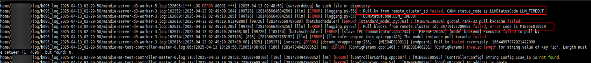

### Cause Analysis

In the prefill-decode disaggregation scenario, the KV cache of the decode node needs to be pulled from the prefill node. If this error occurs, the KV cache transmission from the prefill node to the decode node times out, which is probably caused by poor network quality.

### Solution

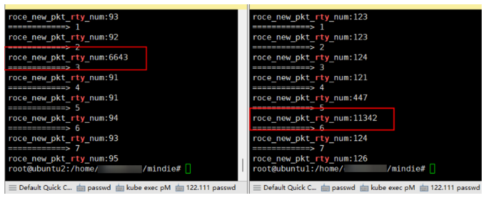

- (Recommended) Check the number of network transmission retries. If certain devices exhibit an unusually high retry count, inspect the corresponding optical modules.
  
  ```python
    for i in $(seq 0 7); do echo "============> $i";hccn_tool -i $i -stat -g |grep rty;done
  ```

- Set `kv_trans_timeout` to `5` in the `ModelDeployConfig` field of the MindIE configuration file, to specify the timeout interval for pulling the KV cache to 5 seconds. However, this setting may mask inference performance degradation caused by network problems. Exercise caution when configuring it.

## What to Do If Error Message "LLMPythonModel Initializes Fail" Is Displayed During MindIE LLM Deployment

### Symptom

During MindIE LLM deployment, the error message "LLMPythonModel initializes fail" is reported, as shown in the following figure.

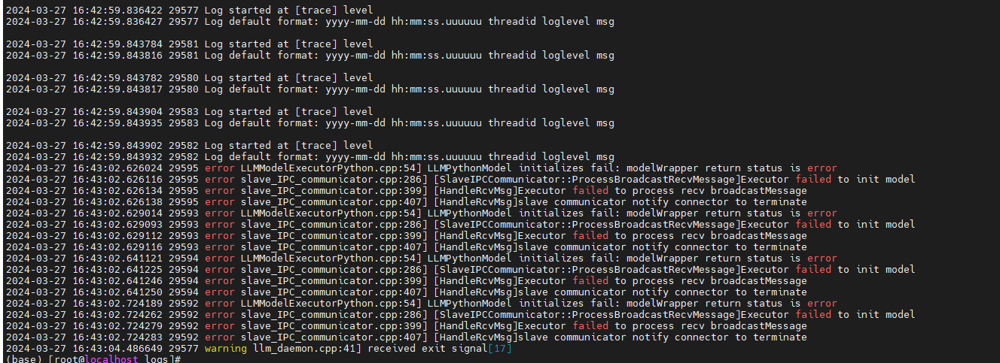

### Cause Analysis

There is no Python dependency for ibis.

### Solution

Go to the `/Service_installation_path/logs` directory, open Python logs, and install the required dependencies based on the error information in logs.

## What to Do If Error Message "out of memory" Is Displayed During Model Loading

### Symptom

During MindIE LLM deployment, the error message "out of memory" is displayed when the model is loaded, as shown in the following figure.

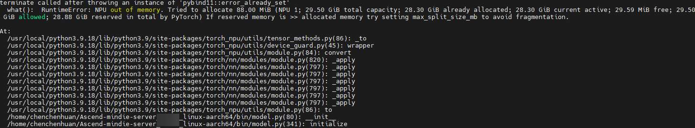

### Cause Analysis

The weight is too large and the memory is insufficient.

### Solution

Set `npuMemSize` of `ModelConfig` in the `config.json` file to a smaller value, for example, `8`.

## What to Do If Error Message Indicating `atb_llm.runner` Cannot Be Imported During MindIE LLM Deployment

### Symptom

During MindIE LLM deployment, `atb_llm.runner` cannot be imported, as shown in the following figure.

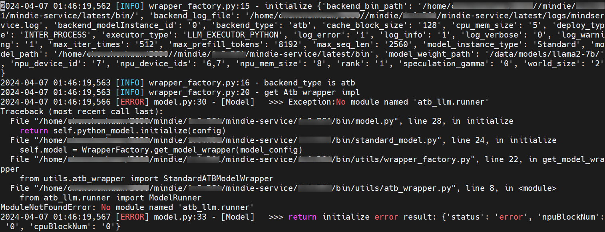

### Cause Analysis

The Python version is not 3.10, or the Python version corresponding to pip is not 3.10. As a result, the corresponding package cannot be found. You can run the `python` and `pip -v` commands to check the Python version.

### Solution

1. Open the `bashrc` file.
   
   ```bash
   vim ~/.bashrc
   ```

2. Add the following environment variables to the `bashrc` file, save the file, and exit.
   
   ```bash
   ## For example, if version 3.11 is used, the installation directory is `/usr/local/python3.11`.
   export LD_LIBRARY_PATH=/usr/local/python3.11/lib:$LD_LIBRARY_PATH
   export PATH=/usr/local/python3.11/bin:$PATH
   ```

3. Make the environment variables take effect.
   
   ```bash
   source ~/.bashrc
   ```

4. Create soft links.
   
   ```bash
   ln -s /usr/local/python3.11/bin/python3.11 /usr/bin/python
   ln -s /usr/local/python3.11/bin/pip3.11 /usr/bin/pip
   ```

## What to Do if Paths Like `tlsCert` Cannot Be Found During MindIE LLM Deployment

### Symptom

During MindIE LLM deployment, paths such as `tlsCert` cannot be found, as shown in the following figure.

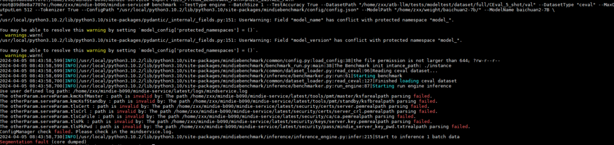

### Cause Analysis

When the HTTPS service is enabled, the required certificates are not stored in the corresponding directories.

### Solution

Save the files required for authentication, such as the server certificate, CA certificate, and server private key, to the corresponding directories.

## What to Do If Error Message "cannot allocate memory in static TLS block" Is Displayed When Transformers Is Used for Model Inference

### Symptom

The following figure displays the error details.

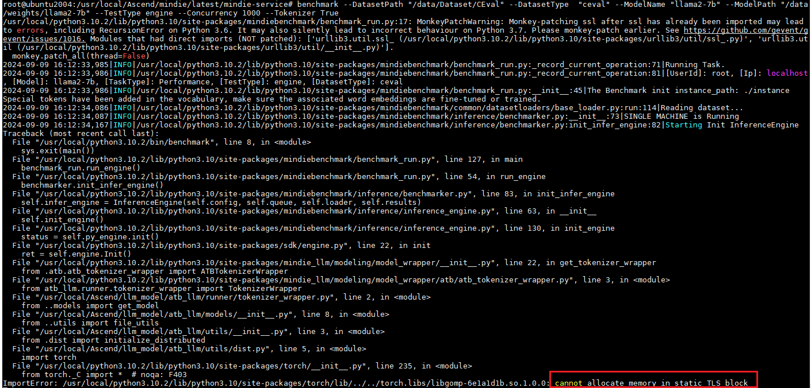

### Cause Analysis

The `glibc.so` file has a bug.

### Solution

Run the following command:

```bash
export LD_PRELOAD=$LD_PRELOAD:/usr/local/python3.11/lib/python3.11/site-packages/torch/lib/../../torch.libs/libgomp-6e1a1d1b.so.1.0.0
```

## What to Do If Loading a Large Model Takes a Long Time <a id="jzdmxshsgc"></a>

### Symptom

It takes about 3 hours to load a 1300B model. "B" stands for "Billion".

### Cause Analysis

Asynchronous loading is not used.

### Solution

Set the environment variable `OMP_NUM_THREADS` to optimize model loading. `OMP_NUM_THREADS` is used to set the number of threads of the Open Multi-Processing (OpenMP) parallel programming framework. After the setting, it takes about 10 minutes to load a 1300B model.

```bash
export OMP_NUM_THREADS=1
```

In addition, run the following command to start collecting NPU graphics memory fragments:

```bash
export PYTORCH_NPU_ALLOC_CONF=expandable_segments:True
export NPU_MEMORY_FRACTION=0.96
```

## What to Do If an Error is Reported Due to the Size Limit During Multi-Modal Model Input

### Symptom

When the multimodal model input (`image_url`/`video_url`/`audio_url`) is used, the following error message is displayed:

- OpenAI API:
  
  ```text
  {"error": "Message len not in (0, 4194304], but the length of inputs is xxxxx", "error_type": "Input Validation Error"}
  ```

- vLLM API:
  
  ```text
  Prompt must be necessary and data type must be string and length in (0, 4194304], but the length of inputs is xxxxx
  ```

- Triton API:
  
  ```text
  Text_input must be necessary and data type must be string and length in (0, 4194304], but the length of inputs is xxxxx
  ```

<br>

### Cause Analysis

The input image, audio, or video is encoded using Base64 (the data after Base64 encoding is usually 4/3 times that of the original data). As a result, the entire `message/prompt/text_input` exceeds 4MB, and an error is reported.

<br>

### Solution

- Method 1: Referring to the API restrictions
  
  - OpenAI API:
    
      The total size of all fields in the messages parameter in the request cannot exceed 4MB. For details, see **inference APIs**.
  
  - vLLM API:
    
      The total size of all fields under the `prompt` parameter in the request cannot exceed 4MB. For details, see "API Reference" \> "RESTful API Reference" > "EndPoint Service Plane RESTful APIs" > "Compatible with vLLM 0.6.4 APIs" > "Text/Streaming Inference APIs" in *MindIE LLM Development Guide*.
  
  - Triton API:
    
      The total size of all fields under the `text_input` parameter in the request cannot exceed 4MB. For details, see "API Description" > "RESTful API Reference" > "EndPoint Service Plane RESTful APIs" > "Compatible with Triton APIs" > "Text Inference APIs" in *MindIE LLM Development Guide*.
    
    > [!NOTE]NOTE
    > 
    > - If the size of a Base64-encoded image is 1MB and the number of other request characters under `message/prompt/text_input` is greater than 3MB, the total size of `message/prompt/text_input` will exceed 4MB, and an error will be reported.
    > - If `image_url`, `video_url`, or `audio_url` is set to a local image, video, or audio file, or a remote URL, the total number of characters under the URL string and the other request characters under `message/prompt/text_input` must be less than 4MB. After the URL is passed, the URL is loaded and parsed to obtain the image, video, or audio file.
    >   - Image: no more than 20MB
    >   - Video: no more than 512MB
    >   - Audio: no more than 20MB
    > - The input encoded using Base64 is more likely to exceed the limit. In the current version, an error is reported because security issues are involved. You are advised to use a web address or local address.
    > - If the Base64 format is used, do not use the terminal curl. You are advised to use the Python script because the character length of the data after Base64 encoding may exceed the system terminal limit. As a result, the request is truncated.

- Method 2: Manually modifying the source code
  
    For example, change the upper limit of `inputs` to 10MB by modifying the code as follows:
  
    **Figure 1** Example 1
  
    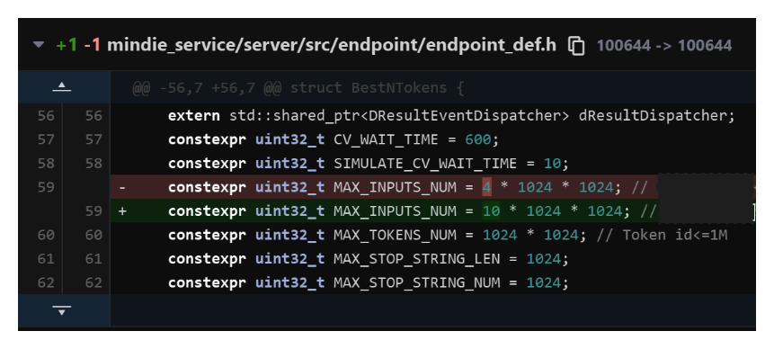
  
    **Figure 2** Example 2
  
    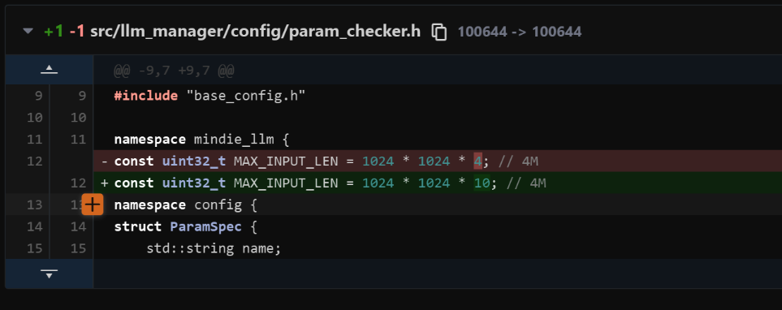

## What to Do If Error Message "RuntimeError: call calnnCat failed, detail:EZ1001" Is Displayed During Multi-Modal Model Inference

### Symptom

When running inference with the multimodal model, an error similar to the following occurs in `MindIE-LLM-master\examples\atb_models\atb_llm\models\qwen2_vl\flash_causal_qwen2_using_mrope.py`:

```text
call calnnCat failed, detail:EZ1001: xxxxxxxx dimnum of tensor 5 is [1], should be equal to tensor 0 [2].
```

**Figure 1** Error message

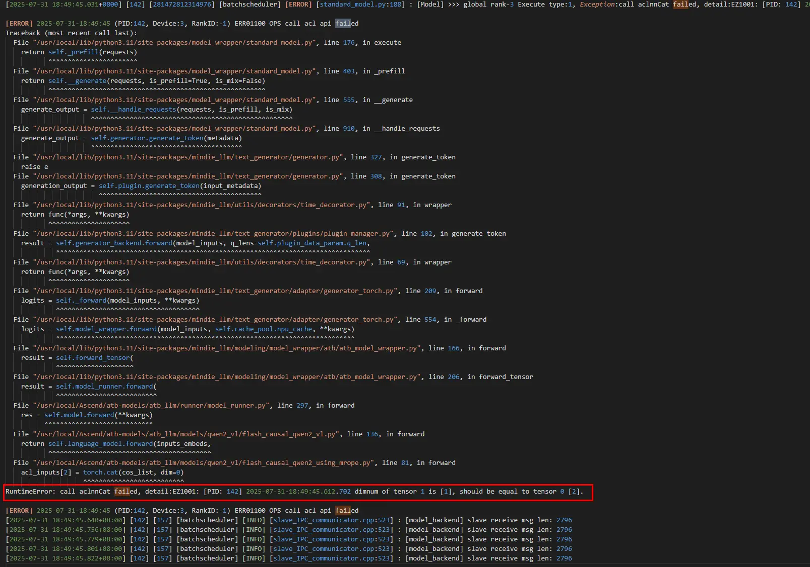

**Figure 2** Error file

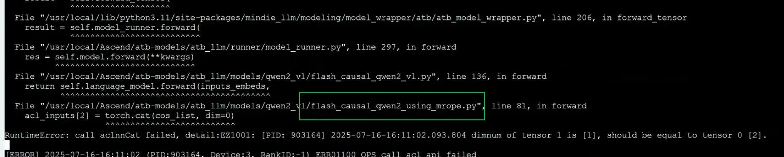

**Figure 3** Error file

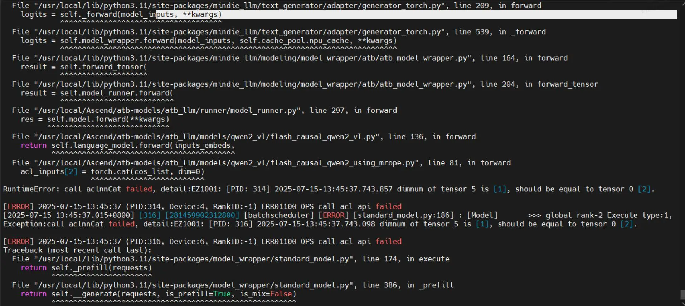

<br>

### Cause Analysis

The issue may stem from a `concat`-related operator where tensor 5 has size 1 in a certain dimension, but the required size is 2, causing a mismatch. This may be related to `squeeze`, as it removes dimensions of size `1`.

Example: If an operator (such as concat or MatMul) expects a dimension to exist and match a specific value (for example, 2), an error will occur if that dimension has been removed by a squeeze operation.

> [!NOTE]
> This issue exists in versions earlier than MindIE 2.0 and has been resolved in MindIE 2.0 and later versions.

<br>

### Solution

Modify the code as follows:

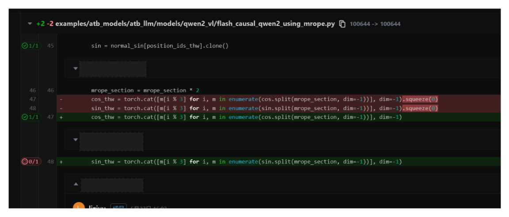

## What to Do if Running Qwen2.5-VL Series Models Fails and Reports an Error

### Symptom

Running Qwen2.5-VL series models fails, and an error message similar to either of the following is displayed:

- Error message 1:
  
  ```text
  You are using a model of type qwen2_5_vl to instantiate a model of type. This is not supported for all configurations of models and can yield errors.
  ```

- Error message 2:
  
  ```text
  [ERROR] TBE Subprocess[task_distribute] raise error[], main process disappeared!
  ```

<br>

### Cause Analysis

The model configuration is not supported because the installed dependencies are incorrect. You need to install the corresponding dependency files.

<br>

### Solution

- Handling method for error message 1:
  
    Install the corresponding `requirements.txt` file based on the dependencies required by each model.
  
  - The path of the common dependency file to be installed for all models is as follows:
    
    ```text
    {MindIE_installation_directory}/atb_llm/requirements/requirements.txt
    ```
  
  - The dependency file of each model is in the `models` directory. For example, the dependency file of the Qwen2-VL model is as follows:
    
    ```text
    {MindIE_installation_directory}/atb_llm/requirements/models/requirements_qwen2_vl.txt
    ```
    
    The installation command is as follows:
    
    ```bash
        pip install -r {MindIE_installation_directory}/atb_llm/requirements/models/requirements_qwen2_vl.txt
    ```

- Handling method for error message 2:
  
    1. Click [here](https://modelers.cn/models/MindIE/DeepSeek-R1-Distill-Llama-70B) to check whether the model is supported by the hardware environment.
  
    2. Run the following command to check whether the driver version is correct. The driver version must be 23.0.7 or later. You are advised to install the driver of 24.1.RC2 or later.
  
        ```bash
        npu-smi info
        ```
  
    3. Check whether the initial environment variables have been configured and taken effect.
  
    4. Check whether the free memory of the system is sufficient.
  
        Run the following command to check the free memory size. Ensure that the size is greater than **Weight size/Number of machines**.
  
        ```bash
        free -h
        ```
  
        Based on experience, try to keep `free_mem >= (weight/num_machines) * 1.3`.
  
        >[!NOTE]
        >Each time a model is run, check the memory usage on the host to prevent model running failures caused by insufficient memory.
  
    5. Import the following environment variables:
  
        ```bash
        export HCCL_DETERMINISTIC=false
        export HCCL_OP_EXPANSION_MODE="AIV"
        export NPU_MEMORY_FRACTION=0.96
        export PYTORCH_NPU_ALLOC_CONF=expandable_segments:True
        ```
  
    6. Check whether the multi-node serving parameter settings are consistent.
  
    7. Restart the server and restart the service.
  
    >[!NOTE]
    >- Updating the hardware environments, version mapping, drivers, and images to the latest versions can effectively avoid such errors.
    >- For details about how to handle this error, see [handling procedure](https://www.hiascend.com/developer/blog/details/02112175404775067102).

## What to Do If an OOM Error is Reported During Model Inference or Serving Startup and Inference

### Symptom

During pure model inference and serving startup/inference, various out of memory (OOM) errors are reported. The error information is similar to the following:

```text
RuntimeError: NPU out of memory. Tried to allocate xxx GiB."
```

<br>

### Cause Analysis

- The model weight file is large.
- The input shape is too large (the batch size is large, the text is too long, or the image, audio, or video is too large).
- The values of some parameters in the configuration file are too large.

<br>

### Solution

1. Increase the value of the `NPU_MEMORY_FRACTION` environment variable (indicating the memory allocation ratio; default value `0.8`). The following is an example:
   
   ```bash
   export NPU_MEMORY_FRACTION=0.96
   export PYTORCH_NPU_ALLOC_CONF=expandable_segments:True
   export OMP_NUM_THREADS=1
   ```

2. Lower the values of parameters such as `maxSeqLen`, `maxInputTokenLen`, `maxPrefillBatchSize`, `maxPrefillTokens`, and `maxBatchSize` in the serving configuration file `config.json`. Focus primarily on adjusting `maxPrefillTokens`, and `maxSeqLen`.
   
    - The value of `maxPrefillTokens` must be greater than or equal to that of `maxInputToken`.
   
    - `maxPrefillTokens` affects the workspace in the ATB initialization phase. If the value is too large, an OOM error may be reported after the service is started.

3. Adjust the value of `npuMemSize` (the maximum memory a single NPU can allocate for KV cache. The default value is `-1`, indicating that KV cache is automatically allocated. If the value is greater than 0, KV cache is manually allocated and the KV cache size is fixed based on the set value).
   
    `npuMemSize` = Total memory of a single NPU x Memory allocation ratio

4. Use more NPUs. For example, if two NPUs are used, you can increase the number of NPUs to four or eight. However, you need to confirm the number of NPUs supported by the current model on the current hardware.

## What to Do If Error Message "Qwen2VL/Qwen2.5VL_VIT_graph nodes[1] infershape fail" Is Displayed During Multi-Modal Model Inference

### Symptom

An error message similar to the following is displayed when the multi-modal model is used for inference:

```text
[standard_model.py:188] : [Model] >>> global rank-2 Execute type:1, Exception:Qwen25VL_VIT_graph nodes[1] infershape  fail, enable log: export ASDOPS_LOG_LEVEL=ERROR, export ASDOPS_LOG_TO_STDOUT=1
```

Or

```text
[error] [1256320] [operation_base.cpp:273] Qwen25VL_VIT_layer_0_graph infer shape fail, error code: 8
```

<br>

### Cause Analysis

- The model may not support the hardware environment in the current version.

- The input shape is too large, which is not supported by the self-attention operator.

<br>

### Solution

- The model may not support the hardware environment in the current version.
  
  - Click [here](https://www.hiascend.com/software/mindie/modellist) to view the model support of each MindIE version and select the correct MindIE version.
  
  - Modify the code in the image. You only need to modify the Python code and do not need to recompile the code. See the following figure.
    
      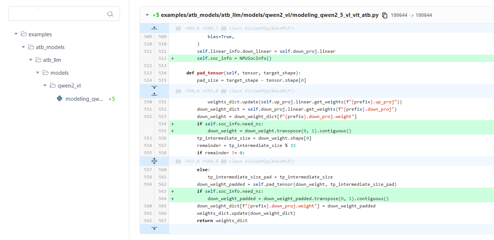

- The input shape is too large, which is not supported by the self-attention operator.
  
    Reduce the value of `maxPrefillTokens` in the serving configuration file `config.json`.

## What to Do If an Error Is Reported When the `image_url`, `video_url`, or `audio_url` Format Is Used for Multi-Modal Model Inference

### Symptom

An error message similar to the following is displayed when the `image_url`, `video_url`, or `audio_url` format is used for multi-modal model inference:

```text
File "/usr/local/lib/python3.11/site-packages/atb_llm/examples/models/qwen2_vl/run_pa.py", line 365, in <module>    raise TypeError("The multimodal input field currently only supports 'image' and 'video'.")
```

<br>

### Cause Analysis

The value in the `image_url`, `video_url`, or `audio_url` parameter does not meet the specified requirements.

<br>

### Solution

**Image**

1. Format 1: `{"type": "image_url", "image_url": image_url}` – `image_url` supports local paths, Base64-encoded JPG, and HTTP/HTTPS URLs.

2. Format 2: `{"type": "image_url", "image_url": {"url": {image_url}}}` – `image_url` supports local paths, Base64-encoded JPG, and HTTP/HTTPS URLs.

3. Format 3: `{"type": "image_url", "image_url": {"url": "file://{local_path}"}` – local paths only.

4. Format 4: `{"type": "image_url", "image_url": {"url": f"data:<mime_type>/<subtype>;base64,<base64_data>"}}` – Base64 encoding only. Supports JPG, JPEG, PNG. MIME types are listed below.

| Format | MIME       |
| ------ | ---------- |
| jpg    | image/jpeg |
| jpeg   | image/jpeg |
| png    | image/png  |

**Video**

1. Format 1: `{"type": "video_url", "video_url": video_url}` – `video_url` supports local paths, HTTP, and HTTPS URLs.

2. Format 2: `{"type": "video_url", "video_url": {"url": {video_url}}}` – `video_url` supports local paths, HTTP, and HTTPS URLs.

3. Format 3: `{"type": "video_url", "video_url": {"url": "file://{local_path}"}` – local paths only.

4. Format 4: `{"type": "video_url", "video_url": {"url": f"data:<mime_type>/<subtype>;base64,<base64_data>"}}` – Base64 encoding only. The source format can be MP4, AVI, or WMV. The following table lists the corresponding MIME types. In addition, the length of an encoded video may exceed the maximum length of the MindIE Service request. Therefore, you are advised not to transfer Base64-encoded videos.

| Format | MIME            |
| ------ | --------------- |
| mp4    | video/mp4       |
| avi    | video/x-msvideo |
| wmv    | video/x-ms-wmv  |

**Audio**

1. Format 1: `{"type": "audio_url", "audio_url": audio_url}` – `audio_url` supports local paths, HTTP, and HTTPS URLs.

2. Format 2: `{"type": "audio_url", "audio_url": {"url": {audio_url}}}` – `audio_url` supports local paths, HTTP, and HTTPS URLs.

3. Format 3: `{"type": "audio_url", "audio_url": {"url": "file://{local_path}"}}` – local paths only.

4. Format 4: `{"type": "audio_url", "audio_url": {"url": f"data:<mime_type>/<subtype>;base64,<base64_data>"}}` – Base64 encoding only. The source format can be MP3, WAV, or FLAC. The following table lists the corresponding MIME types.
   
   | Format | MIME        |
   | ------ | ----------- |
   | mp3    | audio/mpeg  |
   | wav    | audio/x-wav |
   | flac   | audio/flac  |

5. Format 5: `{"type": "input_audio", "input_audio": {"data": f"{audio_base64}", "format": "wav"}}` –  When `type` is `input_audio`, only Base64-encoded data is supported. The source format can be MP3, WAV, or FLAC, and must be explicitly specified using the `format` field.

## What to Do If Error Message "Failed to get vocab size from tokenizer wrapper with exception" Is Displayed When Qwen2-VL Series Models Are Running

### Symptom

The tokenizer of Qwen2-VL series models reports an error (other models may also report errors, which are irrelevant to the models). The following error message is displayed:

```text
Failed to get vocab size from tokenizer wrapper with exception...
```

**Figure 1** Error message

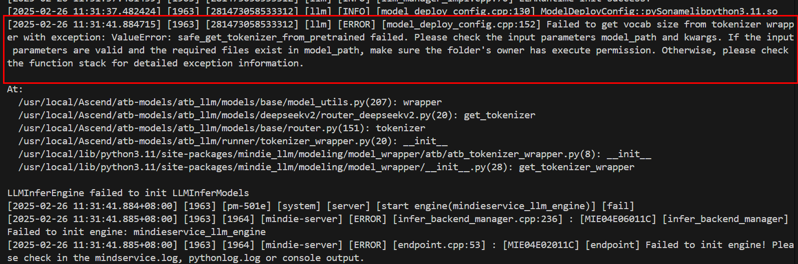

<br>

### Cause Analysis

- The version of the transformers/tokenizer adapted to the model is incorrect.
- The `trust_remote_code` parameter is set to `false`.
- The permissions on the serving `config.json` file, model weight path, and model `config.json` file are incorrect.
- The `config.json` file may be missing from the model weight files.
- The vocabulary file is damaged.

<br>

### Solution

- The version of the `transformers`/`tokenizer` adapted to the model is incorrect.
  
  - Check the required `transformers` version for each model, typically listed in the model's `requirements.txt` file. Then, check whether the `transformers` version in the `config.json` file under the model weight path is the same as that in the `config.json` file under the model weight path.
  
  - Use the following `tokenizer` verification method to create a Python script. If the script runs successfully, the `tokenizer` can be loaded correctly.
  
    ```python
    from transformers import AutoTokenizer  tokenizer = AutoTokenizer.from_pretrained('path/to/model')
    ```

- The value of `trust_remote_code` is `false`.
  
  - Set the `trust_remote_code` parameter to `true`.

- The permissions on the serving `config.json` file, model weight path, and model `config.json` file are incorrect.
  
  - Change the permissions on the serving `config.json` file, model weight path, and model `config.json` file to `640`.

- The `config.json` file may be missing from the model weight files.
  
  - If the `config.json` file is missing, add it.

- The vocabulary file is damaged.
  
  - Run the following command to check the integrity of the `tokenizer.json` file:
    
    ```bash
    sha256sum tokenizer.json # Hash verification. Compare the output value with the original weight file.
    ```

## What to Do If an Error Is Reported When a Qwen2.5 Series Model Is Deployed on MindIE for Quantization Inference

### Symptom

The following error message is displayed when a Qwen2.5 series model is deployed on MindIE for quantization inference:

```text
ValueError: linear type not matched,please check 'config.json' 'quantize' parameter
```

Alternatively,

```text
AttributeError: 'ForkAwareLocal' object has no attribute 'connection'
```

<br>

### Cause Analysis

The `quantize` field is not configured.

<br>

### Solution

When performing quantization inference, add the `quantize` field to the `config.json` file in the path where the quantized weights are located. The field value is the quantization mode of the current quantized weights. The following is an example:

```text
"quantize": "w8a8"
```

## How to Ensure Consistent Inference Results Each Time When MindIE Is Used for Inference

### Symptom

When MindIE is used for inference, the model inference output results are different if the input is the same but the batch sequence is different.

<br>

### Cause Analysis

The accumulation sequence of the MatMul operator varies across different rows. Additionally, floating-point precision lacks the commutative property of addition. Consequently, even if the input is the same across different rows, the calculation results may be inaccurate.

<br>

### Solution

Deterministic computing refers to the process of running an inference application multiple times with unchanged inputs, such as an input dataset, ensuring that the output results are consistent each time. You can set the environment variable `export ATB_MATMUL_SHUFFLE_K_ENABLE` to `0` to disable the shuffle k function of MatMul. After it is disabled, the operator accumulation sequence on all rows can be the same. However, the performance of MatMul decreases by about 10%.

Communication operator:

```bash
export LCCL_DETERMINISTIC=1
export HCCL_DETERMINISTIC=true # Enable deterministic computing of reduction communication operators.
export ATB_LLM_LCOC_ENABLE=0
```

MatMul:

```bash
export ATB_MATMUL_SHUFFLE_K_ENABLE=0
```

## What to Do If Error Message "ERROR failed to connect. error=SO_ERROR: Connection refused" Is Displayed When the Gloo Connection Fails

### Symptom

When the MindIE LLM service is started, a Gloo connection error occurs. Information similar to the following is displayed in the log:

```text
ERROR failed to connect, willRetry=1, retry=2, retryLimit=3, rank=1, size=2, local=[127.0.0.1]:123, remote=[127.0.0.1]:345, error=SO_ERROR: Connection refused
```

### Cause Analysis

This error usually occurs in **multi-node deployment scenarios**. The core cause is that the Gloo component automatically selects an incorrect network interface (NIC), resulting in a failure in communication between nodes.

### Solution

Explicitly specify the network interface used by Gloo through environment variables.

1. **View available NICs.**
    Run the following command on each node to view the NIC name:
   
    ```bash
    # Linux
    ip addr
    # Alternatively,
    ifconfig
    ```
   
    Common NIC naming formats: `enp*`, `ens*` and `eth*`

2. **Set environment variables.**
    Before starting the service, set the `GLOO_SOCKET_IFNAME` environment variable for each node.
   
    ```bash
    export GLOO_SOCKET_IFNAME=<NIC name> # For example, export   GLOO_SOCKET_IFNAME=enp1s0
    ```

3. **Precautions for container deployment:**
   
    - When using Docker, set the container network mode to `host`.
   
    - The NIC name of each machine may be different. You need to set the NIC name to that of the local host.

4. **Precautions for Kubernetes deployment:**
   
    - In a Kubernetes cluster, the NIC name is usually mapped to `eth0`.
   
    - For Moe EP deployment, you can configure environment variables in the `boot_helper/boot.sh` script.

### Verification

After the setting is complete, restart the service and check whether the Gloo connection error is rectified.

## Starting MindIE Motor CPP Fails with `libboost_thread.so.1.82.0` Not Found

### Symptom

When starting the MindIE Motor CPP service, an error occurs indicating that `libboost_thread.so.1.82.0` cannot be found, as shown below.


### Cause Analysis

The `mindieservice_daemon` binary fails to link correctly against its dynamic dependencies, preventing the service from starting.

### Resolution

1. Check the shared libraries linked to `mindieservice_daemon`.

   The following example uses `_{MindIE installation directory}_/latest/mindie-service` as the installation path.

   ```bash
   ldd ./bin/mindieservice_daemon
   ```

   

2. Run `source set_env.sh` to ensure `mindieservice_daemon` links to the correct dynamic libraries.

   ```bash
   source set_env.sh
   ```

   

---

## `curl` Command Fails After Installing MindIE

### Symptom

After sourcing the MindIE environment variable file with the following command, an error occurs: `symbol lookup error: /usr/lib64/libldap.so.2: undefined symbol: EVP_md2`, as shown below.

```bash
source /usr/local/Ascend/mindie/set_env.sh
```


### Root Cause

The `EVP_md2` function is considered insecure. MindIE is compiled against OpenSSL with legacy support disabled, so the `EVP_md2` function is not provided. After sourcing the MindIE environment, the bundled `libcrypto.so` takes precedence over the system library. The `curl` command depends on `EVP_md2`, and fails when the function is unavailable.

### Solution

- **Solution 1**: Open a new terminal and run `curl` without sourcing the MindIE environment. If the environment is sourced automatically, try `unset LD_LIBRARY_PATH` to avoid using the bundled `libcrypto.so`.

- **Solution 2**: Run the `curl` command on another host or in a container where `curl` functions correctly.

- **Solution 3**: Use `LD_PRELOAD` to force the use of the system `libcrypto.so.3`:

    ```bash
    LD_PRELOAD=/usr/lib64/libssl.so.3:/usr/lib64/libcrypto.so.3 curl http://<ip>:<port>/<your_path>
    ```
