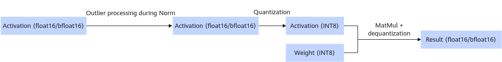

# Anti-Outlier

> [!NOTE] Synonyms
> This feature may be referred to as **anti-outlier**, **outlier suppression**, **Anti-Outlier**, or **AntiOutlier** in different documents or tool logs.

## Feature Introduction

Anti-Outlier is used to solve the problem of accuracy drop caused by abnormal activation value distribution (outlier) in model quantization. During LLM quantization, if there are outliers with extremely large values in the activation values, the quantization range (scale) is enlarged. As a result, the quantization resolution of most normal values is reduced, which severely affects the model accuracy. This technology smooths or suppresses outliers to effectively improve data distribution and ensure that the quantized model can still maintain high inference accuracy.

> [!NOTE]NOTE
> Anti-Outlier can be used together with other quantization methods, such as W4A8, W8A8, and W8A8C8.

The following shows part of the content in weight description file `quant_model_description.json` after the W8A8 + Anti-Outlier + PDMIX quantization:

```json
{
  "model.layers.0.self_attn.q_proj.weight": "W8A8_MIX",
  "model.layers.0.self_attn.q_proj.bias": "FLOAT",                //optional
  "model.layers.0.self_attn.q_proj.quant_bias": "W8A8_MIX",
  "model.layers.0.self_attn.q_proj.input_scale": "W8A8_MIX",
  //...
  "model.layers.0.mlp.down_proj.weight_offset": "W8A8_MIX",
  "model.layers.0.input_layernorm.weight": "FLOAT",
  "model.layers.0.input_layernorm.bias": "FLOAT",                //optional
  "model.layers.0.post_attention_layernorm.weight": "FLOAT",
  "model.layers.0.post_attention_layernorm.bias": "FLOAT",        //optional
  //...
}
```

Currently, mainstream open-source LLMs (such as Llama and Qwen) use RmsNorm as `input_layernorm` and `post_attention_layernorm`. When the asymmetric anti-outlier algorithm is enabled, an extra bias item (referred to as `norm_bias`) is introduced.

To ensure calculation equivalence, the execution logic of the algorithm is as follows:

1. Norm layer introduction: When the Norm operation is performed, `norm_bias` is added to the weights.
2. Linear layer offset: Before the subsequent linear layer calculation, the corresponding `norm_bias` is subtracted.

In the actual model weight, the offset tensor of `norm_bias` at the linear layer is fused in different ways based on the quantization scenario.

- Per-tensor scenario: Directly fused into the quantization bias `quant_bias` at the linear layer.
  - The preceding `model.layers.0.self_attn.q_proj.quant_bias` is an example.
- Per-token scenario: Represented by the common bias `bias` at the linear layer.
  - The preceding `model.layers.0.self_attn.q_proj.bias` is an example.

> [!NOTE]NOTE
>
> * **If the original linear layer has a bias** (for example, in Qwen2 series), the offset tensor is directly fused into the original bias.
> * **If the original linear layer does not have a bias** (for example, in Qwen3-32B), create a new bias layer to store the value.

**Performance Optimization Suggestions**
In the PDMIX scenario (per-token quantization is used in the P phase), the anti-outlier bias has little impact on the quantization accuracy. To improve performance, you can remove the bias from both the norm layer and the linear layer while ensuring equivalence, thereby reducing the overhead of one Add operation.

**Figure 1** Inference process for quantizing weights


**Table 1** dtype and shape information of some layers after quantization (assuming original weight shape is `[n]`)

|Tensor|input_layernorm.bias|post_attention_layernorm.bias|
|--|--|--|
|dtype|fp32|fp32|
|shape|[n]|[n]|

## Weight Generation

You can use the [msModelSlim](https://gitcode.com/Ascend/msmodelslim) tool to generate quantized weights.

The following uses Qwen3-14B as an example. After installing msModelSlim, you can run the following command to quickly generate the W8A8PDMIX quantization weights with outlier suppression:

```sh
msmodelslim quant --model_path {*Floating-point weight path*} --save_path {*Quantized weight path*} --device npu --model_type Qwen3-14B --quant_type w8a8 --trust_remote_code True
```

When the preceding command is executed, the best practice of msModelSlim is used for quantization by default. For details about more quantization parameter configurations, see the msModelSlim documentation.

## Inference

Using the Qwen3-14B-W8A8PDMIX weights as an example, you can run the following command to perform a dialog test. The inference content is "What's deep learning?" and the maximum number of output tokens is 20.

```bash
cd ${ATB_SPEED_HOME_PATH}
torchrun --nproc_per_node 2 --master_port 12350 -m examples.run_pa --model_path {Quantized_weight_path}
```
