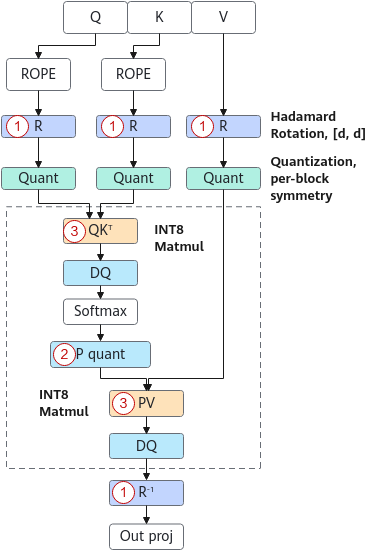

# Attention Quantization

## Overview

This quantization method quantizes q, k, and v to 8-bit values, reducing the graphics memory usage of the KV cache, optimizing the speed of the attention operator in the decode phase, and improving throughput.

> [!NOTE]NOTE
>
>- Only the Atlas 800I A2 inference server supports attention quantization.
>- This method must be used together with W8A8.
>- Only Llama 3.1 70B is supported.
>- This method must be used together with the long sequence feature and function call.

Directory structure of quantized weights after attention and W8A8 quantization:

```text
├─ config.json
├─ quant_model_weight_w8a8.safetensors
├─ quant_model_description.json
├─ tokenizer_config.json
├─ tokenizer.json
└─ tokenizer.model
```

- The quantized output contains the weight file `quant_model_weight_w8a8.safetensors` and the weight description file `quant_model_description.json`. 
- The other files in the directory are required for inference, and they vary slightly by model.

The following is a partial view of `quant_model_description.json` after quantization:

```json
{
  "model_quant_type": "W8A8",
  "fa_quant_type": "FAQuant",
  "model.embed_tokens.weight": "FLOAT",
  "model.layers.0.self_attn.q_proj.weight": "W8A8",
  "model.layers.0.self_attn.q_proj.input_scale": "W8A8",
  "model.layers.0.self_attn.q_proj.input_offset": "W8A8",
  "model.layers.0.self_attn.q_proj.quant_bias": "W8A8",
  "model.layers.0.self_attn.q_proj.deq_scale": "W8A8",
  "model.layers.0.self_attn.k_proj.weight": "W8A8",
  "model.layers.0.self_attn.k_proj.input_scale": "W8A8",
  "model.layers.0.self_attn.k_proj.input_offset": "W8A8",
  "model.layers.0.self_attn.k_proj.quant_bias": "W8A8",
  "model.layers.0.self_attn.k_proj.deq_scale": "W8A8",
  "model.layers.0.self_attn.v_proj.weight": "W8A8",
  "model.layers.0.self_attn.v_proj.input_scale": "W8A8",
  "model.layers.0.self_attn.v_proj.input_offset": "W8A8",
  "model.layers.0.self_attn.v_proj.quant_bias": "W8A8",
  "model.layers.0.self_attn.v_proj.deq_scale": "W8A8",
  "model.layers.0.self_attn.o_proj.weight": "W8A8",
  "model.layers.0.self_attn.o_proj.input_scale": "W8A8",
  "model.layers.0.self_attn.o_proj.input_offset": "W8A8",
  "model.layers.0.self_attn.o_proj.quant_bias": "W8A8",
  "model.layers.0.self_attn.o_proj.deq_scale": "W8A8",

}
```

Compared with the W8A8 weight quantization, description field `fa_quant_type` as well as field `self_attn` and its content are added. `input_scale` is used to quantize the `q`, `k`, and `v` features to the INT8 type, and `deq_scale` is used to dequantize the `q`, `k`, and `v` output to the floating-point type.

**Figure 1** Inference process for quantizing weights 



**Table 1** dtype and shape information after float16 weight quantization (assuming that shape of the original weight is `[n, k]`)

|Tensor|dtype|shape|
|--|--|--|
|q_scale|float16|[q_head_num, head_dim]|
|q_offset|float16|[q_head_num, head_dim]|
|k_scale|float16|[kv_head_num, head_dim]|
|k_offset|float16|[kv_head_num, head_dim]|
|v_scale|float16|[kv_head_num, head_dim]|
|v_offset|float16|[kv_head_num, head_dim]|

**Table 2** dtype and shape information after bfloat16 weight quantization (assuming that shape of the original weight is `[n, k]`)

|Tensor|dtype|shape|
|--|--|--|
|q_scale|bfloat16|[q_head_num, head_dim]|
|q_offset|bfloat16|[q_head_num, head_dim]|
|k_scale|bfloat16|[kv_head_num, head_dim]|
|k_offset|bfloat16|[kv_head_num, head_dim]|
|v_scale|bfloat16|[kv_head_num, head_dim]|
|v_offset|bfloat16|[kv_head_num, head_dim]|
