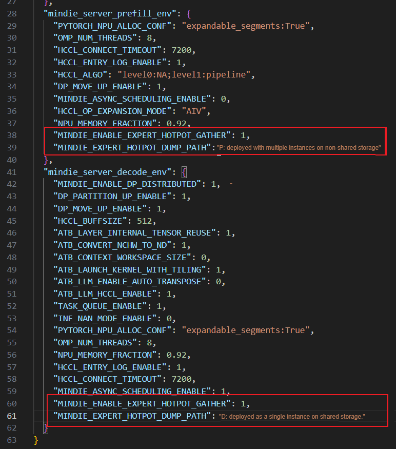

# Load Balancing

## Overview

In MoE architectures, the number of input tokens distributed across experts can vary significantly, resulting in imbalanced AlltoAll communication and uneven expert workload distribution. NPUs hosting hot experts suffer from insufficient compute and communication resources, while those with cold experts are prone to underutilization, leading to performance degradation. The load balancing feature is designed to reduce NPU resource imbalance and improve model inference performance.

MindIE supports two load balancing modes: static load balancing in redundancy mode and forcible load balancing.

- Static load balancing in redundancy mode: Redundant experts are deployed to share the load of hot experts, thereby facilitating effective load balancing.

- Forcible load balancing: Mock the outputs of the top k operator by replacing the original top k outputs with fake tensors that ensure absolute load balancing among experts. This mode only provides a theoretical upper limit for load balancing. It changes the actual routing of model experts and cannot be used in official services.

## Constraints

- The Atlas 800I A2/A3 inference server supports this feature.
- The DeepSeek R1/V3 and Qwen-MoE models support this feature.
- This feature is applicable exclusively during All2All collective communication in MoE architectures (`ep_level` is set to `2` in the model configuration file). In the prefill-decode disaggregation scenario, prefill and decode instances usually use different collective communication modes. Therefore, parameters for configuring load balancing must be set separately.
- Forcible load balancing only represents the theoretical upper limit of load balancing and cannot be used in official services.
- Static load balancing in redundancy mode is implemented by deploying redundant experts on NPUs hosting routing experts. Deploying one additional redundant expert on each NPU requires 2.4 GB extra graphics memory.

## Usage Process

Procedure for static load balancing in redundancy mode: Collect expert hotspot information, generate redundant expert deployment tables, and set load balancing parameters.


- Forcible load balancing does not require collecting expert hotspot information or generating redundant expert deployment tables. It can be enabled by setting the load balancing parameters alone.

### Collecting Expert Hotspot Information

This step is to obtain expert hotspot distribution in the actual service data or dataset.

1. Users can export expert hotspot data in actual service scenarios as a .csv file by setting two environment variables `MINDIE_ENABLE_EXPERT_HOTPOT_GATHER` and `MINDIE_EXPERT_HOTPOT_DUMP_PATH` without enabling load balancing. The hotspot information of the prefill and decode phases is saved separately to generate a redundant expert deployment table for each phase.

    The procedure is as follows:

    Add the following environment variables to the `mindie_server_prefill_env` and `mindie_server_decode_env` fields in `examples/kubernetes_deploy_scripts/conf/mindie_env(_a3).json`:

    - `"MINDIE\_ENABLE\_EXPERT\_HOTPOT\_GATHER": 1,`
    - `"MINDIE_EXPERT_HOTPOT_DUMP_PATH": "You can select a shared disk path for a single instance. Otherwise, the data must be stored in a non-shared disk."`

        

2. Run model inference services and generate files containing hotspot information.

    > [!NOTE]NOTE
    > If the collection is performed in serving mode, disable the mode in a timely manner after the dataset is executed.

3. After the hotspot information is generated, manually gather the expert hotspot information on all servers into a single folder. Alternatively, set the file export paths on all servers to shared disk paths.

### Generate a deployment table of redundant experts

After the hotspot information is collected, each NPU generates a .csv file that contains a matrix (`num_moe_layer` × the number of experts per NPU). Each number in the matrix represents the number of tokens processed by experts in that layer. The matrix is appended to the collection file at an interval of eight tokens.

Based on the collected expert hotspot information, use the `elb` component of the [msit](https://gitcode.com/Ascend/msit/blob/master/msit/docs/install/README.md) tool to generate a redundant expert deployment table.

1. The following describes how to install the `elb` component.

    ```bash
    # 1.git clone
    git clone https://gitcode.com/Ascend/msit.git
    cd msit/msit

    # 2. Install msit.
    pip install .

    # 3. Run the msit install command to install the elb component.
    msit install elb

    # 4. After the installation is complete, run the msit check elb command to check whether the installation is successful.
    msit check elb
    ```

2. The installation is successful if the following information is displayed:

    ```text
    2025-07-16 15:08:58,383 - 36266 - msit_llm_logger - INFO - msit-surgeon
    2025-07-16 15:08:58,395 - 36266 - msit_llm_logger - INFO -   not install yet.
    2025-07-16 15:08:58,395 - 36266 - msit_llm_logger - INFO - msit-analyze
    2025-07-16 15:08:58,407 - 36266 - msit_llm_logger - INFO -   not install yet.
    2025-07-16 15:08:58,407 - 36266 - msit_llm_logger - INFO - msit-convert
    2025-07-16 15:08:58,419 - 36266 - msit_llm_logger - INFO -   not install yet.
    2025-07-16 15:08:58,419 - 36266 - msit_llm_logger - INFO - msit-profile
    2025-07-16 15:08:58,431 - 36266 - msit_llm_logger - INFO -   not install yet.
    2025-07-16 15:08:58,431 - 36266 - msit_llm_logger - INFO - msit-tensor-view
    2025-07-16 15:08:58,443 - 36266 - msit_llm_logger - INFO -   not install yet.
    2025-07-16 15:08:58,443 - 36266 - msit_llm_logger - INFO - msit-benchmark
    2025-07-16 15:08:58,454 - 36266 - msit_llm_logger - INFO -   not install yet.
    2025-07-16 15:08:58,454 - 36266 - msit_llm_logger - INFO - msit-compare
    2025-07-16 15:08:58,465 - 36266 - msit_llm_logger - INFO -   not install yet.
    2025-07-16 15:08:58,465 - 36266 - msit_llm_logger - INFO - msit-opcheck
    2025-07-16 15:08:58,476 - 36266 - msit_llm_logger - INFO -   not install yet.
    2025-07-16 15:08:58,476 - 36266 - msit_llm_logger - INFO - msit-graph
    2025-07-16 15:08:58,488 - 36266 - msit_llm_logger - INFO -   not install yet.
    2025-07-16 15:08:58,488 - 36266 - msit_llm_logger - INFO - msit-elb
    2025-07-16 15:08:58,632 - 36266 - msit_llm_logger - INFO -   OK
    ```

3. Refer to [Load Balancing Affinity Expert Tuning Guide](https://gitcode.com/Ascend/msit/blob/master/msit/docs/expert_load_balancing/%E5%B7%A5%E5%85%B7-%E8%B4%9F%E8%BD%BD%E5%9D%87%E8%A1%A1%E4%BA%B2%E5%92%8C%E4%B8%93%E5%AE%B6%E5%AF%BB%E4%BC%98.md) to generate a redundant expert deployment table using the `elb` component. The typical 8-server 64-device configuration is as follows:

    ```bash
    msit elb -icp input_dir_path -o output_file_path -nre 64 -nd 8 -nn 64 -al 5 -dt a2
    ```

    msit provides two load balancing algorithms: compute-communication load balancing (C2LB) and speculative-moe interface algorithms. Currently, the optimal result is obtained by using the speculative-moe level 2 mixed algorithm (al 5).

    > [!NOTE]NOTE
    >- In the prefill-decode disaggregation scenario, redundant expert deployment tables can be generated for the prefill and decode phases, respectively.
    >- The prefill-decode overlap scenario requires redundant expert deployment tables for the decode phase only to enhance performance.
    >- If OOM occurs when you collect expert hotspot information in long-sequence scenarios, you are advised to reduce the sequence length.

### Setting Load Balancing Parameters

Load balancing parameters can be configured by modifying the `{ATB_installation_path}/atb-models/atb_llm/conf/config.json` file in the `atb-models` installation directory. Modify the `level`, `expert_map_file`, `rep_per_rank`, `aggregate_threshold`, `buffer_expert_layer_num`, and `num_expert_update_ready_countdown` parameters in the `models/deepseekv2/eplb` field. By default, load balancing is disabled. The typical configuration is as follows:

```json
{
    "models": {
        "deepseekv2": {
            "eplb": {
                "level": 1,
                "expert_map_file": "xxxx.json"
            }
        }
    }
}
```

The parameters are described as follows.

|Parameter|Value Type|Value Range|Configuration Description|
|--|--|--|--|
|level|int|[0, 3]|`0`: disables load balancing.<br>`1`: enables static load balancing in redundancy mode.<br>`2`: enables dynamic load balancing in redundancy mode (not supported currently).<br>`3`: enables forcible load balancing.<br>Default value: `0`|
|expert_map_file|string|The file path exists.|Path of the expert deployment table for static load balancing in redundancy mode.<br>Default value: `""`|
