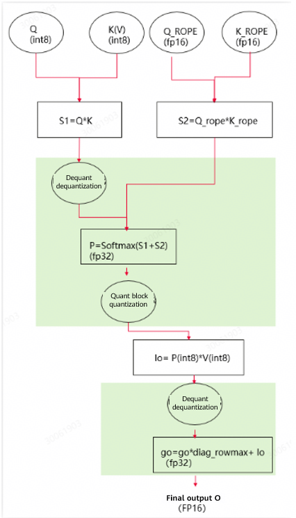

# FA3 Quantization

## Overview

Flash Attention 3 (FA3) quantization is similar to attention quantization. The difference is that DeepSeek uses the MLA algorithm and the value of K RoPE changes too much, which is not suitable for quantization. Therefore, in this quantization method, the non-rope tensor of k is quantized to 8bits, and the rope tensor of k is not quantized. The currently used quantization scheme is perhead quantization. Partial quantization of k is performed to reduce the graphics memory usage of the KV cache, optimize the speed of the attention operator in the decode phase, and improve the throughput.

> [!NOTE]
>
>- The Atlas 800I A2 inference server and Atlas 800I A3 SuperPoD server support FA3 quantization.
>- W8A8 can be used together.
>- Only DeepSeek R1, DeepSeek V3, and DeepSeek-R1-0528 are supported.
>- Only float16 is supported.
>- The NZ format must be enabled for the KV cache.

Directory structure of quantized weights after FA3 and W8A8 quantization:

```text
├─ config.json
├─ quant_model_weight_w8a8.safetensors
├─ quant_model_description.json
├─ tokenizer_config.json
├─ tokenizer.json
└─ tokenizer.model
```

- Quantization output includes: `quant_model_weight_w8a8.safetensors` (weight file) and `quant_model_description.json` (weight description file).
- The other files in the directory are required for inference, and they vary slightly by model.

The following is a partial view of `quant_model_description.json` after quantization:

```json
{
  "model_quant_type": "W8A8_DYNAMIC",
  "fa_quant_type": "FAKQuant",
  "model.embed_tokens.weight": "FLOAT",
  "model.layers.0.self_attn.q_proj.weight": "W8A8",
  "model.layers.0.self_attn.q_proj.input_scale": "W8A8",
  "model.layers.0.self_attn.q_proj.input_offset": "W8A8",
  "model.layers.0.self_attn.q_proj.quant_bias": "W8A8",
  "model.layers.0.self_attn.q_proj.deq_scale": "W8A8",
  "model.layers.0.self_attn.k_proj.weight": "W8A8",
  "model.layers.0.self_attn.k_proj.input_scale": "W8A8",
  "model.layers.0.self_attn.k_proj.input_offset": "W8A8",
  "model.layers.0.self_attn.k_proj.quant_bias": "W8A8",
  "model.layers.0.self_attn.k_proj.deq_scale": "W8A8",
  "model.layers.0.self_attn.v_proj.weight": "W8A8",
  "model.layers.0.self_attn.v_proj.input_scale": "W8A8",
  "model.layers.0.self_attn.v_proj.input_offset": "W8A8",
  "model.layers.0.self_attn.v_proj.quant_bias": "W8A8",
  "model.layers.0.self_attn.v_proj.deq_scale": "W8A8",
  "model.layers.0.self_attn.o_proj.weight": "W8A8",
  "model.layers.0.self_attn.o_proj.input_scale": "W8A8",
  "model.layers.0.self_attn.o_proj.input_offset": "W8A8",
  "model.layers.0.self_attn.o_proj.quant_bias": "W8A8",
  "model.layers.0.self_attn.o_proj.deq_scale": "W8A8"
}
```

Compared with the W8A8 weight quantization, description field `fa_quant_type` as well as field `self_attn` and its content are added. `input_scale` is used to quantize the `q` and `k` features to the INT8 type, and `deq_scale` is used to dequantize the `q` and `k` output to the floating-point type.

**Figure 1** Inference process for FA3 weight quantization



**Table 1** dtype and shape information after float16 weight quantization (assuming that shape of the original weight is [n, k])

|Tensor|dtype|shape|
|--|--|--|
|q_scale|float16|[q_head_num, head_dim]|
|q_offset|float16|[q_head_num, head_dim]|
|k_scale|float16|[kv_head_num, head_dim]|
|k_offset|float16|[kv_head_num, head_dim]|

## Weight Generation

1. Install [msModelSlim](https://gitcode.com/Ascend/msmodelslim/blob/26.0.0/docs/en/getting_started/install_guide.md).
2. Complete the required checks before running DeepSeek-V3/R1. For details, see the [msModelSlim quantization description](https://gitcode.com/Ascend/msmodelslim/blob/26.0.0/example/DeepSeek/README_EN.md).
3. Go to the `msmodelslim/example/DeepSeek/` directory and run the following quantization command:

    ```bash
    python3 quant_deepseek_w8a8.py --model_path {*Floating-point weight path*} --save_path {*W8A8-quantized weight path*} --batch_size 4 --fa_quant --mindie_format
    ```

    The quant\_model\_description.json file of the FA3 quantized weights must contain the "fa\_quant\_type": "FAKQuant" key-value pair.

## Inference

1. Enable the NZ format for the KV cache.

    - For pure model inference: Set `"enable_nz": true` in `${ATB_SPEED_HOME_PATH}/atb_llm/conf/config.json`.
    - For serving inference: Add the `"enable_nz"` field under `"ModelConfig"` in `{MindIE_install_dir}/mindie_llm/conf/config.json` as shown below.

        ```json
        "ModelConfig" : [
                        {
                            "modelInstanceType" : "Standard",
                            "modelName" : "deepseekr1",
                            "modelWeightPath" : "/mnt/nfs/weight/R1_W8A8_FA3_Clamp",
                            "worldSize" : 8,
                            "cpuMemSize" : 5,
                            "npuMemSize" : -1,
                            "backendType" : "atb",
                            "trustRemoteCode" : false,
                            "sp": 1,
                            "tp": 8,
                            "dp": 2,
                            "moe_ep": 4,
                            "moe_tp": 4,
                            "plugin_params": "{\"plugin_type\":\"mtp\",\"num_speculative_tokens\": 1}",
                            "models": {
                                "deepseekv2": {
                                    "kv_cache_options": {
                                    "enable_nz": true
                                    }
                                }
                            }
                        }
        ]
        ```

    > [!NOTE]
    > During PD disaggregation inference, set `enable_nz` to `true` in the configuration file.

2. You can run the following commands to perform a dialog test. The inference content is "What's deep learning?".

    ```bash
    cd ${ATB_SPEED_HOME_PATH}
    bash examples/models/deepseekv2/run_pa.sh {W8A8 quantized weight path}
    ```
