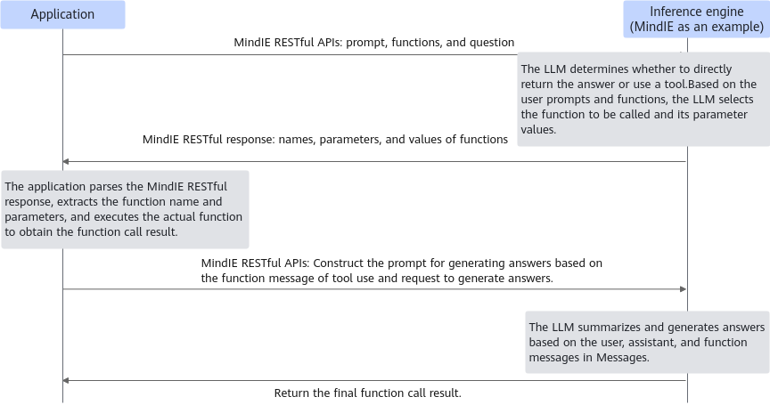

# Function Call

The function call capability of an LLM, also known as the tool use capability, allows the model to call external tools, thereby extending the application scope of the model. Specifically, it allows a model to directly call external functions or APIs to obtain the capability of executing specific tasks, obtaining real-time data, or enhancing decision-making. This feature not only broadens the application scope of models to tackle more complex and specific problems, but also enhances the practicality and interactivity of models. It establishes an efficient connection between LLMs and external systems, offering users richer and more personalized services.

The following uses tool use to represent the function call feature.

**Figure 1** Tool use process<a name="fig11208183710820"></a>


## Procedure

1. The upper-layer application sends system prompts and user inputs to an LLM, and provides the tool set available for model execution.
2. Based on system prompts and user inputs, the model determines whether to directly return an answer or select one or more functions from the tool set provided by the application. If a tool is selected, return the tool name and tool parameters to the upper-layer application.
3. The upper-layer application parses the response from the inference engine, extracts the information about the selected tool, and executes the function selected by the model to obtain the tool use result.
4. The upper-layer application uses the tool use result to construct a prompt for generating an answer, and sends the prompt to the model again to request to generate a final answer.
5. The model summarizes information based on the tool use result, generates an answer, and returns the answer.

## Constraints

- The Atlas 800I A2 inference server, Atlas 800I A3 SuperPoD server, and Atlas 300I Duo inference card support this feature.
- Currently, the ChatGLM3-6B, Qwen3-32B, Qwen3-235B-A22B, Qwen3-30B-A3B, DeepSeek-R1-0528, Qwen2.5-Instruct, and DeepSeek-V3.1 series models support this feature.
- To use the function call feature, parameters listed in [Parameter description](#table1) must be configured for the DeepSeek-V3.1 series models. For other models, these parameters do not need to be configured.
- Currently, only the OpenAI chat API is supported.
- The function call feature can be used with the quantization, long sequence, multi-server inference, prefill-decode disaggregation, MoE, Multi-LoRA, SplitFuse, parallel decoding, expert parallelism, MTP, prefix cache, reasoning analysis (excluding DeepSeek-V3.1, which does not support enabling both function call and reasoning analysis in a single request), tensor parallelism, and MLA features. However, the SplitFuse, parallel decoding, and MTP features cannot be used with the function call feature in streaming inference.
- Currently, the function call feature does not support the postprocessing parameters `include_stop_str_in_output`, `stop`, `best_of`, `n`, `use_beam_search`, and `logprobs`. If the temperature is set to a large value (which will increase sampling randomness), the stability of function call triggering may be affected.
- The function call feature supports non-streaming inference. Only the function call feature of the Qwen3-32B, Qwen3-235B-A22B, Qwen3-30B-A3B, and DeepSeek-R1-0528 models supports streaming inference.
- When a request packet contains the function call feature, the current version supports a maximum JSON nesting depth of 10 levels.

## Parameter Description

[Table 1](#table1) lists the parameters that can be configured when the function call feature is used.

**Table 1** Supplementary parameters for the function call feature: models parameter in ModelConfig <a id="table1"></a>

|Parameter|Value Type|Value Range|Parameter Description|
|--|--|--|--|
|chat_template|string|Path of the .jinja file|Imports a custom dialog template to replace the default dialog template. <ul><li>Default value: `""`</li><li>For DeepSeek models, the default `chat_template` in `tokenizer_config.json` cannot be called using tools. You can use this parameter to input the `chat_template` that can be called using tools. </li><li>This parameter can be used to input a custom template for DeepSeek, Qwen (LLM), ChatGLM, and Llama models.</li></ul>|
|tool_call_options|-|-|-|
|tool_call_parser|string|Optional Registered Name in Table 2 Registered ToolsCallProcessor<br>""|Parsing mode of the tool when the function call feature is enabled.<br><ul><li>Default value: `""`</li><li> If this parameter is not set or is set to an incorrect value, the default tool parsing mode corresponding to the current model is used. </li><li>When DeepSeek-V3.1 uses the function call feature, this parameter must be set to `deepseek_v31`. For other models, use the default value. </li><li>This parameter is used together with `chat_template`. The corresponding `ToolsCallProcessor` is selected based on the function call format specified in `chat_template`.</li></ul>|

**Table 2** Registered ToolsCallProcessor <a id="table2"></a>

|Tool Call Parser|Optional Registered Name|Description|
|--|--|--|
|ToolsCallProcessorChatglmV2|chatglm2_6b, chatglm_v2_6b, chatglm_v2, and chatglm2|Return the content directly without performing tool call parsing.|
|ToolsCallProcessorChatglmV3|chatglm3_6b, chatglm_v3_6b, chatglm_v3, and chatglm3|Tool call parser for ChatGLM3-6B.|
|ToolsCallProcessorChatglmV4|chatglm4_9b, chatglm_v4_9b, glm_4, and glm_4_9b|Tool call parser for GLM4-9B.|
|ToolsCallProcessorDeepseekv3|deepseek_v2, deepseek_v3, deepseekv2, and deepseekv3|Tool call parser for DeepSeek-R1-0528 and DeepSeek-V3-0324.|
|ToolsCallProcessorDeepseekv31|deepseek_v31 and deepseekv31|Tool call parser for DeepSeek-V3.1.|
|ToolsCallProcessorLlama|llama, llama3, and llama3_1|Tool call parser for Llama3.|
|ToolsCallProcessorQwen1_5_or_2|qwen1_5, qwen_1_5, qwen2, qwen_2, qwen1_5_or_2, and qwen_1_5_or_2|Tool call parser for Qwen1.5 and Qwen2.|
|ToolsCallProcessorQwen2_5|qwen2_5 and qwen_2_5|Tool call parser for Qwen2.5.|
|ToolsCallProcessorQwen3|qwen3, qwen3_moe, and hermes|Hermes tool call parsing for the Qwen3 and Qwen3-MoE series.|

## Inference

The following uses DeepSeek-V3.1 as an example to describe how to use the function call feature.

1. Open the `config.json` file of the server.

   - **Installation using the `.whl` package:**

    ```bash
    cd {MindIE_installation_directory}/mindie_llm/
    vi conf/config.json
    ```

   - **Installation using the `.run` package:**

    ```bash
    cd {MindIE_installation_directory}/latest/mindie-service
    vi conf/config.json
    ```

2. Set serving parameters.

    Add the `tool_call_parser` and `chat_template` fields to the `config.json` file of the server based on [Parameter description](#parameter-description). For details about the serving parameters, see [Service Parameter Configuration (Serving)](../user_manual/service_parameter_configuration.md). The following is an example of parameter configuration:

    ```json
     "ModelDeployConfig" :
            {
                "maxSeqLen" : 2560,
                "maxInputTokenLen" : 2048,
                "truncation" : 0,
                "ModelConfig" : [
                    {
                        "modelInstanceType" : "Standard",
                        "modelName" : "dsv31",
                        "modelWeightPath" : "/data/weight/DeepSeek-V3.1",
                        "worldSize" : 16,
                        "cpuMemSize" : 0,
                        "npuMemSize" : -1,
                        "backendType" : "atb",
                        "trustRemoteCode" : false,
                        "async_scheduler_wait_time": 120,
                        "kv_trans_timeout": 10,
                        "kv_link_timeout": 1080,
                        "models": {
                                "deepseekv2": {
                                        "tool_call_options": {
                                                "tool_call_parser": "deepseek_v31"
                                        },
                                        "chat_template": "/path/to/tool_chat_template_deepseekv31.jinja"
                                }
                        }
                    }
                ]
            },
    ```

    > [!NOTE]
    >- DeepSeek-V3.1: `tool_call_parser` must be set to `deepseek_v31`. Otherwise, `deepseek_v3` is used by default, which is incompatible with the DeepSeek-V3.1 model format and may cause incorrect parsing.
    >- Other models: Steps 1 and 2 are not required. The system automatically matches the tool call parsing mode for the corresponding model. If this parameter is configured, change the value of `deepseekv2` to `model_type` of the corresponding model.
    >- `chat_template`: If this parameter is specified, it will override the default `chat_template` defined in the model's `tokenizer_config.json` file. For DeepSeek-V3.1, DeepSeek-R1-0528, and DeepSeek-V3-0324, the default `chat_template` in the model weights' `tokenizer_config.json` file does not support function call. Therefore, you need to set `chat_template` to specify a template that supports function call.
    >- The format of `chat_template` (such as spaces and line breaks) may affect the accuracy of dataset and function call scoring.

3. Start the service.

   - **Installation using the `.whl` package:**

    ```bash
    mindie_llm_server
    ```

   - **Installation using the `.run` package:**

    ```bash
    ./bin/mindieservice_daemon
    ```

4. <a name="step4"></a>Send a request to the service. For details about the parameters, see "Compatible with OpenAI APIs" > "[Inference APIs](https://www.hiascend.com/document/detail/en/mindie/310/mindiellm/llmdev/mindie_llm0022.html)".

    **Request example**:

    ```json
    curl -H "Accept: application/json" -H "Content-type: application/json" --cacert ca.pem --cert client.pem  --key client.key.pem -X POST -d '{
        "model": "dsv31",
        "messages": [
            {
                "role": "system",
                "content": "You are a helpful customer support assistant. Use the supplied tools to assist the user."
            },
            {
                "role": "user",
                "content": "Hi, can you tell me the delivery date for my order?  my order number is 999888"
            }
        ],
        "tools": [
            {
                "type": "function",
                "function": {
                    "name": "get_delivery_date",
                    "description": "Get the delivery date for a customer\u0027s order. Call this whenever you need to know the delivery date, for example when a customer asks \u0027Where is my package\u0027",
                    "parameters": {
                        "type": "object",
                        "properties": {
                            "order_id": {
                                "type": "string",
                                "description": "The customer\u0027s order ID."
                            }
                        },
                        "required": [
                            "order_id"
                        ],
                        "additionalProperties": false
                    }
                }
            }
        ],
        "tool_choice": "auto",
        "stream": false
    }'  https://127.0.0.1:1025/v1/chat/completions
    ```

    **Response example**:

    ```json
    {
        "id": "chatcmpl-123",
        "object": "chat.completion",
        "created": 1677652288,
        "model": "dsv31",
        "choices": [
            {
                "index": 0,
                "message": {
                    "role": "assistant",
                    "content": "",
                    "tool_calls": [
                        {
                            "function": {
                                "arguments": "{\"order_id\": \"999888\"}",
                                "name": "get_delivery_date"
                            },
                            "id": "call_JwmTNF3O",
                            "type": "function"
                        }
                    ]
                },
                "finish_reason": "tool_calls"
            }
        ],
        "usage": {
            "prompt_tokens": 226,
            "completion_tokens": 122,
            "total_tokens": 348
        },
        "prefill_time": 200,
        "decode_time_arr": [56, 28, 28, 28, 28, ..., 28, 32, 28, 28, 41, 28, 25, 28]
    }
    ```

    Call the related local tool based on `tool_calls` returned by the model, use the assistant role to associate `tool_calls` with the ID returned by the API in [4](#step4), use the tool role to associate the tool execution result with the ID returned by the API in [4](#step4), and send a request to the LLM.

    ```json
    curl -H "Accept: application/json" -H "Content-type: application/json" --cacert ca.pem --cert client.pem  --key client.key.pem -X POST -d '{
        "model": "dsv31",
        "messages": [
            {
                "role": "user",
                "content": "Hi, can you tell me the delivery date for my order?  my order number is 999888"
            },
            {
                "role": "assistant",
                "content": "",
                "tool_calls": [
                    {
                        "function": {
                            "arguments": "{\"order_id\": \"999888\"}",
                            "name": "get_delivery_date"
                        },
                        "id": "call_JwmTNF3O",
                        "type": "function"
                    }
                ]
            },
            {
                "role": "tool",
                "content": "the delivery date is 2024.09.10.",
                "tool_call_id": "call_JwmTNF3O"
            }
        ],
        "stream": false,
        "max_tokens": 4096
    }' https://127.0.0.1:1025/v1/chat/completions
    ```
