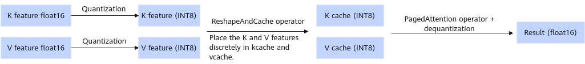

# KV Cache int8

## Overview

In this quantization method, the k cache and v cache are quantized to 8-bit values, reducing the graphics memory usage of the KV cache. In scenarios where the graphics memory is limited (for example, in long-sequence scenarios), the number of recomputations can be reduced to improve the throughput.

> [!NOTE]NOTE
>
>- Only the Atlas 800I A2 inference server supports int8 quantization of the KV cache.
>- This method must be used together with W8A8.
>- Only LLaMA3.1-70B, Qwen2-72B and Qwen2.5-72B-Instruct are supported.
>- Only the float16 data type is supported.

Directory structure of quantized weights after KV Cache INT8 and W8A8 quantization:

```text
├─ config.json
├─ quant_model_weight_w8a8.safetensors
├─ quant_model_description_w8a8.json
├─ tokenizer_config.json
├─ tokenizer.json
└─ tokenizer.model
```

- Quantized outputs include: `quant_model_weight_w8a8.safetensors` (weight file) and `quant_model_description_w8a8.json` (weight description file).
- The other files in the directory are required for inference, and they vary slightly by model.

The following shows part of the quantized weight description file `quant_model_description_w8a8.json`:

```json
{
  "model_quant_type": "W8A8",
  "kv_cache_type": "C8",
  "model.embed_tokens.weight": "FLOAT",
  "model.layers.0.self_attn.q_proj.weight": "FLOAT",
  "model.layers.0.self_attn.k_proj.weight": "FLOAT",
  "model.layers.0.self_attn.k_proj.kv_cache_scale": "W8A8",
  "model.layers.0.self_attn.k_proj.kv_cache_offset": "W8A8",
  "model.layers.0.self_attn.v_proj.weight": "FLOAT",
  "model.layers.0.self_attn.v_proj.kv_cache_scale": "W8A8",
  "model.layers.0.self_attn.v_proj.kv_cache_offset": "W8A8"
}
```

Compared with W8A8-quantized weights, the following are added: `kv_cache_type` description field, the `kv_cache_scale` quantization scaling factor weight file for KV linear activations, and the `kv_cache_offset` quantization offset weight file for KV linear activations. During inference, these two weights are used to derive: `k_quant_scale`, `k_dequant_scale`, `v_quant_scale`, `v_dequant_scale`, `k_quant_offset`, `k_dequant_offset`, `v_quant_offset`, and `v_dequant_offset`. `quant_scale` and `quant_offset` quantize the `k` and `v` features to `int8`. `dequant_scale` and `dequant_offset` dequantize the outputs of paged attention to the floating-point format.

**Figure 1** Process of inference with quantized weights<a name="fig792521919554"></a>


**Table 1** dtype and shape information after float16 weight quantization (assuming that shape of the original weight is `[n, k]`)

|Tensor Information|kv_cache_scale|kv_cache_offset|
|--|--|--|
|dtype|float16|float16|
|shape|[kv_head_num * kv_head_dim]|[kv_head_num * kv_head_dim]|

**Table 2** dtype and shape information after bfloat16 weight quantization (assuming that shape of the original weight is `[n, k]`)

|Tensor Information|kv_cache_scale|kv_cache_offset|
|--|--|--|
|dtype|bfloat16|bfloat16|
|shape|[kv_head_num * kv_head_dim]|[kv_head_num * kv_head_dim]|
