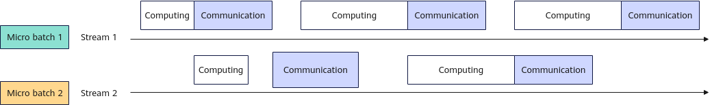

# Micro Batch

Micro-batch processing is a technique where data is split into smaller batches for execution. In the current implementation, an additional data stream is created to split a batch of data into two batches, which are executed on two separate data streams. During computation in Dataflow 1, Dataflow 2 can communicate, overlapping computation and communication overhead. This fully utilizes hardware resources, improving inference throughput.

**Figure 1** Micro-batch processing with dual data streams



Data streams are synchronized using the event mechanism, ensuring that computation and communication tasks do not conflict with each other and preventing hardware resource contention. This feature is typically used in the prefill phase because communication operators consume long execution time and the execution duration of communication and compute operators is balanced. In this implementation, the overlap between computation and communication exceeds 70%.

## Constraints

- This feature is disabled by default.
- This feature cannot be enabled together with the merged communication-computing operator feature.
- Only the Qwen2.5 series, Qwen3 dense series, DeepSeek-R1, and DeepSeek-V3.1 models support this feature.
  - For the Qwen model, this feature can be enabled together with parallel decoding, asynchronous scheduling, SplitFuse, and prefix cache.
  - For the Deepseek model, this feature can be enabled together with the MTP feature.
- Enabling this feature will occupy extra graphics memory. In serving scenarios, if the number of KV caches decreases, scheduling will be affected and the throughput will decrease. Therefore, you are advised not to enable this feature when the graphics memory is limited.

## Parameter Description

[Table 1](#table1) describes the parameters required for enabling the micro batch feature.

**Table 1** Micro batch parameters: `models` in `ModelConfig` <a id="table1"></a>

|Parameter|Value Type|Value Range|Configuration Description|
|--|--|--|--|
|stream_options|-|-|-|
|micro_batch|bool|<ul><li>true</li><li>false</li></ul>|Whether to enable the communication-computing dual-stream overlapping feature.<br>The default value is `false` (disabling the feature).|

## Inference

1. Open the `config.json` file of the server.

   - **Installation using the `.whl` package:**

    ```bash
    cd {MindIE_installation_directory}/mindie_llm/
    vi conf/config.json
    ```

   - **Installation using the `.run` package:**

    ```bash
    cd {MindIE_installation_directory}/latest/mindie-service
    vi conf/config.json
    ```

2. Set serving parameters. Add the `micro_batch` field (the following bold part) to the `config.json` file of MindIE. For details about the parameter fields, see [Table 1](#table1). For details about the serving parameters, see [Configuration Parameters (Serving)](../user_manual/service_parameter_configuration.md). The following is an example of parameter configuration.

    ```json
    "ModelDeployConfig" :
    {
       "maxSeqLen" : 2560,
       "maxInputTokenLen" : 2048,
       "truncation" : 0,
       "ModelConfig" : [
         {
             "modelInstanceType" : "Standard",
             "modelName" : "Qwen3-14B",
             "modelWeightPath" : "/data/weights/Qwen3-14B",
             "worldSize" : 8,
             "cpuMemSize" : 5,
             "npuMemSize" : -1,
             "backendType" : "atb",
             "trustRemoteCode" : false,
             "models": {
                "qwen3": {
                    "ccl": {
                        "enable_mc2": false
                    },
                    "stream_options": {
                        "micro_batch": true
                    }
                }
             }
          }
       ]
    },
    ```

3. Start the service.

   - **Installation using the `.whl` package:**

    ```bash
    mindie_llm_server
    ```

   - **Installation using the `.run` package:**

    ```bash
    ./bin/mindieservice_daemon
    ```
