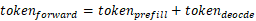
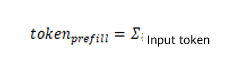
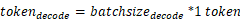

# SplitFuse

The SplitFuse feature is used to split a long prompt request into smaller chunks and schedule the chunks in multiple forward steps. The prompt request is generated only after the last forward step is complete. Short prompt requests are combined to accurately fill the gap of steps. In this way, the calculation workload of each step is basically the same, which can achieve a more stable average latency of all requests.

When MindIE uses the prefill-decode co-location policy by default, requests in the prefill and decode phases are not combined into a single batch. However, with SplitFuse enabled, MindIE integrates prefill requests into the same batch when decode requests are processed first and the batch size is less than `maxBatchSize`.

When `feedforward` is greater than `splitChunk tokens`, SplitFuse splits it as follows:

- In each inference round: , where: 
- In the prefill phase, `tokens` indicates the number of input tokens, and in the decode phase, each request has one token: 

Two key behaviors:

1. Long prompts are split into smaller chunks and scheduled in multiple iterations. Only after the last iteration, tokens can be generated.

2. Short prompts may also be split into small chunks to ensure optimal computing efficiency.

Advantages:

- **Faster response**: The latency in processing long prompts is reduced, improving user experience.

- **Efficiency improvement**: Proper combination of short prompts ensures that a model runs at a high throughput.

- **Enhanced consistency**: Unified forward propagation can reduce latency fluctuation and stabilize generation frequency.

## Constraints

- The Atlas 800I A2 inference server and Atlas 800I A3 SuperPoD server support this feature.
- The Llama 3.1 70B floating-point model, Qwen2, Qwen2.5, and Qwen3 series models support this feature.
- This feature supports only the W8A8 quantization.
- This feature cannot be used with Multi-LoRA, Function Call, parallel decoding, MTP, or long sequence.
- This feature supports the `n`, `best_of`, and `use_beam_search` postprocessing parameters.

## Parameter Description

[Table 1](#table1) and [Table 2](#table2) list the supplementary parameters required for enabling the SplitFuse feature.

**Table 1** SplitFuse parameter: **`ModelConfig` in `ModelDeployConfig`** <a id="table1"></a>

|Parameter|Value Type|Value Range|Configuration Description|
|--|--|--|--|
|plugin_params|std::string|"{\"plugin_type\":\"splitfuse\"}"|<ul><li>If the value is set to `{"plugin_type":"splitfuse"}`, SplitFuse is executed. </li><li>If no plugin function is required, remove this field from the configuration.</li></ul><br>Restriction: If `templateType` is set to `Mix`, this parameter must be set to enable SplitFuse. (This parameter is optional when SplitFuse is disabled.)|

**Table 2** SplitFuse parameter: `ScheduleConfig` <a id="table2"></a>

|Parameter|Value Type|Value Range|Configuration Description|
|--|--|--|--|
|templateType|std::string|`Standard` or `Mix`|<ul><li>`Mix`: hybrid inference scenario, where batch processing can be performed for prefill and decode requests at the same time. </li><li>`Standard`: default value (required when the feature is disabled), indicating that prefill and decode requests are grouped in batches respectively.</li></ul>|
|prefillChunkSize|uint32_t|[1,maxPrefillTokens]|If this parameter is set, fixed-length splitting is enabled for prefill requests. If this parameter is not set, the dynamic length splitting is performed based on the values of `maxPrefillTokens` and the number of prefill requests.|
|maxNumPartialPrefills|uint32_t|[1,maxBatchSize]|This parameter is used for dynamic splitting and indicates the maximum number of requests that can be partially prefilled in parallel in a batch. The default value is `64`.|
|longPrefillTokenThreshold|uint32_t|[1,maxPrefillTokens]|This parameter is used for dynamic splitting. It indicates the token count threshold for a request to be considered as a long prefill request. If the prompt length of a request exceeds this threshold and the number of long prefill requests in a batch exceeds the value of `maxLongPartialPrefills`, the excess requests will be scheduled with a delay to ensure the TTFT of short sequences. The default value is `1024`.|
|maxLongPartialPrefills|uint32_t|[1,maxBatchSize]|This parameter is used for dynamic splitting. It indicates the maximum number of long prefill requests allowed in a batch. The default value is `8`.|

## Inference

1. Open the `config.json` file of the server.

    - **Installation using the `.whl` package:**

    ```bash
    cd {MindIE_installation_directory}/mindie_llm/
    vi conf/config.json
    ```

    - **Installation using the `.run` package:**

    ```bash
    cd {MindIE_installation_directory}/latest/mindie-service
    vi conf/config.json
    ```

2. Set serving parameters. Add the `plugin_params` and `templateType` parameters to the `config.json` file of the server. For performance tuning, you need to edit `ScheduleConfig` in the `config.json` configuration file. It is recommended that you configure the `prefillChunkSize` parameter when a fixed chunk size is required. In other scenarios, you can use the default dynamic splitting configuration.

    For details about the SplitFuse parameters, see [Table 1](#table1) and [Table 2](#table2). For details about the serving parameters, see [Configuration Parameters (Serving)](../user_manual/service_parameter_configuration.md). The following is an example of parameter configuration.

    ```json
            "ModelDeployConfig":
            {
                "maxSeqLen" : 65536,
                "maxInputTokenLen" : 65536,
                "truncation" : 0,
                "ModelConfig" : [
                    {
                        "modelInstanceType": "Standard",
                        "modelName" : "llama3-70b",
                        "modelWeightPath" : "/home/models/llama3-70b/",
                        "worldSize" : 8,
                        "cpuMemSize" : 5,
                        "npuMemSize" : -1,
                        "backendType": "atb",
                        "plugin_params": "{\"plugin_type\":\"splitfuse\"}"
                    }
                ]
            },
            "ScheduleConfig":
            {
                "templateType": "Mix",
                "templateName" : "Standard_LLM",
                "cacheBlockSize" : 128,

                "maxPrefillBatchSize" : 40,
                "maxPrefillTokens" : 65536,
                "prefillTimeMsPerReq" : 600,
                "prefillPolicyType" : 0,

                "decodeTimeMsPerReq" : 50,
                "decodePolicyType" : 0,
                "maxBatchSize" : 256,
                "maxIterTimes" : 512,
                "maxPreemptCount" : 0,
                "supportSelectBatch" : false,
                "maxQueueDelayMicroseconds" : 5000,

                "prefillChunkSize" : 1024,
                "maxNumPartialPrefills" : 64,
                "longPrefillTokenThreshold" : 1024,
                "maxLongPartialPrefills" : 8
            }
    ```

3. Start the service.

   - **Installation using the `.whl` package:**

    ```bash
    mindie_llm_server
    ```

   - **Installation using the `.run` package:**

    ```bash
    ./bin/mindieservice_daemon
    ```

4. Use the AISBench tool to perform a performance test. For details, see "[Performance Test](https://gitcode.com/Ascend/MindIE-LLM/blob/v3.1.0/docs/en/user_guide/quick_start/quick_start.md)" in *Quick Start*.

5. Adjust parameters based on the actual values of the TTFT and decode latency.
    - If both the TTFT and decode latency (average value: P90) meet the threshold requirements, increase the value of `RequestRate`.
    - If the average decode latency is less than the restricted threshold while the average TTFT is not, the value of `RequestRate` is greater than the system throughput. In this case, decrease the value of `RequestRate`.
    - If the average TTFT and decode latency meet the threshold requirements but the average P90 decode latency does not, reduce the chunk size. However, this operation may affect the overall throughput.
    - When input questions vary in length, the prefill-decode co-location policy tends to generate more scheduling bubbles. In contrast, the SplitFuse feature is less impacted by such bubbles, resulting in superior performance.
