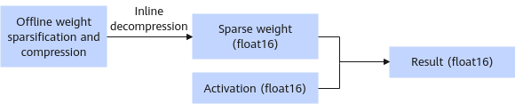

# W16A16SC Sparse Quantization

## Overview

This quantization mode is floating-point sparse quantization. The following two operations are performed on the existing weights:

- Sparsification: The model sparsification tool uses an algorithm to determine the importance of each element in the model weights to the accuracy result and sets the weights that have little impact on the final accuracy to zero.
- Compression: The weight compression tool further encodes and compresses model weights using a compression algorithm to minimize the weight size and generate compressed weights and an index file.

    > [!NOTE]NOTE
    >- Compression algorithms are highly dependent on hardware capabilities, and floating-point sparse compression quantization is supported only by the Atlas 300I Duo inference card.
    >- Only Qwen3-32B is supported.

    Weight directory structure after sparsification:

    ```text
    ├─ config.json
    ├─ quant_model_weights.safetensors
    ├─ quant_model_description.json
    ├─ tokenizer_config.json
    ├─ tokenizer.json
    └─ tokenizer.model
    ```

    - The sparse output includes: `quant_model_weights.safetensors` (weight file) and `quant_model_description.json` (weight description file).
    - The other files in the directory are required for inference, and they vary slightly by model.

    The following shows part of the sparsified weight description file `quant_model_description.json`:

    ```json
    {
      "model_quant_type": "W16A16S",
      "model.embed_tokens.weight": "FLOAT",
      "model.layers.0.self_attn.q_proj.weight": "W16A16S",
      "model.layers.0.self_attn.k_proj.weight": "W16A16S",
      "model.layers.0.self_attn.v_proj.weight": "W16A16S",
      "model.layers.0.self_attn.o_proj.weight": "W16A16S",
      "model.layers.0.self_attn.q_norm.weight": "FLOAT",
      "model.layers.0.self_attn.k_norm.weight": "FLOAT"
    }
    ```

    Weight directory structure after compression:

    ```text
    ├─ config.json
    ├─ part0-of-4
    │  ├─ quant_model_weight_w16a16sc.safetensors
    │  └─ quant_model_description.json
    ├─ part1-of-4
    │  ├─ quant_model_weight_w16a16sc.safetensors
    │  └─ quant_model_description.json
    ├─ part2-of-4
    │  ├─ quant_model_weight_w16a16sc.safetensors
    │  └─ quant_model_description.json
    ├─ part3-of-4
    │  ├─ quant_model_weight_w16a16sc.safetensors
    │  └─ quant_model_description.json
    ├─ tokenizer_config.json
    └─ tokenizer.json
    ```

    Before compression, the weights are loaded and split across devices. The compression algorithm must be executed based on the split weights.

    The following shows part of the quantized weight description file `part0-of-4/quant_model_description.json`:

    ```json
    {
      "model_quant_type": "W16A16SC",
      "model.embed_tokens.weight": "FLOAT",
      "transformer.h.0.attn.c_attn.weight": "W16A16SC",
      "transformer.h.0.attn.c_attn.index": "W16A16SC",
      "transformer.h.0.attn.c_attn.info": "W16A16SC",
      "transformer.h.0.attn.c_proj.weight": "W16A16SC",
      "transformer.h.0.attn.c_proj.index": "W16A16SC",
      "transformer.h.0.attn.c_proj.info": "W16A16SC",
      "transformer.h.0.attn.q_norm.weight": "FLOAT",
      "transformer.h.0.attn.k_norm.weight": "FLOAT",
      "transformer.h.0.attn.c_attn.weight.outdim": 2560,
      "transformer.h.0.attn.c_proj.weight.outdim": 5120,
    }
    ```

    Compared with sparsification, the compressed MatMul weights have `index` and `outdim` added. `index` is used to restore the weight, and `outdim` is used to restore the output dimension.

    **Figure 1** Process of inference with quantized weights<a name="fig23731756155515"></a>
    

**Table 1** dtype and shape information after float16 weight quantization (assuming that shape of the original weight is `[n, k]`)

|Tensor|weight|quant_bias|index|
|--|--|--|--|
|dtype|int8|float32|int8|
|shape|[x]<br>The value range of **x** is determined by the compression ratio.|[n]|[y] stores the index of the non-zero elements.|

## Prerequisites

Before using the sparse quantization script, install the msModelSlim tool. For details about the installation procedure, see [msModelSlim Installation](https://gitcode.com/Ascend/msit/blob/master/msmodelslim/docs/%E5%AE%89%E8%A3%85%E6%8C%87%E5%8D%97.md).

## Weight Generation

The following uses Qwen3-32B as an example:

1. Run the following command to generate the W16A16S floating-point sparse weights:

    ```bash
    msmodelslim quant --model_path ${floating_point_weight_path} --save_path ${W16A16S_quantized_weight_save_path} --device npu --model_type Qwen3-32B --quant_type w16a16s --trust_remote_code True
    ```

    - The preceding command contains the optimal parameter configuration for generating the Qwen3-32B W16A16S floating-point sparse weights.
    - This quantization method has been integrated into the one-click quantization function of the msModelSlim tool. For details about the parameter configuration, see [One-Click Quantization Usage Guide](https://gitcode.com/Ascend/msit/blob/master/msmodelslim/docs/%E5%8A%9F%E8%83%BD%E6%8C%87%E5%8D%97/%E4%B8%80%E9%94%AE%E9%87%8F%E5%8C%96/%E4%BD%BF%E7%94%A8%E8%AF%B4%E6%98%8E.md
    )".

2. Use the following instruction to set the environment variable of the Python path where msModelSlim is located. `{Python Lib Path}` is the Python path in the compilation procedure for msModelSlim installation.

    ```bash
    export LD_LIBRARY_PATH={Python Lib Path}/lib:$LD_LIBRARY_PATH
    ```

3. Run the following command to compress the floating-point sparse weights to generate the W16A16SC-quantized weights:

    ```bash
    torchrun --nproc_per_node {Number_of_TPs} -m examples.convert.model_slim.sparse_compressor --model_path {W16A16S_quantized_weight_path} --save_directory {W16A16SC_quantized_weight_path}
    ```

    The number of TPs is the number of parallel tensors, which must be the same as the number of parallel tensors during weight running.

## Inference

The following uses Qwen3-32B as an example. You can run the following commands to perform a dialog test. The inference content is "What's deep learning?".

```bash
cd ${ATB_SPEED_HOME_PATH}
torchrun --nproc_per_node {Number_of_TPs} -m examples.run_pa --model_path {W16A16SC_quantized_weight_path}
```
