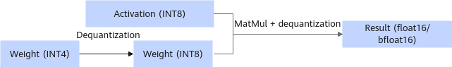

# W4A8 Hybrid Quantization

## Overview

Hybrid quantization is to use different quantization modes for different levels of a model. W4A8 hybrid quantization of DeepSeek R1/V3: The first three layers of MLP use W8A8 dynamic quantization, the MLA and shared expert layers use W8A8 quantization, and the routing expert layer uses W4A8 dynamic quantization. W4A8 dynamic quantization uses per-channel and per-group to perform 4-bit quantization on weights and 8-bit quantization on activations.

> [!NOTE]
>
>- Only DeepSeek-R1 and DeepSeek-V3 models are supported.
>- This feature can be used together with only anti-outlier processing but not KV cache INT8 quantization..
>- To enable the mixed deployment feature of shared experts, you need to change the shared expert layer quantization to W4A8 with special weights and keep W4A8 enabled.

Weight directory structure after quantization:

```text
├─ config.json
├─ quant_model_weight_w8a8.safetensors
├─ quant_model_description.json
├─ tokenizer_config.json
├─ tokenizer.json
└─ tokenizer.model
```

- Quantization output includes: `quant_model_weight_w8a8.safetensors` (weight file) and `quant_model_description.json` (weight description file).
- The other files in the directory are required for inference, and they vary slightly by model.

The following is a partial view of `quant_model_description.json` after quantization:

```json
{
  "model_quant_type": "W8A8_DYNAMIC",
  "model.embed_tokens.weight": "FLOAT",
  "model.layers.0.self_attn.q_proj.weight": "W8A8",
  "model.layers.0.self_attn.q_proj.weight_scale": "W8A8",
  "model.layers.0.self_attn.q_proj.weight_offset": "W8A8",
   ...
   "model.layers.1.mlp.gate_proj.weight": "W8A8_DYNAMIC",
   "model.layers.1.mlp.gate_proj.weight_scale": "W8A8_DYNAMIC",
   "model.layers.1.mlp.gate_proj.weight_offset": "W8A8_DYNAMIC",
   ...
  "model.layers.3.mlp.experts.0.gate_proj.weight": "W4A8_DYNAMIC",
  "model.layers.3.mlp.experts.0.gate_proj.weight_scale": "W4A8_DYNAMIC",
  "model.layers.3.mlp.experts.0.gate_proj.weight_scale_second": "W4A8_DYNAMIC",
   "model.layers.3.mlp.experts.0.gate_proj.scale_bias": "W4A8_DYNAMIC",
  ...
}
```

Quantized MatMul weights now include `weight_scale`, `weight_scale_second`, and `scale_bias` to dequantize the MatMul computation results.

**Figure 1** Process of inference with quantized weights <a name="fig132131518185315"></a> 


This quantization mode supports quantization of the original weights of the float16 or bfloat16 type.

**Table 1** dtype and shape information after float16 weight quantization (assuming that shape of the original weight is `[n, k]`)

|Tensor|weight|weight_scale|weight_scale_second|scale_bias|
|--|--|--|--|--|
|dtype|int4|float32|float32|uint64|
|shape|[n, k]|[n, 1]|[n, group_num]|[n,group_num]|

**Table 2** dtype and shape information after bfloat16 weight quantization (assuming that shape of the original weight is `[n, k]`)

|Tensor Information|weight|weight_scale|weight_scale_second|scale_bias|
|--|--|--|--|--|
|dtype|int4|bfloat32|bfloat32|uint64|
|shape|[n, k]|[n, 1]|[n, group_num]|[n,group_num]|

> [!NOTE]
> The quantized weight has bias only when the floating-point weight has bias.
