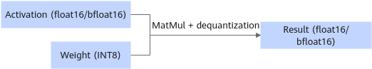

# W8A16

## Overview

In this quantization mode, activations are not quantized, and only weights are quantized to 8-bit format. The per-channel quantization scheme is used.

> [!NOTE]NOTE
>
>- Only the Atlas 800I A2 inference server supports this quantization mode.
>- Only LLaMA3-70B, Qwen1.5-110B, and Qwen2-72B are supported.
>- This feature must be used along with anti-outlier outlier processing and KV cache INT8 quantization.

Weight directory structure after quantization:

```text
├─ config.json
├─ quant_model_weight_w8a16.safetensors
├─ quant_model_description.json
├─ tokenizer_config.json
├─ tokenizer.json
└─ tokenizer.model
```

- Quantization output includes: `quant_model_weight_w8a16.safetensors` (weight file) and `quant_model_description.json` (weight description file).
- The other files in the directory are required for inference, and they vary slightly by model.

The following is a partial view of `quant_model_description.json` after quantization:

```json
{
  "model_quant_type": "W8A16",
  "model.embed_tokens.weight": "FLOAT",
  "model.layers.0.self_attn.q_proj.weight": "W8A16",
  "model.layers.0.self_attn.q_proj.weight_scale": "W8A16",
  "model.layers.0.self_attn.q_proj.weight_offset": "W8A16"
}
```

Quantized MatMul weights include `weight_scale` and `weight_offset` to dequantize the MatMul output.

**Figure 1** Process of inference with quantized weights<a name="fig132131518185315"></a>


This quantization mode supports quantization of the original weights of the float16 or bfloat16 type.

**Table 1** dtype and shape information after float16 weight quantization (assuming that shape of the original weight is `[n, k]`)

|Tensor|weight|weight_scale|weight_offset|bias|
|--|--|--|--|--|
|dtype|int8|float32|float32|float16|
|shape|[n, k]|[n, 1]|[n, 1]|[n]|

**Table 2** dtype and shape information after bfloat16 weight quantization (assuming that shape of the original weight is `[n, k]`)

|Tensor Information|weight|weight_scale|weight_offset|bias|
|--|--|--|--|--|
|dtype|int8|float32|float32|float32|
|shape|[n, k]|[n, 1]|[n, 1]|[n]|

> [!NOTE]NOTE
> The quantized weight has bias only when the floating-point weight has bias.
