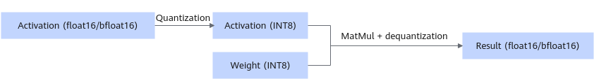

# W8A8

## Overview

In this quantization mode, the weights and activations are quantized, and the high-precision floating point numbers are converted into 8-bit numbers to reduce the size of the model weight. Using data in int8 format for computation can reduce the computation workload of the matrix multiplication (MatMul) operator and improve the inference performance.

Weight directory structure after quantization:

```text
├─ config.json
├─ configuration.json
├─ generation_config.json
├─ quant_model_description.json
├─ quant_model_weight_w8a8.safetensors
└─ tokenizer.json
```

- Quantized outputs: `quant_model_weight_w8a8.safetensors` (weight file) and `quant_model_description.json` (weight description file).
- The other files in the directory are required for inference, and they vary slightly by model.

The following shows part of the content in weight description file `quant_model_description.json` after quantization:

```json
{
  "model.layers.0.self_attn.q_proj.weight": "W8A8",
  "model.layers.0.self_attn.q_proj.input_scale": "W8A8",
  "model.layers.0.self_attn.q_proj.input_offset": "W8A8",
  "model.layers.0.self_attn.q_proj.quant_bias": "W8A8",
  "model.layers.0.self_attn.q_proj.deq_scale": "W8A8"
}
```

Quantized MatMul weights include `input_scale`, `input_offset`, `quant_bias`, and `deq_scale`. `input_scale` and `input_offset` are used to quantize the activations. MatMul uses the quantized activations and weights for computation. `quant_bias` and `deq_scale` are used to dequantize the computation result of MatMul.

**Figure 1** Process of inference with quantized weights <a name="fig82011323195212"></a> 


This quantization mode supports quantization of the original weights of the fp16 or bf16 type.

**Table 1** dtype and shape information after fp16 weight quantization (assuming that the shape of the original weight is `[n, k]`)

|Tensor|weight|input_scale|input_offset|quant_bias|deq_scale|
|--|--|--|--|--|--|
|dtype|int8|fp16|fp16|int32|int64|
|shape|[n, k]|[1]|[1]|[n]|[n]|

**Table 2** dtype and shape information after bf16 weight quantization (assuming that the shape of the original weight is `[n, k]`)

|Tensor|weight|input_scale|input_offset|quant_bias|deq_scale|
|--|--|--|--|--|--|
|dtype|int8|bf16|bf16|int32|fp32|
|shape|[n, k]|[1]|[1]|[n]|[n]|

## Generating Weights

You can use the [msModelSlim](https://gitcode.com/Ascend/msit/blob/master/msmodelslim/README.md) tool to generate quantized weights.

The following uses Qwen2-7B as an example. After installing msModelSlim, you can run the following command to quickly generate the W8A8-quantized weights:

```sh
msmodelslim quant --model_path {Floating_point_weight_path} --save_path {W8A8_quantized_weight_path} --device npu --model_type Qwen2-7B --quant_type w8a8 --trust_remote_code True
```

The preceding command is a best practice of msModelSlim. For details about more quantization parameter configurations, see the msModelSlim documentation.

## Inference

The following uses the Qwen2-7B-W8A8-quantized weight as an example. You can run the following commands to perform a dialog test, with the inference content being "What's deep learning?" and a maximum output of 20 tokens.

```sh
cd ${ATB_SPEED_HOME_PATH}
torchrun --master_port 12350 -m examples.run_pa --model_path {W8A8_quantized_weight_path}
```
