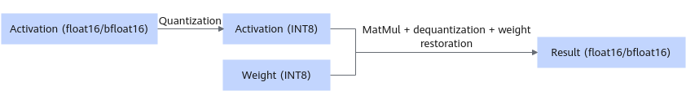

# W8A8SC Sparse Quantization

## Overview

The LLM sparse quantization tool provides three functions: sparsification, quantization, and compression.

- Sparsification: The model sparsification tool uses an algorithm to determine the importance of each element in the model weight to the precision result and sets the weight value that has little impact on the final precision to zero.
- Quantization: Both the weights and activations are quantized. The high-precision floating-point numbers are converted into 8-bit numbers, which directly reduces the size of the weights and brings performance benefits.
- Compression: The weight compression tool further encodes and compresses model weights using a compression algorithm to minimize the weight size and generate compressed weights and an index file.

> [!NOTE]
>
>- Compression algorithms are highly dependent on hardware capabilities, and sparse quantization is supported only by the Atlas 300I Duo inference card.
>- The bfloat16 weight does not support sparse quantization.
>- Only Qwen3-8B, Qwen3-14B, and Qwen3-32B are supported.
>- This feature can only be used along with the parallel decoding, prefix cache, function call, and long sequence features.

Weight directory structure after sparsification and quantization:

```text
├─ config.json
├─ quant_model_weight_w8a8s.safetensors
├─ quant_model_description.json
├─ tokenizer_config.json
├─ tokenizer.json
└─ tokenizer.model
```

- Quantized outputs: `quant_model_weight_w8a8s.safetensors` (weight file) and `quant_model_description.json` (weight description file).
- The other files in the directory are required for inference, and they vary slightly by model.

The following is a partial view of `quant_model_description.json` after quantization:

```json
{
  "model_quant_type": "W8A8S",
  "model.embed_tokens.weight": "FLOAT",
  "model.layers.0.self_attn.q_proj.weight": "W8A8S",
  "model.layers.0.self_attn.q_proj.input_scale": "W8A8S",
  "model.layers.0.self_attn.q_proj.input_offset": "W8A8S",
  "model.layers.0.self_attn.q_proj.quant_bias": "W8A8S",
  "model.layers.0.self_attn.q_proj.deq_scale": "W8A8S"
}
```

Quantized MatMul weights now include `input_scale`, `input_offset`, `quant_bias`, and `deq_scale`. `input_scale` and `input_offset` are used to quantize the activations. MatMul uses the quantized activations and weights for computation. `quant_bias` and `deq_scale` are used to dequantize the MatMul computation result.

Weight directory structure after compression:

```text
├─ config.json
├─ part0-of-4
│  ├─ quant_model_weight_w8a8sc.safetensors
│  └─ quant_model_description.json
├─ part1-of-4
│  ├─ quant_model_weight_w8a8sc.safetensors
│  └─ quant_model_description.json
├─ part2-of-4
│  ├─ quant_model_weight_w8a8sc.safetensors
│  └─ quant_model_description.json
├─ part3-of-4
│  ├─ quant_model_weight_w8a8sc.safetensors
│  └─ quant_model_description.json
├─ tokenizer_config.json
├─ tokenizer.json
└─ tokenizer.model
```

Before compression, the weights are loaded and split across devices. The compression algorithm needs to be executed based on the split weights.

The following shows part of the quantized weight description file `part0-of-4/quant_model_description.json`:

```json
{
  "model_quant_type": "W8A8SC",
  "transformer.wte.weight": "FLOAT",
  "transformer.h.0.attn.c_attn.weight": "W8A8SC",
  "transformer.h.0.attn.c_attn.index": "W8A8SC",
  "transformer.h.0.attn.c_attn.info": "W8A8SC",
  "transformer.h.0.attn.c_attn.input_scale": "W8A8S",
  "transformer.h.0.attn.c_attn.input_offset": "W8A8S",
  "transformer.h.0.attn.c_attn.deq_scale": "W8A8S",
  "transformer.h.0.attn.c_attn.quant_bias": "W8A8S"
}
```

Compared with quantization, the compressed MatMul weights include an index. The compression information is used to restore the weights.

**Figure 1** Process of inference with quantized weights <a name="fig13717203714549"></a>


**Table 1** dtype and shape information after float16 weight quantization (assuming that shape of the original weight is `[n, k]`)

|Tensor|weight|input_scale|input_offset|quant_bias|deq_scale|index|
|--|--|--|--|--|--|--|
|dtype|int8|float16|int8|int32|int64|int8|
|shape|[x]<br>(The value of *x* ranges from 0 to n × k.)|[1]|[1]|[n]|[n]|[y]<br>*y* is calculated as follows:<br>y = k_index *n_index* 8<br>k_index = ceil(k1 / tilingK)<br>n_index = ceil(n1 / tilingN)<br>k1 = k / 32<br>n1 = n / 16<br>The ceil() function rounds up the result, and `tilingK` and `tilingN` are default sparse quantization parameters.|

## Prerequisites

Before using the sparse quantization script, install the msModelSlim tool. For details about the installation procedure, see [msModelSlim Installation](https://gitcode.com/Ascend/msmodelslim/blob/26.1.0/docs/en/install_guide/install_guide.md).

## Weight Generation

The following uses Qwen3-8B as an example:

1. Use the following instructions to generate the W8A8S-quantized weights.

    ```bash
    msmodelslim quant --model_path ${Floating_point_weight_path} --save_path ${W8A8S_quantized_weight_save_path} --device npu --model_type Qwen3-8B --quant_type w8a8s --trust_remote_code True
    ```

    - The preceding command demonstrates the optimal parameter configuration for generating the W8A8S sparse quantization weights of Qwen3-8B. Different models require different parameter configurations. Check the `README` file of the model for more details.
    - After the weights are generated, copy the `special_tokens_map.json` file of the floating-point weights to the W8A8S-quantized weight path.

2. Run the following command to set the environment variable of the Python path where msModelSlim is located. `{Python Lib Path}` is the Python path in the compilation procedure for msModelSlim installation.

    ```bash
    export LD_LIBRARY_PATH={Python Lib Path}/lib:$LD_LIBRARY_PATH
    ```

3. Run the following command to compress the quantized weights to generate the W8A8SC-quantized weights:

    ```bash
    torchrun --nproc_per_node {Number_of_TPs} -m examples.convert.model_slim.sparse_compressor --model_path {W8A8S_quantized_weight_path} --save_directory {W8A8SC_quantized_weight_path}
    ```

    The number of TPs is the number of parallel tensors, which must be the same as the number of parallel tensors during weight running.

## Inference

The following uses Qwen3-8B as an example. You can run the following commands to perform a dialog test. The inference content is "What's deep learning?".

```bash
cd ${ATB_SPEED_HOME_PATH}
bash examples/models/qwen/run_pa.sh -m {W8A8SC_quantized_weight_path} --trust_remote_code true
```
