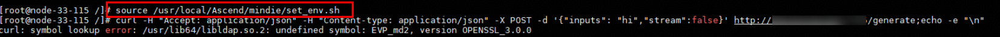

# cURL Command Fails After Installing MindIE

<!-- md-trans-meta sourceCommit=unknown translatedAt=2026-05-28T08:55:44.297Z pushedAt=2026-06-01T09:45:39.189Z -->

## Symptom

After sourcing the MindIE environment variable script using the following command, a symbol lookup error occurs:  
`symbol lookup error: /usr/lib64/libldap.so.2: undefined symbol: EVP_md2`  

See the screenshot below.

```bash
source /usr/local/Ascend/mindie/set_env.sh
```



## Cause Analysis

The function `EVP_md2` is insecure. MindIE depends on OpenSSL during compilation and does not enable the legacy option by default, so `EVP_md2` is not provided. After sourcing the MindIE environment, the `libcrypto.so` provided by MindIE takes higher precedence. Since the `curl` command depends on `EVP_md2`, and the function is unavailable, executing `curl` results in an error.

## Solution

- Method 1:

Run the `curl` command in a new terminal. If the terminal automatically sources the MindIE environment script (`set_env.sh`), try `unset LD_LIBRARY_PATH` to prevent it from preferentially using `libcrypt.so` from the installation package.

- Method 2:

Execute the `curl` command on another host or in a container where `curl` functions normally.

- Method 3:

Use `LD_PRELOAD` to specify the existing `crypto.so.3` in the system, as shown in the following example:

    ```bash
    LD_PRELOAD=/usr/lib64/libssl.so.3:/usr/lib64/libcrypto.so.3 curl http://<ip>:<port>/<your_path>
    ```
