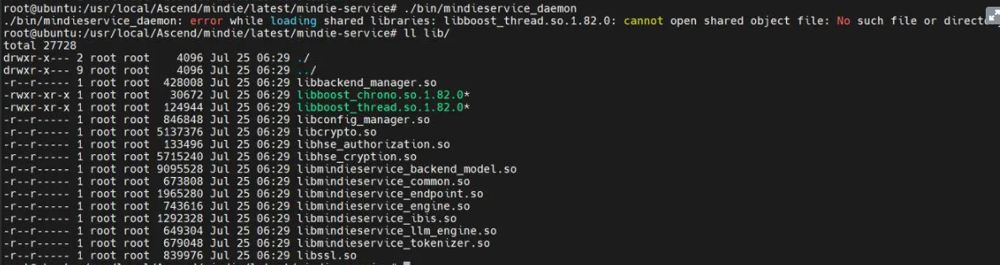
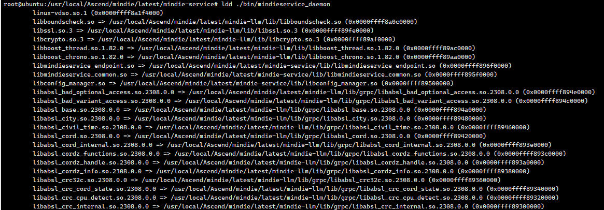
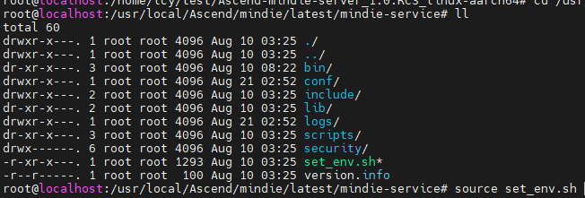

# `libboost_thread.so.1.82.0` Cannot Be Found When MindIE Motor Is Started

## Symptom

When MindIE Motor is started, an error message is displayed, indicating that `libboost_thread.so.1.82.0` cannot be found, as shown in the following figure.



## Cause Analysis

`mindieservice_daemon` is not correctly linked to the SO file of the dynamic dependency. As a result, the service fails to be started.

## Procedure

1. Query the specific .so file of `mindieservice_daemon`.

    `{MindIE_installation_directory}/latest/mindie-service` is used as an example.

    ```bash
    ldd ./bin/mindieservice_daemon
    ```

    

2. Run the `source set_env.sh` command to correctly link `mindieservice_daemon` to the SO file of the dynamic dependency.

    ```bash
    source set_env.sh
    ```

    
