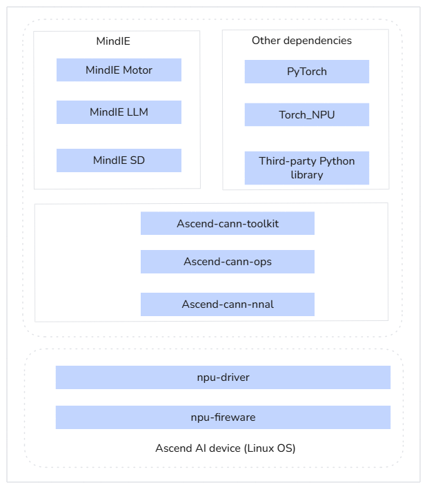

# Installation Guide

<!-- md-trans-meta sourceCommit=unknown translatedAt=2026-05-28T09:07:29.543Z pushedAt=2026-06-02T01:17:57.842Z -->

Describes how to quickly complete the installation of MindIE LLM.

## Installation Methods

This document describes how to install the MindIE software in image, offline, and source code scenarios. [Figure 1](#figure1) shows the deployment architecture.

The following describes the application scenarios, advantages, and disadvantages of each installation method. Select an installation method based on the application scenario.

- Image installation: This is the simplest installation method. You can directly download the packaged image from the Ascend community. The image contains necessary dependencies and software such as CANN, PyTorch, and MindIE. You only need to pull the image and start the container. The `.run` package is supported.
- Offline installation: In this method, software such as CANN, PyTorch, and MindIE and dependencies can be installed on physical machines or containers. The `.run` and `.whl` packages can be installed offline.
- Source code installation: To experience the latest functions or modify and enhance the source code, download the code from the repository, compile the code, and install it. WHL package installation is supported for source builds.
  
    > [!NOTE]NOTE
    >
    > - The `.whl` package installation is recommended for new users.
    > - For existing users upgrading their installation, the `.run` package method is recommended.

**Figure 1**  Installation scheme <a id="figure1"></a>



## Hardware Compatibility and Supported Operating Systems

This section provides the list of operating systems supported by the software package. Run the following command to query the current operating system version. If the queried operating system version is not in the corresponding product list, replace it with a supported operating system.

```bash
uname -m && cat /etc/*release
```

**Table 1**  Supported operating systems

|Hardware|Operating System|
|--|--|
|Atlas 800I A2 Inference Server|AArch64: <li>CentOS 7.6</li><li>CTYunOS 23.01</li><li>CULinux 3.0</li><li>Kylin V10 GFB</li><li>Kylin V10 SP2</li><li>Kylin V10 SP3</li><li>Kylin V10 SP3 2403 4.19.90-89.11.v2401</li><li>Kylin V11</li><li>Ubuntu 22.04</li><li>AliOS3</li><li>BCLinux 21.10 U4</li><li>Ubuntu 24.04 LTS</li><li>openEuler 22.03 LTS</li><li>openEuler 24.03 LTS SP1</li><li>openEuler 22.03 LTS SP4</li><li>Alibaba Cloud Linux 3.2104 U10</li><li>AntOS 6.6</li><li>UOS V25 (Kernel 6.6)</li>|
|Atlas 300I Duo Inference Card + Atlas 800 Inference Server (Model 3000)|AArch64: <li>BCLinux 21.10</li><li>Debian 10.8</li><li>Kylin V10 SP1</li><li>Kylin V10 SP3 2403 4.19.90-89.11.v2401</li><li>Kylin V11</li><li>Ubuntu 20.04</li><li>Ubuntu 22.04</li><li>UOS20-1020e</li><li>openEuler 24.03 SP1</li><li>openEuler 22.03 LTS SP4</li>|
|Atlas 300I Duo Inference Card + Atlas 800 Inference Server (Model 3010)|x86_64: <li>Ubuntu 22.04</li>|
|Atlas 800I A3 SuperPoD Server|AArch64: <li>openEuler 22.03</li><li>CULinux 3.0</li><li>Kylin V10 SP3 2403</li><li>Kylin V11</li><li>BCLinux 21.10 U4 (Kernel version: 5.10.0-200.0.0.131.30)</li><li>CTyunOS 3</li><li>UOS V25 (Kernel 6.6)</li>|
