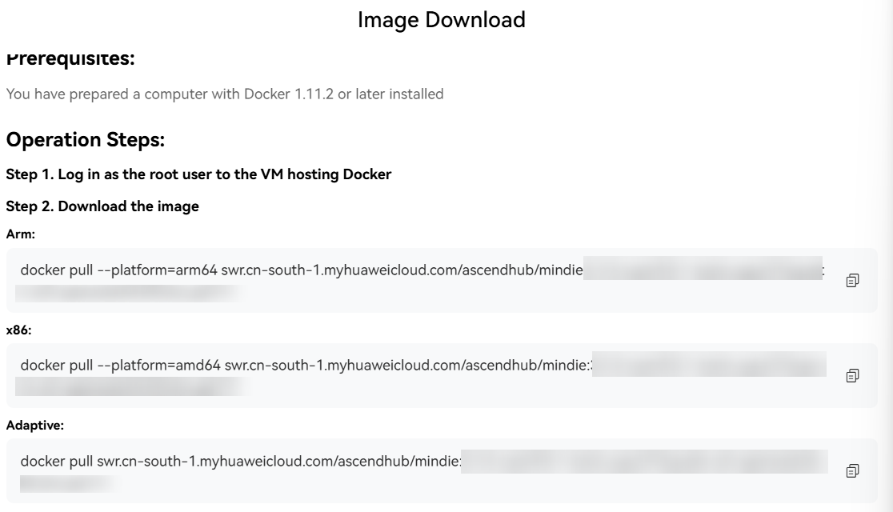

# Image Deployment Mode

The following describes how to install the MindIE container image. Before that, ensure that the server can connect to the network.

## Prerequisites

- Ensure that the NPU driver and firmware have been installed on the host. If the firmware and driver are not installed, download [firmware and driver](https://hiascend.com/hardware/firmware-drivers/community) and select the firmware and driver of the community edition or commercial edition based on the product series and model. Run the following commands to install them:
  
    ```shell
    chmod +x Ascend-hdk-<chip_type>-npu-driver_<version>_linux-<arch>.run
    chmod +x Ascend-hdk-<chip_type>-npu-firmware_<version>.run
    ./Ascend-hdk-<chip_type>-npu-driver_<version>_linux-<arch>.run --full --force
    ./Ascend-hdk-<chip_type>-npu-firmware_<version>.run --full
    ```

- You have installed Docker (version 24.x.x or later) on the host. For details about how to install Docker, see [Installing Docker](../source/docker_installation.md).
- Before configuring the source, make sure that the installation environment can connect to the network.

## Obtaining the MindIE Image

1. Click [AscendHub](https://www.hiascend.com/developer/ascendhub/detail/af85b724a7e5469ebd7ea13c3439d48f) to go to the MindIE image download page.
2. Click the login button in the upper right corner of the page and log in with your Huawei account. (If you have not registered, register one first.)
3. Locate the image according to your device.
4. Download the image according to the displayed image download guide, as shown in [Figure 1](#figure1).

    **Figure 1** Image download<a id="figure1"></a>

    

## Using an Image

1. Run the following command to start the container. The container startup command is for reference only. You can modify the command as required. For details about the command parameters, see [Table 1](#table1).

     ```bash
     docker run -it -d --net=host --shm-size=1g \
        --name <container-name> \
        --device=/dev/davinci_manager:rwm \
        --device=/dev/hisi_hdc:rwm \
        --device=/dev/devmm_svm:rwm \
        --device=/dev/davinci0:rwm \
        -v /usr/local/Ascend/driver:/usr/local/Ascend/driver:ro \
        -v /usr/local/dcmi:/usr/local/dcmi:ro \
        -v /usr/local/bin/npu-smi:/usr/local/bin/npu-smi:ro \
        -v /usr/local/Ascend/firmware/:/usr/local/Ascend/firmware:ro \
        -v /usr/local/sbin:/usr/local/sbin:ro \
        -v /path-to-weights:/path-to-weights:ro \
        mindie:3.0.0-800I-A2-py311-openeuler24.03-lts bash
    ```

    > [!NOTE]NOTE
    >- The image name and tag `mindie:3.0.0-800I-A2-py311-openeuler24.03-lts` can be modified as needed. You can run the `docker images` command on the host to view the existing images on the host.
    >- For the `--device` parameter, the mount permission is set to `rwm` instead of the less permissive `rw` or `r`, for the following reasons:
        >- For the Atlas 800I A2 inference server, if the mount permission is set to `rw`, the container launches successfully. The `npu-smi` command can be used to view NPU usage, and MindIE services run normally. However, if the mounted NPU (e.g., `davinci0` for `npu0` in mount options) is already occupied by another task, `npu-smi` will return an error and MindIE tasks will fail (e.g., `torch.npu.set_device()` will not work).
        >- For the Atlas 800I A3 SuperPoD server, if the mount permission is set to `rw`, entering the container and running `npu-smi` will print an error, MindIE tasks will fail, and `torch.npu.set_device()` will not work.

    **Table 1** Parameter description <a id="table1"></a>

    |Parameter|Description|
    |----|----|
    |--pids-limit -1|Removes the limit on the number of processes.<br>When using the Atlas 800I A2 inference server with Alibaba Cloud Linux 3.2104 U10, include this parameter in the container start command to disable the process limit.|
    |-it|Starts an interactive terminal (`-i`) and allocates a pseudo-TTY (`-t`), allowing you to interact with the container—e.g., run command-line operations.|
    |-d|Runs the container in the background (detached mode). It does not block the current terminal, allowing you to continue other operations after the container starts.|
    |--net|Makes the container use the host's network stack, giving it direct access to the host's network interfaces. This is suitable for low-latency scenarios where direct access to network resources is required.|
    |--shm-size|Specifies the shared memory size (`/dev/shm`) for the container. Users can set a custom value—`1g` is an example.<br>The value cannot exceed the remaining physical memory of the host. You can run the `free -h` command to view the remaining physical memory. When data parallelism is enabled (DP > 1), the size of the shared memory needs to be adjusted as the DP value increases.<br>For a DP value of 2, set `shm-size` to at least 2 GB.<br>For a DP value of 4, set `shm-size` to at least 3 GB.<br>For a DP value of 8, set `shm-size` to at least 5 GB.<br>For a DP value of 16, set `shm-size` to at least 9 GB.|
    |--name|Specifies a name for the container. `container-name` is a unique identifier for a container within the current system. You can set it manually. If this parameter is not set, Docker automatically allocates a random name.|
    |--device|Maps the host device to the container. Each `--device` parameter shares a host device (e.g., hardware accelerator or other hardware) directly with the container.<br>`/dev/davinci_manager`: Da Vinci-related management device.<br>`/dev/hisi_hdc`: HDC-related management device.<br>`/dev/devmm_svm`: Memory-related management device<br>`/dev/davinciX`: NPU device. `X` indicates the ID, for example, `davinci0`.<br>Run `ll /dev/ \| grep davinci` to check the number and names of devices. Then bind the required devices by modifying `--device=****`.|
    |-v|Maps the folders of the physical machine to the corresponding directories in the container and sets the directories to read-only using the `ro` parameter.<br>`/usr/local/Ascend/driver` contains hardware driver files. The driver must be installed on the host and mapped into the container for usage. Change them according to the actual paths of the driver.<br>`/usr/local/sbin` contains NPU status check commands such as `npu-smi`. Adjust the path based on your environment.<br>`/path-to-weights` points to the directory containing the model weights for container access. Update this path as needed. (The weight file and dataset file are stored in this path.)|

2. Access the container.

    ```bash
    docker exec -it <container-name> bash
    ```

3. Install the dependency.

    Before running inference with a model, install its dependencies. The path of the dependency installation file (requirements\__xxx_.txt) for each model is as follows: `/usr/local/Ascend/atb-models/requirements/models`. To install dependencies for Llama 3 series models (example), run the following commands:

    ```bash
    cd /usr/local/Ascend/atb-models/requirements/models
    pip3 install -r requirements_llama3.txt
    ```

4. Run the following command to enable MindIE log printing:

    ```bash
    export MINDIE_LOG_TO_STDOUT="true"
    ```

5. Use the model for inference.

    For the Llama3 series models, refer to `$ATB_SPEED_HOME_PATH/examples/models/llama3/README.md` in the container. For other models, see [model list](https://www.hiascend.com/software/mindie/modellist).

    Run the following commands to perform inference:

    ```bash
    cd $ATB_SPEED_HOME_PATH
    python examples/run_pa.py --model_path /path-to-weights # Change the weight path
    ```

    The default question and inference result are printed, as shown in the following:

    ```text
    2024-11-18 11:08:13,291 [INFO] [pid: 389497] logging.py-180: Question[0]: What's deep learning?
    2024-11-18 11:08:13,291 [INFO] [pid: 389497] logging.py-180: Answer[0]:  Deep learning is a subset of machine learning that uses neural networks to learn from data. Neural networks are
    2024-11-18 11:08:13,291 [INFO] [pid: 389497] logging.py-180: Generate[0] token num: (0, 20)
    ```

    If you want to customize an input question, set `--input_texts`. For example:

    ```bash
    python examples/run_pa.py --model_path /path-to-weights --input_texts "What is deep learning?"  # Change the weight path
    ```

    > [!NOTE]NOTE
    > `$ATB_SPEED_HOME_PATH` has been set in the .bashrc file. You do not need to modify it.

6. MindIE Motor is an inference serving framework designed for general-purpose models, establishing an adaptable and open inference service structure. It interfaces with prominent industry inference frameworks, meeting the high-performance inference needs of LLMs.
   For details about how to connect to Motor, see [Quick Start](../../quick_start/quick_start.md#model inference).
