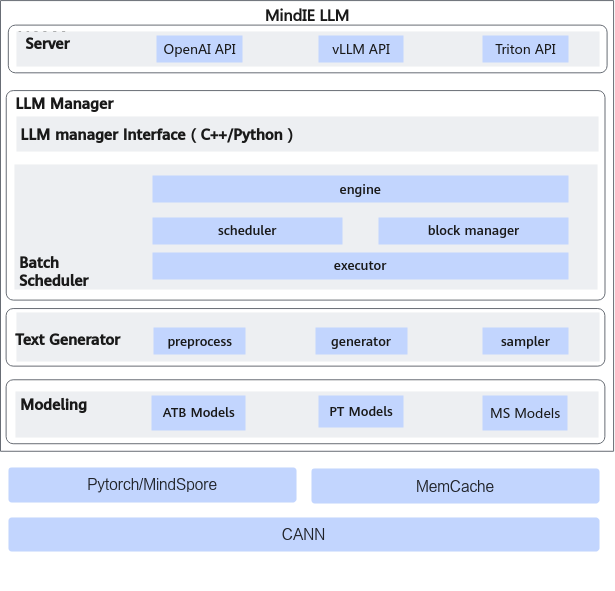

# Introduction to MindIE LLM

## Overview

**Mind Inference Engine for Large Language Models (MindIE LLM)** is a inference acceleration suite for large language models (LLMs) on Ascend hardware. It delivers specialized performance and usability improvements through deeply optimized model libraries and inference optimizers. It delivers general-purpose LLM inference on Ascend hardware, supporting concurrent request scheduling with acceleration features such as Continuous Batching, PagedAttention, and FlashDecoding to meet high-performance inference needs.

MindIE LLM provides C++ and Python APIs for LLM inference, concurrent request scheduling, and LLM Manager integration, making it easy to incorporate into production systems.

> [!NOTE]
> MindIE LLM will pause future feature development. Existing functionality remains in maintenance mode and will not support new features or models. We recommend deploying inference services using MindIE Motor with vLLM Ascend. For a quick start with vLLM Ascend, refer to [Quick Start](https://docs.vllm.ai/projects/ascend/en/v0.23.0/quick_start.html).

## MindIE LLM Architecture Diagram

**Figure 1** MindIE LLM architecture diagram

- **Server**: The inference service layer provides unified access and model serving capabilities. Endpoint offers RESTful APIs for inference service developers and encapsulates the inference protocol and interfaces. It is compatible with request interfaces from mainstream inference frameworks such as Triton, OpenAI, TGI, and vLLM.

- **LLM Manager**: It handles request state management and task scheduling. It batches user requests based on scheduling policies, and manages KV cache through a unified memory pool. The module aggregates inference results for return, and provides status logging and query interfaces.

  - LLM Manager Interface: The external interface layer of the MindIE-LLM inference engine, designed to interface with upper-layer services and enable capability integration.

  - Engine: Orchestrates and chains components such as Scheduler, Executor, and Worker. Through component collaboration, the Engine provides unified request handling and execution for diverse inference scenarios.

  - Scheduler: Within a DP domain, batches multiple requests during either Prefill or Decode phases. This strategy improves utilization of computation and communication resources, thereby boosting overall throughput and efficiency.

  - Block Manager: Manages KV Cache resources within a DP domain and supports pooling to enhance memory reuse efficiency. Additionally, it provides location-aware and index-based management for KV Cache offloading (to host or external storage).

  - Executor: Dispatches the execution plan and metadata generated during scheduling to the Text Generator module. It supports task dispatch in distributed inference scenarios, including cross-node and cross-device execution.

- **Text Generator**: It handles model configuration, initialization, and loading, and implements autoregressive inference pipelines along with result postprocessing. It provides LLM Manager with a unified autoregressive inference interface and supports pluggable parallel decoding extensions.

  - Preprocess: Converts scheduled tasks into model-ready input representations.

  - Generator: Abstracts and encapsulates the model execution process, covering core logic such as forward computation, state updates, and autoregressive decoding.

  - Sampler: Performs token selection based on model output logits (e.g., greedy search, beam search, top-p sampling, temperature-based sampling), determines stop conditions, and manages context state updates and necessary cleanup (e.g., cache eviction).

- **Modeling**: Provides performance-tuned operator modules and built-in model implementations, with support for Ascend Transformer Boost Models (ATB Models).

  - Built-in modules include Attention, Embedding, ColumnLinear, RowLinear, Multilayer Perceptron (MLP), and Mixture-of-Experts (MoE). These modules support online tensor sharding and weight loading.

  - Built-in models support full network construction and composition using the above modules, along with tensor sharding. They also support multiple quantization methods. Users can also refer to examples to build and customize model architectures using the built-in modules.

  - After the model is fully assembled, it proceeds to the compilation and tuning phase, ultimately producing an executable computation graph optimized for accelerated inference on Ascend NPU devices.
