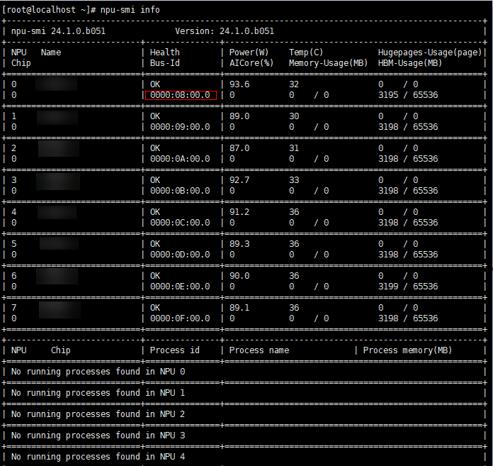
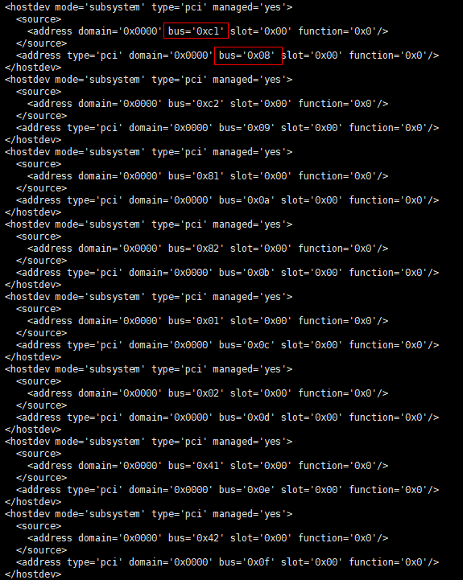
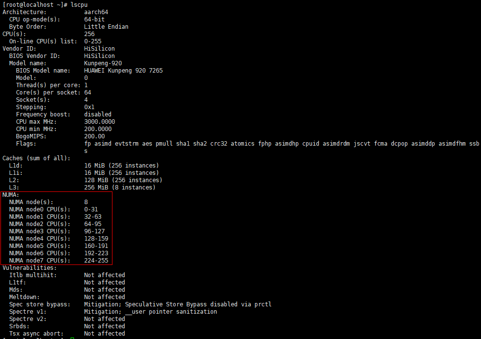
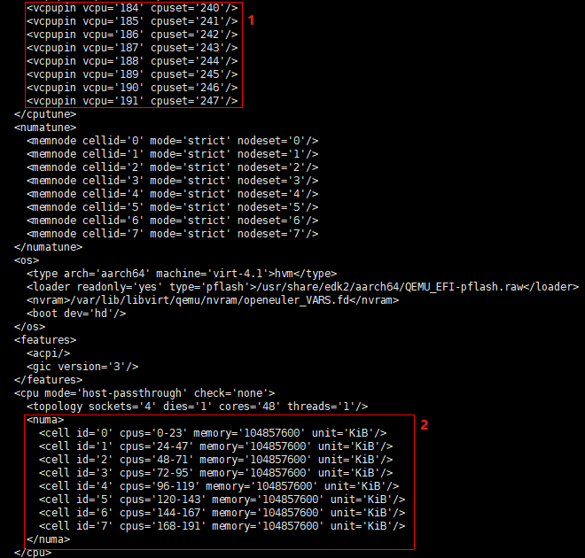
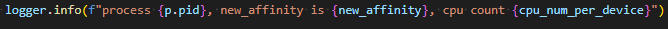

# Manual Core Binding on Virtual Machines

When ATB Models is used for inference on virtual machines, you need to manually bind cores to improve performance.

1. On the virtual machine, run the `npu-smi info` command to query the PCI ID of the NPU, as shown in [Figure 1](#figure1).

    **Figure 1** NPU 0's PCI ID 0000:08:00.0 .

    

2. Query the PCI ID mapping between the physical and virtual machines by running the `virsh edit {Virtual machine name}` command on the physical machine. The virtual machine name can be queried by running the `virsh list --all` command.

    [Figure 2](#figure2) shows the query page, where you can find the PCI ID mapping between the physical and virtual machines.

    **Figure 2** PCI ID 0000:08:00.0 on the virtual machine corresponding to 0000:C1:00.0 on the physical machine  of the physical machine.

    

3. To query the NUMA node for a physical machine, run `cat /sys/bus/pci/devices/{pci_id}/numa_node`. See [Figure 3](#figure3) for an example.

    **Figure 3** `0000:C1:00.0` corresponding to NUMA node 6 .

    

4. Run the `lscpu` command on the physical machine to query the CPU corresponding to the NUMA node, as shown in [Figure 4](#figure4).

    **Figure 4** CPUs 192-223 corresponding to NUMA node 6 .

    

5. Run the `virsh edit {Virtual machine name}` command on the physical machine to query the NUMA node mapping between the physical and virtual machines. The virtual machine name can be queried by running the `virsh list --all` command. [Figure 5](#figure5) shows the query page.

    The red box 1 shows the CPU mapping between the virtual and physical machines. For example, CPU 191 on the virtual machine corresponds to CPU 247 on the physical machine.

    In the red box 2, `cell id='0' cpus='0-23'` under `<numa>` indicates that when the NUMA node ID is `0`, the CPU IDs on the virtual machine are `0` to `23`.

    The CPU IDs of the NUMA node 6 on the physical machine are `192` to `223`, and the query shows that the corresponding CPU IDs on the virtual machine are `144` to `167`. That is, the NUMA node 6 on the physical machine corresponds to the NUMA node 6 on the virtual machine. Therefore, NPU 0 corresponds to the NUMA node 6 on the virtual machine.

    **Figure 5** VM configuration page 

    

6. Run `echo x > /sys/bus/pci/devices/{PCI_ID}/numa_node` in the VM, where `x` is the NPU's VM NUMA node from [Step 5](#step5), and `PCI_ID` is the PCI ID within the VM.

    For example, for NPU 0, the command is `echo 6 > /sys/bus/pci/devices/0000:08:00.0/numa_node`.

    The core binding for NPU 0 on the virtual machine is complete.

7. Query the MindIE LLM logs to verify the NPUs that are successfully bound to cores. For details about how to query logs, see "Viewing Logs" in *MindIE Log Reference*.

    If the log shown in Figure 6 is displayed, the NPU is successfully bound.

    **Figure 6** Successfully bound NPU
    
    
