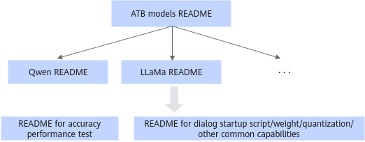

# Offline Inference

## ATB Models: Pure Model Usage

### Prerequisites

CANN, PyTorch, Torch-NPU, and ATB Models have been installed in the environment. For details, see *MindIE Installation Guide*.

> [!NOTE]NOTE
> The following installation path is used as an example to
> install ATB Models and initialize the ATB Models environment variables. The `${ATB_SPEED_HOME_PATH}` environment variable initialization is contained in the `set_env.sh` script of the model repository. Therefore, sourcing the `set_env.sh` script from the model repository also initializes the `${ATB_SPEED_HOME_PATH}` environment variable.

### Constraints

- If model initialization fails due to user-defined modifications when ATB Models is used for inference, manually end the process.
- When ATB Models is used for inference, ensure that other users do not have the write permission on the weight path and file.

### README Document Interpretation

Currently, ATB Models provides three types of README documents to help you understand the inference process and the features supported by models, and offer basic commissioning and fault locating methods.

**Figure 1** ATB Models README document relationship <a name="fig89051134504"></a>


**Table 1** README documents

|Document|Function|Topic|
|--|--|--|
|`${ATB_SPEED_HOME_PATH}/README.md`|General entry for all ATB Models documents.|<ul><li>Hardware and software versions required for running ATB Models. The software version on which each model depends varies. Install required software version based on the corresponding requirements. For details, see README.md. </li><li>Basic debugging and fault locating methods:<br>Enabling logging of the operator library, ATB, and model repository<br>Performance analysis method<br>Accuracy analysis method </li><li>Preset model list:<br>The model README document is linked.</li></ul>|
|`${ATB_SPEED_HOME_PATH}/examples/models/{Model_name}/README.md`| <br>Document of each model in ATB Models. |<ul><li>Model feature support matrix, that is, the support of models with different parameter scales for various hardware, quantization modes, and features. </li><li>Address for downloading the open-source model weights. </li><li>Introduction to generating quantized model weights. </li><li>Methods of executing the dialog test, accuracy test, and performance test scripts.</li></ul>|
|${ATB_SPEED_HOME_PATH}/examples/README.md|Introduction to common capabilities and interfaces.|<ul><li>Introduction to the script for converting weights from the .bin format to the .safetensor format. </li><li>Introduction to the script for generating quantized weights. </li><li>Introduction to the parameters in the startup scripts of Flash Attention and Paged Attention. </li><li>Introduction to the environment variables that can be optionally configured. </li><li>Precautions for special scenarios.</li></ul>|

### Example

The following uses LLaMA3-8B as an example to describe how to perform dialog inference and performance test.

1. Set the environment variable.

   - Using the `.whl` package

      ```bash
       # Configure the CANN environment. By default, the CANN is installed in the `/usr/local` directory.
       source /usr/local/Ascend/cann/set_env.sh
       # Configure an acceleration library environment.
       source /usr/local/Ascend/nnal/atb/set_env.sh
       # Configure the model repository environment variables.
       /usr/local/lib/python3.11/site-packages/mindie_llm/set_env.sh
       ```

   - Using the `.run` package

       ```bash
       # Configure the CANN environment. By default, the CANN is installed in the `/usr/local` directory.
       source /usr/local/Ascend/cann/set_env.sh
       # Configure an acceleration library environment.
       source /usr/local/Ascend/nnal/atb/set_env.sh
       # Configure the model repository environment variables.
       source /usr/local/Ascend/atb-models/set_env.sh
       ```

2. Download model weights from the Hugging Face official website and save the downloaded weight file in `/data/Llama-3-8b`.
3. Run the following command to change the permission on the weight file:

    ```bash
    chmod -R 755 /data/Llama-3-8b
    ```

4. (Optional) Convert the weight file format. Currently, only the weight files in .safetensor format can be loaded for ATB Models inference. If the downloaded weight file is in .safetensor format, you do not need to convert the format. If the downloaded weight file is in bin format, perform the following operations:

    ```bash
    # Go to the directory where the ATB Models are located.
    cd ${ATB_SPEED_HOME_PATH}
    # Run the script to generate the weight file in the .safetensor format.
    python examples/convert/convert_weights.py --model_path /data/Llama-3-8b
    ```

    The output result is saved in the same directory where the weight file in .bin format is saved.

5. Test dialog inference.

    ```bash
    cd ${ATB_SPEED_HOME_PATH}
    bash examples/models/llama/run_pa.sh /data/Llama-3-8b
    ```

    The `run_pa.sh` script wraps `run_pa.py`. By default, it infers the prompt "What's deep learning?" with a batch size of 1. You can change the inference content in [Step 6](#step6) below.

6. <a name="step6"></a>Customize the inference content.

    - You can directly call the `run_pa.py` script and customize the inference content and inference mode by passing parameters.

        For example, if the weights in the `/data/Llama-3-8b` path are used for 8-device inference of "What's deep learning?" and "Hello World," the batch size is 2.

        ```bash
        # Specify the available logical NPU cores on the current host. Use commas (,) to separate multiple cores.
        export ASCEND_RT_VISIBLE_DEVICES=0,1,2,3,4,5,6,7
        # Inference
        torchrun --nproc_per_node 8 --master_port 20030 -m examples.run_pa --model_path /data/Llama-3-8b --input_texts "What's deep learning?" "Hello World." --max_batch_size 2
        ```

        > [!NOTE]NOTE
        > For details about the environment variables, see [Environment Variables](environment_variable.md).

    - You can pass token IDs to perform inference.

        Create a .py script (for example, `test.py`) to generate token IDs.

        ```python
        from transformers import AutoTokenizer
        tokenizer = AutoTokenizer.from_pretrained(
            pretrained_model_name_or_path="{Path to the folder where the tokenizer is located}",
            use_fast=False,
            padding_side='left',
            trust_remote_code="{Set the value yourself}")
        inputs = tokenizer("What's deep learning?", return_tensors="pt")
        token_id = inputs.data["input_ids"]
        print(token_id)
        ```

        Run the following command to generate token IDs:

        ```python
        python test.py
        ```

        Run the following command to start inference. In the following example, the token ID `1,15043,2787` corresponds to the first inference content and the token ID `1,306,626,2691` corresponds to the second inference content. The inference content is separated by spaces.

        ```linux
        # Inference
        torchrun --nproc_per_node 8 --master_port 20030 -m examples.run_pa --model_path /data/Llama-3-8b --input_ids 1,15043,2787 1,306,626,2691 --max_batch_size 2
        ```

        **Table 2** Parameters in the `run_pa.py` script <a id="table2"></a>

        |Parameter Name|Required (Yes/No)|Type|Default Value|Description|
        |--|--|--|--|--|
        |--model_path|Yes|string|""|Path to the model weight file. Security verification is performed on this path, which must be an absolute path and have the same owner group and permission as the user who starts inference.|
        |--input_texts|No|string|"What's deep learning?"|Inference text or inference text path. Multiple inference texts are separated by spaces.|
        |--input_ids|No|string|None|Token ID list obtained after the inference text is processed by the model tokenizer. Multiple inference requests are separated by spaces. Each token in a single inference request is separated by a comma (,).|
        |--input_file|No|string|None|Only JSONL files are supported. Each line must be dialog data sorted by time in List[Dict] format. Each dictionary must contain at least the `role` and `content` fields.|
        |--input_dict|No|parse_list_of_json|None|Inference text and the corresponding adapter name. Format example: '[{"prompt": "A robe takes 2 bolts of blue fiber and half that much white fiber.How many bolts in total does it take?", "adapter": "adapter1"}, {"prompt": "What is deep learning?", "adapter": "base"}]'|
        |--max_prefill_batch_size|No|int or None|None|Maximum prefill batch size for model inference.|
        |--max_position_embeddings|No|int or None|None|Maximum context length supported by the model. If this parameter is set to `None`, the length is read from the model weight file.|
        |--max_input_length|No|int|1024|Maximum number of tokens in the inference text.|
        |--max_output_length|No|int|20|Maximum number of tokens in the inference result.|
        |--max_prefill_tokens|No|int|-1|Maximum number of tokens that are supported in the prefill phase for model inference. If it is set to `-1`, max_prefill_tokens = max_batch_size * (max_input_length + max_output_length).|
        |--max_batch_size|No|int|1|Maximum batch size for model inference.|
        |--block_size|No|int|128|Maximum number of tokens stored in each KV cache block. The default value is `128`.|
        |--chat_template|No|string or None|None|Prompt template of the dialog model.|
        |--ignore_eos|No|bool|store_true|Whether to end the inference when an EOS token (sentence end identifier) is encountered in the inference result. If this parameter is passed, the EOS token is ignored.|
        |--is_chat_model|No|bool|store_true|Whether to support the dialog mode. If this parameter is passed, the dialog mode is entered.|
        |--is_embedding_model|No|bool|store_true|Whether the model is an embedding model. By default, the model is a causal inference model. If this parameter is passed, the model is an embedding model.|
        |--load_tokenizer|No|bool|True|Whether to load the tokenizer. If `False` is passed, `input_ids` is necessary, and the inference output is token ID.|
        |--enable_atb_torch|No|bool|store_true|Whether to use the Python graph. By default, the C++ graph is used. If this parameter is passed, the Python graph is used.|
        |--kw_args|No|string|""|Extended parameter, which can be used to extend functions.|
        |--trust_remote_code|No|bool|store_true|Whether to trust the custom code file in the model weight path. This operation is not executed by default. If this parameter is passed, Transformers will execute the custom code files in the model weight path. The use is responsible for the security of these code files. Check the security in advance.|
        |--dp|No|int|-1|Number of data parallel processes. By default, data parallelism is not performed.|
        |--tp|No|int|-1|Number of tensor parallel processes on the entire network. If the value is `-1`, this number is the value of `worldSize` by default.|
        |--sp|No|int|-1|Number of sequence parallel processes. By default, sequence parallelism is not performed. If sequence parallelism is enabled, the number of sequence parallel processes is generally the same as the number of tensor parallel processes.|
        |--cp|No|int|-1|Number of text parallel processes. By default, text parallelism is not performed.|
        |--moe_tp|No|int|-1|Number of tensor parallel processes in the MoE module of a sparse model. By default, the number is the same as the value of `tp`. If both `tp` and `moe_tp` are configured, the priority of `moe_tp` is higher than that of `tp`.|
        |--moe_ep|No|int|-1|Number of expert parallel processes in the MoE module of a sparse model. By default, there is no expert parallel process.|
        |--lora_modules|No|string|None|Name of the LoRA weight to be loaded and the corresponding LoRA weight path, for example, '{"adapter1": "/path/to/lora1", "adapter2": "/path/to/lora2"}'. By default, the LoRA weight is not loaded.|
        |--max_loras|No|int|0|Maximum number of LoRAs that can be stored in LoRA scenarios. This parameter is mandatory in dynamic LoRA scenarios and optional in static LoRA scenarios. If the input value is too large, an out_of_memory error is reported because too much weight space is reserved. For example: "RuntimeError: NPU out of memory.Tried to allocate xxx GiB."|
        |--max_lora_rank|No|int|0|Maximum LoRA rank in dynamic LoRA loading and unloading scenarios. This parameter is mandatory in dynamic LoRA scenarios and optional in static LoRA scenarios. If the input value is too large, an out_of_memory error is reported because too much weight space is reserved. For example: "RuntimeError: NPU out of memory.Tried to allocate xxx GiB."|

        > [!NOTE]NOTE
        > The `run_pa.py` script in this section is used for quick pure model test. No strong verification is added to the script. If an exception occurs, an exception message will be thrown. Example:
        > - `input_texts`, `input_ids`, `input_file`, and `input_dict` contain the inference content. The data processing time of the program is in direct proportion to the input data volume. These inputs are converted into token IDs and transferred to the NPU. If the input data volume is too large, the NPU tensors may occupy too much memory. As a result, an error message, for example, "req: xx input length: xx is too long, max_prefill_tokens: xx", is displayed due to out of memory.
        > - `chat_template` supports two types of inputs: template text or template file path. When you input a long template text, the system may run slowly.
        > - The script allocates the inference input and KV cache based on parameters such as `max_batch_size`, `max_input_length`, `max_output_length`, `max_prefill_batch_size`, and `max_prefill_tokens`. If the input value is too large, an out of memory error may occur, for example, "RuntimeError: NPU out of memory. Tried to allocate xxx GiB.".
        > - The script allocates NPU tensors such as rotary position embedding and attention mask based on `max_position_embeddings`. If the input value is too large, an out of memory error may occur, for example, "RuntimeError: NPU out of memory. Tried to allocate xxx GiB.".
        > - If `block_size` is less than the number of attention heads allocated to each card in tensor parallelism mode, an error ("Setup fail, enable log: export ASDOPS_LOG_LEVEL=ERROR, export ASDOPS_LOG_TO_STDOUT=1 to find the first error. For more details, see the MindIE official document.") is reported due to shape mismatch. In this case, you need to enable the log function to view details.

7. Test the performance.

    After the `ATB_LLM_BENCHMARK_ENABLE` environment variable is enabled, the first token, incremental token, and end-to-end inference latency of the model are collected.

    ```bash
    # Enable the environment variable.
    export ATB_LLM_BENCHMARK_ENABLE=1
    # Start inference. For details, see step 4 and step 5.
    ```

    The time consumption result is displayed on the console and saved in the `./benchmark_result/benchmark.csv` file.

    > [!NOTE]NOTE
    > After the performance test, you can use the msprof tool to collect and analyze performance data for performance tuning. For usage of the `msprof` tool, see "[msprof Command-Line Tool](https://www.hiascend.com/document/detail/en/mindstudio/700/TITools/Profiling/atlasprofiling_16_0010.html)" in *Performance Tuning Tools*.

## ATB Models Serving Usage

### Prerequisites

CANN, PyTorch, Torch-NPU, ATB Models, MindIE LLM, and MindIE Motor have been installed in the environment. For details, see *MindIE Installation Guide*.

### Example

1. Set the environment variable.
   If the installation path is the default path, run the following commands to initialize the environment variables of each component:

   - Using the `.whl` package

      ```bash
       # Configure the CANN environment. By default, the CANN is installed in the `/usr/local` directory.
       source /usr/local/Ascend/cann/set_env.sh
       # Configure an acceleration library environment.
       source /usr/local/Ascend/nnal/atb/set_env.sh
       # Configure the model repository environment variables.
       /usr/local/lib/python3.11/site-packages/mindie_llm/set_env.sh
       ```

   - Using the `.run` package

       ```bash
       # Configure the CANN environment. By default, the CANN is installed in the `/usr/local` directory.
       source /usr/local/Ascend/cann/set_env.sh
       # Configure an acceleration library environment.
       source /usr/local/Ascend/nnal/atb/set_env.sh
       # Configure the model repository environment variables.
       source /usr/local/Ascend/atb-models/set_env.sh
       # MindIE
       source /usr/local/Ascend/mindie/latest/mindie-llm/set_env.sh
       source /usr/local/Ascend/mindie/latest/mindie-service/set_env.sh
       ```

2. Start serving and send a request.

    For details about how to use the MindIE serving, see "Quick Start" \> "[Starting the Service](https://gitcode.com/Ascend/MindIE-Motor/blob/v3.0.0/docs/en/user_guide/quick_start.md)" in *MindIE Motor Development Guide*. For details about how to configure serving parameters, see [Configuration Parameters (Serving)](service_parameter_configuration.md).

    In serving configurations, ATB Models is used as the model backend by default.

    - Using the `.whl` package
  
    ```bash
    vim /usr/local/lib/python3.11/site-packages/mindie_llm/conf_/config.json
    # The default value of ModelDeployConfig.ModelConfig.backendType is atb.
    "backendType": "atb"
    ```

    - Using the `.run` package

    ```bash
    vim /usr/local/Ascend/mindie/latest/mindie-service/conf/config.json
    # The default value of ModelDeployConfig.ModelConfig.backendType is atb.
    "backendType": "atb"
    ```

    For details about serving APIs, see "Serving APIs" in *MindIE Motor Development Guide*.

    You can use an HTTPS client (Linux `curl` command, Postman tool, and others) to send HTTPS requests. The following uses Linux `curl` command as an example. Open a new window and run the following command to send a request:

    ```bash
    curl -H "Accept: application/json" -H "Content-type: application/json" -X POST --cacert {*Path to the root certificate and signature verification certificate of Server certificate*} --cert {*Path to the client certificate file*} --key {*Path to the client certificate private key*} -d '{"inputs": "hi","stream":false}' https://{ip}:{port}/generate
    ```
