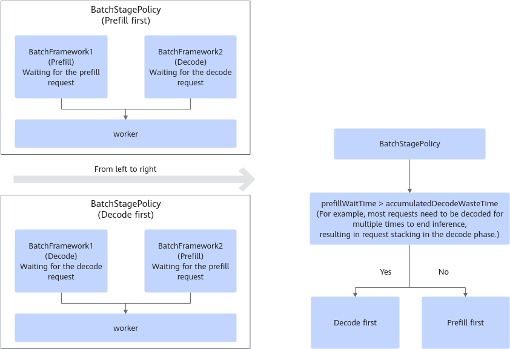
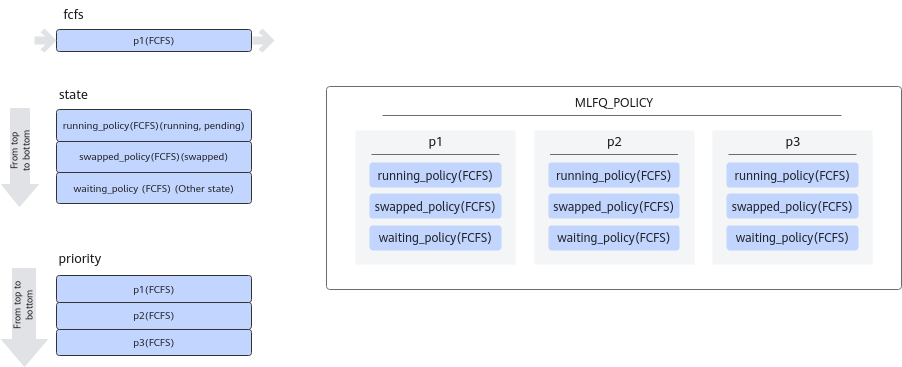

# Configuration Parameters (Serving)

> [!NOTE]
>
>- Server configuration file `config.json`:
>   - Path for obtaining the `.whl` package installation mode: `{MindIE_installation_directory}/mindie_llm/conf/config.json`
>   - Path for obtaining the `.run` package: `{MindIE_installation_directory}/latest/mindie-service/conf/config.json`
>- When reading the configuration file, the system checks the file size first. If the file size is not in the range \(0 MB, 10 MB\], the system fails to read the file.

## Parameters in the Configuration File

|Parameter|Value Type|Value Range|Configuration Description|
|--|--|--|--|
|Version|std::string|"1.0.0"|Configuration file version, which is fixed at 1.0.0 and cannot be modified.|
|ServerConfig|map|-|Server configuration, such as ip:port, network request, and network security. For details, see [Parameters in ServerConfig](#parameters-in-serverconfig).|
|BackendConfig|map|-|Model backend configuration, including scheduling and model configurations. For details, see [Parameters in BackendConfig](#parameters-in-backendconfig).|
|LogConfig|map|-|Log-level configuration. For details, see [Parameters in LogConfig](#parameters-in-logconfig).|
|EnableDynamicAdjustTimeoutConfig|bool|<li>true</li><li>false</li>|Dynamic configuration parameter of the timeout interval.<br>If this parameter is set to `true`, all inference-related timeout intervals are dynamically set to the maximum value.|

## Parameters in ServerConfig

|Parameter|Value Type|Value Range|Configuration Description|
|--|--|--|--|
|ipAddress|std::string|IPv4 or IPv6 address.|Required. The default value is `127.0.0.1`.<br>IP address bound to the service-plane RESTful API and provided by EndPoint. <ul><li>If `MIES_CONTAINER_IP` exists, use its value as the service-plane IP address. </li><li>If `MIES_CONTAINER_IP` does not exist, the value of `ipAddress` is used. </li></ul> **NOTE**<br>If all-zero monitoring is enabled, triple-plane isolation becomes invalid, which does not meet security configuration requirements. Therefore, the IP address cannot be set to `0.0.0.0` by default. If the IP address is set to `0.0.0.0`, set `allowAllZeroIpListening` in the configuration file to `true` to ensure security.|
|managementIpAddress|std::string|IPv4 or IPv6 address.|Optional. The default value is `127.0.0.2`.<br>IP address bound to the internal RESTful API and provided by EndPoint. <ul><li>If `MIES_CONTAINER_MANAGEMENT_IP` exists, use its value as the internal API IP address. </li><li>If `managementIpAddress` exists, use its value. Otherwise, use the value of `ipAddress` as the internal API IP address. </li><li>If multiple IP addresses are used, the initial values of `ipAddress` and `managementIpAddress` must be changed accordingly. </li></ul> **NOTE**<br>If all-zero monitoring is enabled, triple-plane isolation becomes invalid, which does not meet security configuration requirements. Therefore, the IP address cannot be set to `0.0.0.0` by default. If the IP address is set to `0.0.0.0`, set `allowAllZeroIpListening` in the configuration file to `true` to ensure security.|
|port|int32_t|[1024, 65535]|Required. The default value is `1025`.<br>Port number bound to the service-plane RESTful API provided by EndPoint.<br>If the IP address of a physical machine (PM) or host is used for communication, ensure that the port number does not conflict.|
|managementPort|int32_t|[1024, 65535]|Optional. The default value is `1026`.<br>Port number bound to the internal interface provided by EndPoint. (For details about the internal interface, see [Table 1](./service_APIs_usage_guidance.md#table1).)<br>The following four solutions can be used for the service-plane and internal interfaces: <ul><li>Multiple IP addresses and multiple port numbers (recommended)</li><li>Multiple IP addresses and a single port</li><li>A single IP address and multiple ports</li><li>A single IP address and a single port</li></ul>|
|metricsPort|int32_t|[1024, 65535]|Optional. The default value is `1027`.<br>Port number of the service management and control metric API (Prometheus format). The value can be the same as or different from the value of `managementPort`.|
|allowAllZeroIpListening|bool|<ul><li>true</li><li>false</li></ul>|Mandatory. The default value is `false`, and the recommended value is `false`. If the value is `true`, all-zero monitoring may pose risks to the user environment, which requires the protection capabilities of the environment.<br>Whether to support all-zero monitoring IP addresses. <ul><li>`true`: supports all-zero monitoring IP addresses. </li><li>`false`: does not support all-zero monitoring IP addresses.</li></ul>|
|maxLinkNum|uint32_t|[1, 4096]|Required. The default value is `1000`.<br>Maximum number of concurrent RESTful requests supported by EndPoint.<br>This parameter indicates that `maxLinkNum` requests are being processed concurrently and 2 × `maxLinkNum` requests are waiting in the queue. Therefore, the request at position (3 × `maxLinkNum` + 1) is rejected.<br>The recommended value is `300`. This parameter is affected by model performance. Typically, 1,000 concurrent requests can be used for a small model with short sequence lengths.|
|httpsEnabled|bool|<ul><li>true</li><li>false</li></ul>|Required. The default value is `true`. You are advised to enable this function. If this function is disabled, high network security risks exist.<br>Whether to enable HTTPS communication security authentication. <ul><li>`true`: enabled. </li><li>`false`: disabled. </li></ul>If this parameter is set to `false`, subsequent HTTPS communication parameters are ignored.|
|fullTextEnabled|bool|<ul><li>true</li><li>false</li></ul>|Optional. The default value is `false`.<br>Whether to enable the streaming API to return all historical results. <ul><li>`true`: enabled </li><li>`false`: disabled</li></ul>|
|tlsCaPath|std::string|The length range of the absolute file path is [1, 4096]. The actual path is the combined result of the project path and `tlsCaPath`.|Root certificate path. Only the relative path under the software package installation path is supported.<br>This parameter takes effect when `httpsEnabled` is set to `true` and is required in this case. The default value is `security/ca/`.|
|tlsCaFile|std::set`<std::string>`|The length range of the absolute file path is [1, 4096]. The minimum number of elements in the list is 1 and the maximum number is 3.|List of root certificate names on the service plane.<br>This parameter takes effect when `httpsEnabled` is set to `true` and is required in this case. The default value is `["ca.pem"]`.|
|tlsCert|std::string|The length range of the absolute file path is [1, 4096]. The actual path is the combined result of the project path and `tlsCert`.|Path to the service certificate file on the service plane. Only the relative path under the software package installation path is supported.<br>This parameter takes effect when `httpsEnabled` is set to `true` and is required in this case. The default value is `security/certs/server.pem`.|
|tlsPk|std::string|The length range of the absolute file path is [1, 4096]. The actual path is the combined result of the project path and `tlsPk`.|Path to the private key file of the service certificate on the service plane. Only the relative path under the software package installation path is supported. The length of the private key must be greater than or equal to 3072.<br>This parameter takes effect when `httpsEnabled` is set to `true` and is required in this case. The default value is `security/keys/server.key.pem`.|
|tlsPkPwd|std::string|The length range of the absolute file path is [0, 4096]. The actual path is the combined result of the project path and `tlsPkPwd`.|Path to the encryption private key file of the service certificate on the service plane. Only the relative path under the software package installation path is supported.<br>This parameter takes effect when `httpsEnabled` is set to `true`. This parameter is optional.The default value is `security/pass/key_pwd.txt`.<br>If the private key is encrypted but this file is not provided, the system prompts you to enter the private key encryption password in the interactive window when the system is started.|
|tlsCrlPath|std::string|The path length range of `tlsCrlPath`+`tlsCrlFiles` is [0,4096]. The actual path is the combined result of the project path and `tlsCrlPath`.|Path to the service certificate CRL folder on the service plane. Only the relative path under the software package installation path is supported. <ul><li>This parameter takes effect when `httpsEnabled` is set to `true`. This parameter is optional. The default value is `security/certs/`. </li><li>If `httpsEnabled` is `false`, the CRL is disabled.</li></ul>|
|tlsCrlFiles|std::set`<std::string>`|The path length range of `tlsCrlPath`+`tlsCrlFiles` is [1, 4096]. The minimum number of elements in the list is 1 and the maximum number is 3.|CRL name list on the service plane.<br>This parameter takes effect when `httpsEnabled` is set to `true`. This parameter is optional. The default value is `["server_crl.pem"]`.|
|managementTlsCaFile|std::set`<std::string>`|It is recommended that the path length range of `tlsCaPath`+`managementTlsCaFile` be [0, 4096]. The minimum number of elements in the list is 1 and the maximum number is 3.|List of internal interface root certificates. Currently, internal interface certificates and service plane certificates are stored in the same path (`tlsCaPath`).<br>This parameter takes effect when `httpsEnabled` = `true` and `ipAddress!` = `managementIpAddress`, and is required in this case. The default value is `["management_ca.pem"]`.|
|managementTlsCert|std::string|The length range of the file path is [1, 4096]. The actual path is the combined result of the project path and `managementTlsCert`.|Path to the internal interface service certificate file. Only the relative path under the software package installation path is supported.<br>This parameter takes effect when `httpsEnabled` = `true` and `ipAddress!` = `managementIpAddress`, and is required in this case. The default value is `security/certs/management/server.pem`.|
|managementTlsPk|std::string|The length range of the file path is [1, 4096]. The actual path is the combined result of the project path and `managementTlsPk`.|Path to the private key file of the internal interface service certificate. Only the relative path under the software package installation path is supported. The length of the private key must be greater than or equal to 3072.<br>This parameter takes effect when `httpsEnabled` = `true` and `ipAddress!` = `managementIpAddress`, and is required in this case. The default value is `security/keys/management/server.key.pem`.|
|managementTlsPkPwd|std::string|The length range of the file path is [0, 4096]. The actual path is the combined result of the project path and `managementTlsPkPwd`.|Path to the private key encryption key file of the internal interface service certificate.<br>This parameter takes effect when `httpsEnabled` = `true` and `ipAddress!` = `managementIpAddress`. This parameter is optional. The default value is `security/pass/management/key_pwd.txt`. If the private key is encrypted but this file is not provided, the system prompts you to enter the private key encryption password in the interactive window when the system is started.|
|managementTlsCrlPath|std::string|The path length range of `managementTlsCrlPath`+`managementTlsCrlFiles` is [1, 4096]. The actual path is the combined result of the project path and `managementTlsCrlPath`.|Path to the CRL folder of the internal interface. Only the relative path under the software package installation path is supported. <ul><li>This parameter takes effect when `httpsEnabled` = `true` and `ipAddress!` = `managementIpAddress`. This parameter is optional. The default value is `security/management/certs/`. </li><li>If `httpsEnabled` is `false`, the CRL is disabled.</li></ul>|
|managementTlsCrlFiles|std::set`<std::string>`|The path length range of `managementTlsCrlPath`+`managementTlsCrlFiles` is [1, 4096]. The minimum number of elements in the list is 1 and the maximum number is 3.|List of internal interface CRL names.<br>This parameter takes effect when `httpsEnabled` is set to `true`. This parameter is optional. The default value is `["server_crl.pem"]`.|
|metricsTlsCaFile|std::set`<std::string>`|It is recommended that the length of the `tlsCaPath`+`metricsTlsCaFile` path range from [0,4096]. The minimum number of elements in the list is 1 and the maximum number is 3.|List of internal interface root certificates. Currently, internal interface certificates and service plane certificates are stored in the same path (`tlsCaPath`).<br>This parameter takes effect when `httpsEnabled` = `true` and `ipAddress!` = `managementIpAddress`, and is required in this case. The default value is `["metrics_ca.pem"]`.|
|metricsTlsCert|std::string|The length range of the file path is [1, 4096]. The actual path is the combined result of the project path and `metricsTlsCert`.|Path to the internal interface service certificate file. Only the relative path under the software package installation path is supported.<br>This parameter takes effect when `httpsEnabled` = `true` and `ipAddress!` = `managementIpAddress`, and is required in this case. The default value is `security/certs/metrics/server.pem`.|
|metricsTlsPk|std::string|The length range of the file path is [1, 4096]. The actual path is the combined result of the project path and `metricsTlsPk`.|Path to the private key file of the internal interface service certificate. Only the relative path under the software package installation path is supported. The length of the private key must be greater than or equal to 3072.<br>This parameter takes effect when `httpsEnabled` = `true` and `ipAddress!` = `managementIpAddress`, and is required in this case. The default value is `security/keys/metrics/server.key.pem`.|
|metricsTlsPkPwd|std::string|The length range of the file path is [0, 4096]. The actual path is the combined result of the project path and `metricsTlsPkPwd`.|Path to the private key encryption key file of the internal interface service certificate.<br>This parameter takes effect when `httpsEnabled` = `true` and `ipAddress!` = `managementIpAddress`. This parameter is optional. The default value is `security/pass/metrics/key_pwd.txt`.<br>If the private key is encrypted but this file is not provided, the system prompts you to enter the private key encryption password in the interactive window when the system is started.|
|metricsTlsCrlPath|std::string|The path length range of `metricsTlsCrlPath`+`metricsTlsCrlFiles` is [1, 4096]. The actual path is the combined result of the project path and `metricsTlsCrlPath`.|Path to the CRL folder of the internal interface. Only the relative path under the software package installation path is supported. <ul><li>This parameter takes effect when `httpsEnabled` = `true` and `ipAddress!` = `managementIpAddress`. This parameter is optional. The default value is `security/metrics/certs/`. </li><li>If `httpsEnabled` is `false`, the CRL is disabled.</li></ul>|
|metricsTlsCrlFiles|std::set`<std::string>`|The path length range of `metricsTlsCrlPath`+`metricsTlsCrlFiles` is [1, 4096]. The minimum number of elements in the list is 1 and the maximum number is 3.|List of internal interface CRL names.<br>This parameter takes effect when `httpsEnabled` is set to `true`. This parameter is optional. The default value is `["server_crl.pem"]`.|
|kmcKsfMaster|std::string|The length range of the file path is [1, 4096]. The actual path is the combined result of the project path and `kmcKsfMaster`.|Path to the KMC keystore file. Only the relative path under the software package installation path is supported.<br>This parameter takes effect when `httpsEnabled` is set to `true` and is required in this case. The default value is `tools/pmt/master/ksfa`.|
|kmcKsfStandby|std::string|The length range of the file path is [1, 4096]. The actual path is the combined result of the project path and `kmcKsfStandby`.|Path of the KMC keystore backup file. Only the relative path under the software package installation path is supported.<br>This parameter takes effect when `httpsEnabled` is set to `true` and is required in this case. The default value is `tools/pmt/standby/ksfb`.|
|inferMode|std::string|<ul><li>standard</li><li>dmi</li></ul>|Required. The default value is `standard`.<br>Whether prefill-decode disaggregation is enabled. <ul><li>`standard`: prefill-decode co-location mode.</li><li>`dmi`: prefill-decode disaggregation mode.</li></ul>|
|interCommTLSEnabled|bool|<ul><li>true</li><li>false</li></ul>|Optional. The default value is `true`. You need to configure related certificates.<br>Whether to enable TLS for communication between instances in a cluster. <ul><li>`true`: enabled. </li><li>`false`: disabled. </li></ul><br>If the value is `false` or `inferMode` is standard, ignore the parameters related to internal communication of a cluster.|
|interCommPort|uint16_t|[1024, 65535]|Optional. The default value is `1121`.<br>Communication port between instances in a cluster.|
|interCommTlsCaPath|std::string|The path length of `interCommTlsCaPath`+`interCommTlsCaFiles` depends on the OS configuration (`PATH_MAX` for Linux). The actual path is the combined result of the project path and `interCommTlsCaPath`.|Optional. The default value is `security/grpc/ca/`.<br>If TLS is enabled for communication between instances in a cluster, this parameter is used to specify the path of the CA file.|
|interCommTlsCaFiles|std::set`<std::string>`|The path length of `interCommTlsCaPath`+`interCommTlsCaFiles` depends on the OS configuration (`PATH_MAX` for Linux). The actual path is the combined result of the project path and `interCommTlsCaPath`.|Optional. The default value is `["ca.pem"]`.<br>If TLS is enabled for communication between instances in a cluster, this parameter is used to specify the name of the CA file.|
|interCommTlsCert|std::string|The path length depends on the OS configuration (`PATH_MAX` for Linux). The actual path is the combined result of the project path and `interCommTlsCert`.|Optional. The default value is `security/grpc/certs/server.pem`.<br>If TLS is enabled for communication between instances in a cluster, the file specified by this parameter is used as the certificate.|
|interCommPk|std::string|The path length depends on the OS configuration (`PATH_MAX` for Linux). The actual path is the combined result of the project path and `interCommPk`.|Optional. The default value is `security/grpc/keys/server.key.pem`.<br>If TLS is enabled for communication between instances in a cluster, the file specified by this parameter is used as the private key.|
|interCommPkPwd|std::string|The path length depends on the OS configuration (`PATH_MAX` for Linux). The actual path is the combined result of the project path and `interCommPkPwd`.|Optional. The default value is `security/grpc/pass/key_pwd.txt`.<br>If TLS is enabled for communication between instances in a cluster, the file specified by this parameter is used as the private key password.|
|interCommTlsCrlPath|std::string|The path length of `interCommTlsCrlPath` + `interCommTlsCrlFiles` depends on the OS configuration (`PATH_MAX` for Linux). The actual path is the combined result of the project path and `interCommTlsCrlPath`.|Optional. The default value is `security/grpc/certs/`.<br>If TLS is enabled for communication between instances in a cluster, use this parameter to specify the path of the CRL file.|
|interCommTlsCrlFiles|std::set`<std::string>`|The path length of `interCommTlsCrlPath` + `interCommTlsCrlFiles` depends on the OS configuration (`PATH_MAX` for Linux). The actual path is the combined result of the project path and `interCommTlsCrlFiles`.|Optional. The default value is `["server_crl.pem"]`.<br>If TLS is enabled for communication between instances in a cluster, use this parameter to specify the name of the CRL file.|
|openAiSupport|std::string|String|Optional. The default value is `vllm`.<br>Whether to use OpenAI compatible with vLLM. <ul><li>If the value is `vllm` or the configuration field is missing, the `/v1/chat/completions` interface uses an OpenAI interface version compatible with vLLM. </li><li>If the value is any other character, the `/v1/chat/completions` interface uses the native OpenAI interface version. </li></ul>This configuration supports hot update.|
|tokenTimeout|uint32_t|[1, 3600]|Inference timeout interval of each token. The default value is `600`, in seconds.<br>This parameter is invalid in the prefill-decode disaggregation scenario.|
|e2eTimeout|uint32_t|[1, 65535]|End-to-end (from request receiving to inference completion) timeout interval. The default value is `600`, in seconds.<br>This parameter is invalid in the prefill-decode disaggregation scenario.|
|maxRequestLength|uint32_t|[1, 100]|Optional. The default value is `40`, in MB.<br>Maximum number of characters allowed in the request body.|
|distDPServerEnabled|bool|<ul><li>true</li><li>false</li></ul>|Mandatory. The default value is `false`.<br>Whether to enable distributed deployment. This parameter is takes effect only in MoE EP scenarios.|
|HealthCheckConfig|map|-|Health check configuration. For details, see [Parameters in HealthCheckConfig](#parameters-in-healthcheckconfig).|

>
> [!NOTE]
>
>- If the network environment is insecure, HTTPS communication will be disabled (`httpsEnabled` = `false`) due to high network security risks.
>- If the compute node where the inference service is conducted is networked across both the WAN and LAN, the IP address bound to 0.0.0.0 could compromise network isolation, leading to significant security vulnerabilities. Therefore, the EndPoint IP address cannot be bound to 0.0.0.0 in this scenario by default. If you still need to use `0.0.0.0`, ensure that the environment has the protection capability for all-zero monitoring and set `allowAllZeroIpListening` to `true` to manually allow all-zero monitoring. You need to bear the security risks of enabling all-zero monitoring.
>- In addition to the `tokenTimeout` and `e2eTimeout` parameters in the configuration file, the time parameters related to inference timeout also include the timeout parameter from the client in some APIs (for example, token inference APIs). If either of the two timeout intervals is reached, a timeout occurs. When a request times out, the Server returns a timeout error to the client and terminates the inference process of the request.

### Parameters in HealthCheckConfig

|Parameter|Value Type|Value Range|Configuration Description|
|--|--|--|--|
|npuUsageThreshold|uint32_t|[0,100]|Optional. The default value is `10`, in percentage (%).<br>Indicates whether to enable health check and sets the NPU usage threshold for health check. The health check determines whether the service is healthy based on the NPU usage during virtual inference (single-token inference). <li>`0`: Health check disabled </li><li>`[1, 100]`: Health check enabled.</li><br>The value sets the NPU usage threshold as follows:<li>Virtual inference succeeds → service status: healthy. </li><li>Virtual inference fails and actual NPU utilization ≥ threshold → service status: busy. </li><li>Virtual inference fails and actual NPU utilization < threshold → service status: unhealthy.</li>

> [!NOTE]
>
>- Health check solution: Each Server instance periodically and synchronously performs virtual inference (single-token inference) along with NPU usage monitoring. The service status is then updated locally based on the detection results.<br>　　Healthy: The service is working properly.<br>　　Busy: The service is running under heavy load. In this case, some requests may be delayed or time out.<br> 　　Abnormal: The service is faulty and cannot process requests properly.
>- Service health can be checked via the `v2/health/live` and `v2/health/ready` endpoints. When healthy, both return `200`. When busy, `live` returns `200`, while `ready` returns `503`. When unhealthy, both return `500`.

## Parameters in BackendConfig

|Parameter|Value Type|Value Range|Configuration Description|
|--|--|--|--|
|backendName|std::string|The value is a string of 1 to 50 characters and can contain only lowercase letters and underscores (_). The value cannot start or end with an underscore (_).|Required. Only `mindieservice_llm_engine` is supported.<br>Inference backend name. You can use this parameter to obtain the backend instance.|
|modelInstanceNumber|uint32_t|[1, 10]|Required. The default value is `1`.<br>Number of model instances.<br>In the single-model multi-node inference scenario, the value must be `1`.|
|npuDeviceIds|std::vector<std::set<size_t>>|Set this parameter based on the model and environment.|Required. The default value is `[[0,1,2,3]]`.<br>Devices to be enabled. The NPU IDs allocated to each model instance are represented by the logical chip IDs. <ul><li>If the `ASCEND_RT_VISIBLE_DEVICES` environment variable is not configured, you can run the `npu-smi info -m` command to query the logical ID of each card. </li><li>If the `ASCEND_RT_VISIBLE_DEVICES` environment variable is configured, the logical IDs of the visible chips are counted from 0 based on the sequence configured in `ASCEND_RT_VISIBLE_DEVICES`. </li></ul>For example:<br>If `ASCEND_RT_VISIBLE_DEVICES=1,2,3,4`, the logical IDs of the visible devices are `0`, `1`, `2`, and `3` in sequence. This parameter is invalid in multi-node inference scenarios. The value of `npuDeviceIds` used on each node is calculated based on `ranktable`.|
|tokenizerProcessNumber|uint32_t|[1, 32]|Required. The default value is `8`.<br>Number of tokenizer processes.<br>When there are many CPU cores, you can increase the value to improve tokenizer performance.|
|multiNodesInferEnabled|bool|<ul><li>true</li><li>false</li></ul>|Optional. The default value is `false`. <ul><li>`false`: single-node inference</li><li>`true`: multi-node inference</li></ul>|
|multiNodesInferPort|int32_t|[1024, 65535]|Optional. The default value is `1120`.<br>Port number for cross-machine communication, which is used in multi-node inference scenarios.|
|interNodeTLSEnabled|bool|<ul><li>true</li><li>false</li></ul>|Optional. The default value is `true`. If this parameter is set to `false`, subsequent parameters can be ignored.<br>Whether to enable certificate security authentication for cross-machine communication during multi-node inference. <ul><li>`true`: enabled. </li><li>`false`: disabled.</li></ul>|
|interNodeTlsCaPath|std::string|It is recommended that the path length of `interNodeTlsCaPath`+`interNodeTlsCaFiles` be less than or equal to 4096. The actual path is the combined result of the project path and `interNodeTlsCaPath`. The upper limit depends on the operating system. The minimum length is `1`.|Path to root certificate. Only the relative path under the software package installation path is supported.<br>This parameter takes effect when `interNodeTLSEnabled` is set to `true` and is required in this case. The default value is `security/grpc/ca/`.|
|interNodeTlsCaFiles|std::set`<std::string>`|It is recommended that the path length of `interNodeTlsCaPath`+`interNodeTlsCaFiles` be less than or equal to 4096. The actual path is the combined result of the project path and `interNodeTlsCaFiles`. The upper limit depends on the operating system. The minimum length is `1`.|Root certificate name list.<br>This parameter takes effect when `interNodeTLSEnabled` is set to `true` and is required in this case. The default value is `["ca.pem"]`.|
|interNodeTlsCert|std::string|It is recommended that the length of the file path be less than or equal to 4096. The actual path is the combined result of the project path and `interNodeTlsCert`. The upper limit depends on the operating system. The minimum length is `1`.|Path to the service certificate file. Only the relative path under the software package installation path is supported.<br>This parameter takes effect when `interNodeTLSEnabled` is set to `true` and is requirement in this case. The default value is `security/grpc/certs/server.pem`.|
|interNodeTlsPk|std::string|It is recommended that the length of the file path be less than or equal to 4096. The actual path is the combined result of the project path and `interNodeTlsPk`. The upper limit depends on the operating system. The minimum length is `1`.|Path to private key file of the service certificate. Only the relative path under the software package installation path is supported.<br>This parameter takes effect when `interNodeTLSEnabled` is set to `true` and is requirement in this case. The default value is `security/grpc/keys/server.key.pem`.|
|interNodeTlsPkPwd|std::string|It is recommended that the length of the file path be less than or equal to 4096. This parameter can be left empty. If this parameter is not left empty, the actual path is project path + `interNodeTlsPkPwd`. The upper limit depends on the operating system. The minimum length is `1`.|Path to the encryption private key file of the service certificate. Only the relative path under the software package installation path is supported.<br>This parameter takes effect when `interNodeTLSEnabled` is set to `true` and is requirement in this case. The default value is `security/grpc/pass/mindie_server_key_pwd.txt`.|
|interNodeTlsCrlPath|std::string|It is recommended that the path length of `interNodeTlsCrlPath`+`interNodeTlsCrlFiles` be less than or equal to 4096. The actual path is the combined result of the project path and `interNodeTlsCrlPath`. The upper limit depends on the operating system. The minimum length is `1`.|Optional. The default value is `security/grpc/certs/`.<br>Path of the service certificate revocation list. This parameter takes effect when `interNodeTLSEnabled` is set to `true`.|
|interNodeTlsCrlFiles|std::set`<std::string>`|It is recommended that the path length of `interNodeTlsCrlPath`+`interNodeTlsCrlFiles` be less than or equal to 4096. The actual path is the combined result of the project path and `interNodeTlsCrlFiles`. The upper limit depends on the operating system. The minimum length is `1`.|Optional. The default value is `["server_crl.pem"]`.<br>Name of the service certificate revocation list. This parameter takes effect when `interNodeTLSEnabled` is set to `true`.|
|interNodeKmcKsfMaster|std::string|It is recommended that the length of the file path be less than or equal to 4096. The actual path is the combined result of the project path and `interNodeKmcKsfMaster`. The upper limit depends on the operating system. The minimum length is `1`.|Path to the KMC keystore file. Only the relative path under the software package installation path is supported.<br>This parameter takes effect when `interNodeTLSEnabled` is set to `true` and is required in this case. The default value is `tools/pmt/master/ksfa`.|
|ModelDeployConfig|map|-|Configurations for model deployment. For details, see [Parameters in ModelDeployConfig](#parameters-in-modeldeployconfig).|
|ScheduleConfig|map|-|Scheduling configurations. For details, see [Parameters in ScheduleConfig](#parameters-in-scheduleconfig).|

### Parameters in ModelDeployConfig

|Parameter|Value Type|Value Range|Configuration Description|
|--|--|--|--|
|maxSeqLen|uint32_t|The upper limit is determined by the graphics memory and user requirements. The minimum value must be greater than 0.|Required. The default value is `2560`.<br>Maximum sequence length. Select a proper value for `maxSeqLen` based on the inference scenario.<br>If `maxSeqLen` is greater than the maximum sequence length supported by the model, the inference accuracy may be affected.|
|maxInputTokenLen|uint32_t|[1, 4194304]|Required. The default value is `2048`.<br>Maximum length of the input token ID.<br>`maxInputTokenLen` = `min(maxInputTokenLen, maxSeqLen -1)`<ul><li>When `truncation` = `-1` or `true`, the input length (`inputLen`) is right-truncated. When `truncation` = `1`, it is left-truncated.    > **Note:** Left truncation is currently supported only by Qwen and DeepSeek models. For other models, set `truncation` to `-1`/`0`/`true`/`false`.    The actual input length is determined by:   `inputLen` = `min(inputLen, maxInputLen)` </li><li>When `truncation=0` or `false`: if `inputLen` > `maxInputTokenLen`, an error is returned.</li></ul>|
|truncation|int32_t / bool|<ul><li>-1</li><li>0</li><li>1</li><li>true</li><li>false</li></ul> |Optional. The default value is `0`.<br>Truncation mode when the input is too long. <ul><li>`-1` or `true`: right truncation.</li><li>`0` or `false`: truncation disabled.</li><li>`1`: left truncation.</li></ul>`maxInputTokenLen` = `min(maxInputTokenLen, maxSeqLen -1)`<ul><li>When `truncation` = `-1` or `true`, the input length (`inputLen`) is right-truncated. When `truncation` = `1`, it is left-truncated.    > **Note:** Left truncation is currently supported only by Qwen and DeepSeek models. For other models, set `truncation` to `-1`/`0`/`true`/`false`.    The actual input length is determined by:   `inputLen` = `min(inputLen, maxInputLen)` </li><li>When `truncation=0` or `false`: if `inputLen` > `maxInputTokenLen`, an error is returned.</li></ul>|
|ModelConfig|map|-|Model configurations, including postprocessing parameters. For details, see [Parameters in ModelConfig](#parameters-in-modelconfig).|

### Parameters in ModelConfig

|Parameter|Value Type|Value Range|Configuration Description|
|--|--|--|--|
|modelInstanceType|std::string|<ul><li>"Standard"</li><li>"StandardMock"</li></ul>|Optional. The default value is `Standard`.<br>Model type. <ul><li>`Standard`: common inference.</li><li>`StandardMock`: mock model (In this mode, the model is not loaded and only the Server is running.)</li></ul>|
|modelName|string|The value can contain a maximum of 256 characters, including uppercase letters, lowercase letters, digits, hyphens (-), periods (.), and underscores (_). It cannot start or end with a hyphen (-), period (.), or underscore (_).|Required. The default value is `llama_65b`.<br>Model name.|
|modelWeightPath|std::string|The maximum length of an absolute file path depends on the setting of the operating system (`PATH_MAX` in Linux). The minimum value is `1`.|Required. The default value is `/data/atb_testdata/weights/llama1-65b-safetensors`.<br>Model weight path. The program reads the values of the `torch_dtype` and `vocab_size` fields in the `config.json` file in this path. Ensure that the path and related fields exist.<br>Security verification is performed on the path. The owner group and permission of the path must be the same as those of the execution user.|
|worldSize|uint32_t|Set this parameter based on the actual situation of the model. The value of `worldSize` in each set of model parameters must be the same as the number of NPUs in use.|Required. The default value is `4`.<br>Number of inference cards to be used. <ul><li>This parameter is invalid in distributed multi-node inference scenarios. The value of `worldSize` is calculated based on `ranktable`. </li><li>In the prefill-decode disaggregation scenario, the value must be the same as the number of cards set for role delivery.</li></ul>|
|cpuMemSize|uint32_t|The upper limit is determined by the graphics memory and user requirements.|Required. The default value is `0`, and the recommended value is `0`. `0` indicates that swap is disabled. Unit: GB.<br>Maximum size of the KV cache that can be allocated on a single CPU.|
|npuMemSize|int32_t|<ul><li>-1</li><li>Integer. Value range: (0, 2147483647] </li></ul>.|Required. The default and recommended value `-1`, in GB.<br>Maximum size of the KV cache that can be allocated on an NPU. <ul><li>Automatic allocation of KV cache: If the value is `-1`, the KV cache is automatically allocated based on the available graphics memory.<br>Quick formula for KV Cache calculation: `npuMemSize = total memory per card × memory allocation ratio - weight memory per card - runtime variable memory - system memory` <ul><li>**Total memory per card**: Check it using `npu-smi info`. <ul><li>*Memory allocation ratio*: The default value is `0.8`, which can be changed by using the environment variable `NPU_MEMORY_FRACTION`. When OOM occurs during weight loading, you can increase the allocation ratio or use more cards for inference. </li><li>Approximately, *weight memory per card* = *Weight size* × *Type size* (2 for the floating point type; 1 for the int8 type)/Number of cards. Actual usage depends on loaded weights. </li><li>*Runtime variable memory* refers to the memory occupied by model input variables, output variables, intermediate variables, and other variables. </li><li>System memory: You can run the `npu-smi info` command to check the graphics memory used in the static state. </li></ul></li><li>Manual allocation of the KV cache: If the value is greater than 0, the KV cache size is fixed based on the configured value. </li><li>In the current version, some performance optimization algorithms may increase the device memory usage. If you have set `npuMemSize` to a fixed value in an earlier version and OOM occurs during service running after the version is updated, you are advised to change the value of `npuMemSize` to `-1` or a smaller value. </li></ul></li></ul>**NOTE**<br>1. For a multimodal model, `npuMemSize` cannot be set to `-1` because space needs to be reserved for ViT. Calculate `npuMemSize` using the formula below, then round up:  ``` 4 * num_hidden_layers * num_key_value_heads * (hidden_size/num_attention_heads) * (maxPrefillBatchSize × maxSeqLen)/worldSize/(1024^3) ```  Where `num_hidden_layers`, `num_key_value_heads`, `hidden_size`, and `num_attention_heads` are parameters from `config.json` under the weight path.<br>2. When `backendType` is set to `ms`, `npuMemSize` = `-1` supports only `ParallelLlamaForCausalLM` in prefill-decode co-location.<br>3. A formula is provided to quickly determine the optimal value range of the graphics memory. The result obtained using the formula is for reference only. To achieve the best performance, you can increase the value and perform a performance stress test.<br>4. If the value of `npuMemSize` exceeds the maximum graphics memory that can be allocated by the system, exceptions such as the inference service startup failure or suspension may occur. In this case, you need to decrease the value and try again.<br>5. In the prefill-decode disaggregation scenario, this parameter can be set to `-1` only when `backendType` is set to `atb`.|
|backendType|std::string|<ul><li>"atb"</li><li>"torch"</li></ul> |Required. The default value is `atb`.<br>Backend type. <ul><li>`atb`: The inference engine backend is the acceleration library.</li><li>`torch`: compatible with the torch framework.</li></ul>|
|trustRemoteCode|bool|<ul><li>true</li><li>false</li></ul>|Optional. The default value is `false`.<br>Whether to trust remote code. <ul><li>`false`: Do not trust remote code. </li><li>`true`: Trust remote code. </li></ul> **NOTE**<br>If this parameter is set to `true`, remote code is trusted, which may cause malicious code injection risks. You need to guarantee code injection security.|
|kv_trans_timeout|int32_t|The upper limit is determined by the graphics memory and user requirements. If the value is less than or equal to 0, it is automatically changed to 1.|In the prefill-decode disaggregation scenario, the timeout interval for the decode node to pull the KV cache from the prifill node. This parameter needs to be set only on the decode node. The default value is `10`, in seconds. <ul><li>This parameter is used only in the prefill-decode disaggregation scenario. In other scenarios, this parameter does not take effect. </li><li>Recommended value: greater than (number of network packet retransmissions × retransmission timeout).</li><li>When configuring this parameter, also ensure that the `HCCL_RDMA_RETRY_CNT` and `HCCL_RDMA_TIMEOUT` environment variables are set accordingly. For details, see [Example of Deploying a Single-Node PD Disaggregation Service Using kubectl](https://www.hiascend.com/document/detail/en/mindie/310/mindiellm/llmdev/mindie_motor_cpp/user_guide/service_deployment/pd_separation_service_deployment.md#%E4%BD%BF%E7%94%A8kubectl%E9%83%A8%E7%BD%B2%E5%8D%95%E6%9C%BApd%E5%88%86%E7%A6%BB%E6%9C%8D%E5%8A%A1%E7%A4%BA%E4%BE%8B) in *MindIE Motor CPP Development Guide*.</li></ul>|
|kv_link_timeout|int32_t|The upper limit is determined by the graphics memory and user requirements. If the value is less than or equal to 0, it is automatically changed to the default value 1080.|Timeout interval for establishing a communicator for KV cache transmission in the prefill-decode disaggregation scenario. If the communicator is not created within the timeout, the system retries until it succeeds or the timeout expires. Default and recommended value: `1080`,·in seconds. <ul><li>This parameter is used only in the prefill-decode disaggregation scenario. In other scenarios, this parameter does not take effect. </li><li>If there is no network issue, you do not need to change the default value. If the cluster scale is small and the communicator fails to be established due to a network fault, you can reduce the timeout interval for quick debugging.</li></ul>|

### Parameters in ScheduleConfig

> [!NOTE]
> Due to the adjustment of the recomputation scheduling policy, the performance of different versions may fluctuate under the same scheduling parameters. For details about how to obtain the optimal performance, see [Performance Tuning](performance_tuning.md).

|Parameter|Value Type|Value Range|Configuration Description|
|--|--|--|--|
|templateType|std::string|<ul><li>"Standard"</li><li>"Mix"</li></ul>|Required. The default value is `Standard`.<br>Inference type. <ul><li>`Standard`: In the prefill-decode co-location scenario, the prefill and decode request are grouped in different batches. </li><li>`Mix`: parameter related to the SplitFuse feature. The prefill and decode requests can be grouped into batches together. </li></ul>This field does not take effect in the prefill-decode disaggregation scenario.|
|templateName|std::string|The value can only be `Standard_LLM`.|Required. The default value is `Standard_LLM`.<br>Name of a scheduling workflow.|
|cacheBlockSize|uint32_t|[1, 128]|Mandatory. The default and recommended value is 128. Other values must be multiples of 16.<br>Size of a KV cache block.|
|maxPrefillBatchSize|uint32_t|[1, maxBatchSize]|Required. The default value is `50`.<br>Maximum prefill batch size. A batch is grouped when either `maxPrefillBatchSize` or `maxPrefillTokens` reaches its value.<br>This parameter is used when the batch size in the prefill phase needs to be limited. In other scenarios, you can set this parameter to `0` (the engine uses the value of `maxBatchSize` by default) or a value the same as that of `maxBatchSize`.<br>When beam search or parallel sampling is enabled, the prefill batch size per request equals the sampling parameter `n`. It is advised to set this parameter to `(number of concurrent requests during prefill) * maxN`.|
|maxPrefillTokens|uint32_t|[1, 4194304]. The value must be greater than or equal to the value of `maxInputTokenLen`.|Required. The default value is `8192`.<br>During each prefill, the total number of input tokens in the current batch cannot exceed the value of `maxPrefillTokens`. A batch is grouped when either `maxPrefillTokens` or `maxPrefillBatchSize` reaches its value.<br>You are advised not to set this parameter to a large value. If the graphics memory overflows, you can set this parameter to a smaller value.|
|prefillTimeMsPerReq|uint32_t|[0, 1000]|Required. The default value is `150`.<br>This parameter, used together with `decodeTimeMsPerReq`, determines whether the next inference step should be prefill or decode. This parameter is valid only when `supportSelectBatch` is set to `true`. The unit is ms. For details about the scheduling policy process, see [Figure 1](#figure1). <ul><li>In prefill-decode co-location scenarios, the next inference step (prefill or decode) is determined by the following parameters:<ul><li>`prefillWaitTime = prefillTimeMsPerReq * decodeReqNum` – the wait time for decode requests if prefill is chosen.</li><li>`accumulatedDecodeWasteTime = accumulatedDecodeWasteTime + decodeTimeMsPerReq * (maxBatchSize - decodeReqNum)` – the cumulative idle time from consecutive Decode executions. </li>Compare the results to determine the next inference step:<li>If `prefillWaitTime > accumulatedDecodeWasteTime`, decode requests are overly backlogged, and the next inference will be **decode**. </li><li>When `prefillWaitTime <= accumulatedDecodeWasteTime`, excessive time has been wasted on consecutive decodes. The next inference will be a prefill. </li></ul></li><li>This parameter is invalid in the prefill-decode disaggregation scenario. If the current instance is a prefill instance, prefill computing is performed first. If the current instance is a decode instance, decode computing is performed first.</li></ul>|
|prefillPolicyType|uint32_t|0|Required. The value must be `0`.<br>Scheduling policy in the prefill phase. For details about the scheduling policy process, see [Figure 2](#figure2). `0`: first-come first-served (FCFS)|
|decodeTimeMsPerReq|uint32_t|[0, 1000]|Required. The default value is `50`.<br>This parameter is used together with `prefillTimeMsPerReq` to determine whether prefill or decode should be selected for the next inference. This parameter is valid only when `supportSelectBatch` is set to `true`. The unit is ms. For details about the scheduling policy process, see [Figure 1](#figure1). <ul><li>In prefill-decode co-location scenarios, the next inference step (prefill or decode) is determined by the following parameters:<ul><li>`prefillWaitTime = prefillTimeMsPerReq * decodeReqNum` – the wait time for decode requests if prefill is chosen.</li><li>`accumulatedDecodeWasteTime = accumulatedDecodeWasteTime + decodeTimeMsPerReq * (maxBatchSize - decodeReqNum)` – the cumulative idle time from consecutive decode executions. </li>Compare the results to determine the next inference step:<li>If `prefillWaitTime > accumulatedDecodeWasteTime`, decode requests are overly backlogged, and the next inference will be **decode**.</li><li>When `prefillWaitTime <= accumulatedDecodeWasteTime`, excessive time has been wasted on consecutive decodes. The next inference will be a prefill. </li></ul></li><li>This parameter is invalid in the prefill-decode disaggregation scenario. If the current instance is a prefill instance, prefill computing is performed first. If the current instance is a decode instance, decode computing is performed first.</li></ul>|
|decodePolicyType|uint32_t|0|Required. The value must be `0`.<br>Scheduling policy in the decode phase. For details about the scheduling policy process, see [Figure 2](#figure2). `0`: FCFS|
|maxBatchSize|uint32_t|[1, 819200]. The value must be greater than or equal to the value of `maxPreemptCount`.<br>**NOTE**<br>The value range for the Atlas 300I Duo inference card is [1, 2000].|Required. The default value is `200`.<br>Maximum decode batch size.<br>1. Calculate `block_num`: `Total Block Num = Floor(NPU memory/(Number of model layers × cacheBlockSize × Number of model attention heads × Attention head size × Number of cache bytes × Number of caches))`. The number of caches is 2. In tensor parallel mode, `block_num × world_size` is the actual number of allocated blocks. If there are multiple cards, the value of *Number of model attention heads × Attention head size* in the formula needs to be evenly distributed to each card, that is, *Number of model attention heads × Attention head size/Number of cards*. In the formula, `Floor` indicates that the calculation result is rounded down.<br>2. Calculate the number of blocks allocated for each request: Block Num = Ceil(Number of input tokens/cacheBlockSize) + Ceil(Maximum number of output tokens/cacheBlockSize) *Number of input tokens* is the number of token IDs after tokenization is performed on the input (character string). *Maximum number of output tokens* is the smaller value between the maximum number of iterations for model inference and the maximum output length. In the formula, `Ceil` indicates that the calculation result is rounded up.<br>3. maxBatchSize = Total Block Num/Block Num|
|maxIterTimes|uint32|[1, maxSeqLen]|Required. The default value is `512`.<br>Global maximum output length of the model. <ul><li>Request: `maxOutputLen = min(maxIterTimes, max_tokens)` or `min(maxIterTimes, max_new_tokens)` </li><li>Response: `outputLen = min(maxSeqLen - inputLen, maxOutputLen)`</li></ul>|
|maxPreemptCount|uint32_t|[0, maxBatchSize]. If the value is greater than 0, the value of `cpuMemSize` cannot be `0`.|Required. The default value is `0`.<br>Maximum number of requests that can be preempted in a batch, that is, the maximum number of requests that can be preempted in a round of scheduling. The maximum value is `maxBatchSize`. If the value is greater than 0, preemption is enabled.|
|maxQueueDelayMicroseconds|uint32_t|[500, 1000000]|Required. The default value is `5000`.<br>Maximum waiting time of a request in the queue before the number of requests in the queue reaches the maximum value of `maxBatchSize`, `maxPrefillBatchSize`, or `maxPrefillTokens`. The unit is μs.<br>As long as the waiting time reaches the value of this parameter, the next inference is performed even if the number of requests does not reach the maximum value of `maxBatchSize`, `maxPrefillBatchSize`, or `maxPrefillTokens`.|
|maxFirstTokenWaitTime|uint32_t|[0, 3600000]|Optional. The default value is `2500` ms.<br>Maximum queuing time after a request arrives. After the waiting time reaches the value of this parameter, the current round of scheduling are allowed to preempt requests to reduce the Time to first token (TTFT).<br>This field does not take effect in prefill-decode disaggregation scenarios.|
|maxN|uint32_t|[1, 8192]. The value must be less than or equal to the value of `maxBatchSize`.|Optional. The default value is `128`.<br>Maximum beam width for beam search.<br>Maximum parallelism for parallel sampling.<br>The `n` value in a request must not exceed `maxN`.|

## Parameters in LogConfig

|Parameter|Value Type|Value Range|Configuration Description|
|--|--|--|--|
|dynamicLogLevelValidHours|uint32_t|[1, 168]|Duration for a dynamic log to take effect.<br>Requirements. The default value is `2` hours.<br>The effective time is the start time specified by `dynamicLogLevelValidTime` plus the time specified by this parameter. When the configured duration elapses, the values of `dynamicLogLevelValidHours` and `dynamicLogLevelValidTime` are automatically restored to the default values.|
|dynamicLogLevelValidTime|string|-|Start time of a dynamic log.<br>Optional. This parameter is left empty by default.<br>After the value of `dynamicLogLevelValidHours` is changed, the system automatically applies the modification as the new configuration.|

**Figure 1** Scheduling policy and execution sequence <a id="figure1"></a>



**Figure 2** Process of scheduling policies in the prefill and decode phases <a id="figure2"></a>


